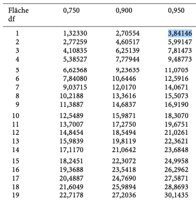
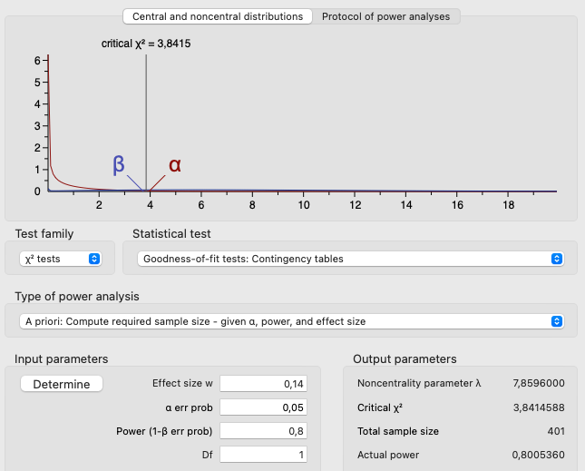

```{r setup, include=FALSE}
options(htmltools.dir.version = FALSE)

library(tidyverse)
library(kableExtra)
library(ggplot2)
library(plotly)
library(htmlwidgets)
library(plotly)
library(MASS)
library(ggpubr)
library(xaringanthemer)
library(xaringanExtra)
library(sjPlot)
library(sjmisc)
options(scipen = 999)

style_duo_accent(
  primary_color = "#621C37",
  secondary_color = "#EE0071",
  background_image = "blank.png"
)

xaringanExtra::use_xaringan_extra(c("tile_view"))

use_scribble(
  pen_color = "#EE0071",
  pen_size = 4
  )

knitr::opts_chunk$set(
  fig.retina = TRUE,
  warning = FALSE,
  message = FALSE
)

Xname = ""
Yname = ""
nudgnumber = 3
my_green = "#EE0071"
```

name: Title slide
class: middle, left
<br><br><br><br><br><br><br>
# Statistik I
***
### Einheit 10: Verfahren für Nominaldaten - $\chi^2-$Test
##### `r format(as.Date(data.frame(readxl::read_excel("Modul Quantitative Methoden I_Termine.xlsx"))$Datum), "%d.%m.%Y")[10]` | Prof. Dr. Stephan Goerigk

---
class: top, left
### Verfahren für Nominaldaten

#### Kurzvorstellung

**Voraussetzungen bisher gelernter Tests:**

* Viele Hypothesentests nutzen Kombinationen aus numerischen vs. kategorialen UVs

```{r echo=FALSE}
d = data.frame(
  Hypothesentest = c("Ein-Stichproben t-Test",
                     "Unabhängiger t-Test",
                     "Abhängiger t-Test",
                     "Einfaktorielle ANOVA",
                     "ANOVA mit Messwiederholung",
                     "Einfache Regression",
                     "Mehrfaktorielle ANOVA",
                     "Multiple Regression",
                     "Mixed ANOVA"),
  AV = rep("Intervallskaliert", 9),
  UVs = c("Keine UV, nur Referenzwert",
            "1 kategoriale UV, 2 Stufen",
            "1 UV Messwiederholung, 2 Messungen",
            "1 kategoriale UV, ≥2 Stufen",
            "1 UV Messwiederholung, ≥2 Messungen",
            "1 kategoriale UV oder 1 stetige UV",
            "2 kategoriale UVs",
            "2 kategoriale oder stetige UVs",
            "2 UVs, davon 1 kategoriale UV und eine Messwiederholung"),
  Fragestellung = c("Unterschied zwischen Stichprobenmittelwert und Referenzwert?",
                    "Unterschied zwischen 2 Gruppen?",
                     "Unterschied zwischen 2 Messzeitpunkten?",
                     "Unterschied zwischen ≥2 Gruppen?",
                     "Unterschied zwischen ≥2 Messzeitpunkten?",
                     "Kann UV die AV vorhersagen?",
                     "Unterschiede zwischen der Stufen der Faktoren? Besteht Interaktion?",
                     "Können UVs die AV vorhersagen? Besteht Interaktion?",
                     "Unterschiede zwischen Stufen und Zeitpunkten? Besteht Interaktion?"),
   Teststatistik = c("t-Wert",
                    "t-Wert",
                     "t-Wert",
                     "F-Wert",
                     "F-Wert",
                     "t-Wert (Steigung) oder F-Wert (Omnibus)",
                     "F-Wert",
                     "t-Wert (Steigung) oder F-Wert (Omnibus)",
                     "F-Wert")
)
knitr::kable(d,
             booktabs = T,
             longtable = F) %>%
  kable_classic(full_width = F,
                  font_size = 14,
                  html_font = "Times New Roman")
```

---
class: top, left
### Verfahren für Nominaldaten

#### Kurzvorstellung

**Voraussetzungen bisher gelernter Tests:**

* ABER: Alle bislang kennengelernten statistischen Tests beinhalten **intervallskalierte AVs**

* Was können wir tun, wenn wie eine **nominalskalierte AV** haben?

Zunächst: nominalskalierte Variablen mit 2 Merkmalsausprägungen (dichotom aka. binär):

* Klassische Beispiele:

  * richtig vs. falsch
  * krank vs. gesund
  * rückfällig vs. nicht rückfällig
  * tod vs. lebendig

---
class: top, left
### Verfahren für Nominaldaten

#### Kurzvorstellung - Zur Erinnerung:

* Nominalskalierte Variablen sind eine Art von Variablen, bei denen die Werte Kategorien oder Namen repräsentieren

* Die Kategorien oder Namen haben keine natürliche Ordnung oder Rangfolge (z.B. Geschlecht, Nationalität oder Augenfarbe).

* Es können nur Aussagen über die Gleichheit oder Ungleichheit der Kategorien gemacht werden. 

* Es ist nicht möglich, Aussagen über die Größe oder den Abstand zwischen den Kategorien zu treffen.

* Die Umwandlung in andere Skalenniveaus wie ordinal oder metrisch ist nicht sinnvoll, da die Informationen über die Rangfolge oder die Abstände zwischen den Kategorien nicht vorhanden sind.

* Bei der Darstellung nominalskalierter Variablen werden häufig Balkendiagramme verwendet, um die Häufigkeit oder Verteilung der einzelnen Kategorien zu veranschaulichen.


---
class: top, left
### Verfahren für Nominaldaten

```{r echo=FALSE}
Behandlung = c("Psychotherapie", "Warteliste")
Diagnose = c("Somatoform", "Sucht", "Depression", "Zwang")
Behandlungserfolg = c("nein", "ja")

data = data.frame(
  Behandlung = rep(c("Psychotherapie", "Warteliste"), each = 5),
   Behandlungserfolg = c("ja", "ja", "nein", "ja", "ja", "nein", "nein", "nein", "ja", "ja")
)
```

.pull-left[
#### Deskriptivstatistiken
<small>

* Lage- und Streuungsmaße lassen sich nicht berechnen
* ABER: Kategorien können ausgezählt werden (Häufigkeiten)

**Absolute Häufigkeiten (n):**
.code80[
```{r}
table(data$Behandlungserfolg)
```

**Relative Häufigkeiten (%):**

```{r}
prop.table(table(data$Behandlungserfolg))
```

]
]
.pull-right[
**Beispiel - nominalskalierte Variablen:**

```{r echo=FALSE}
knitr::kable(data,
             booktabs = T,
             longtable = F) %>%
  kable_classic(full_width = F,
                  font_size = 18,
                  html_font = "Times New Roman")
```
]

---
class: top, left
### Verfahren für Nominaldaten

.pull-left[
#### Kreuztabelle (aka. Kontingenztafel)
<small>

* Tabelle zur Verteilung von zwei oder mehr nominalskalierten Variablen.
* Werte beider Variablen in Zeilen und Spalten aufgeteilt 
* Zellen enthalten Kombinationen beider Variablen.

**Absolute Häufigkeiten (n):**
.code80[
```{r}
table(data$Behandlungserfolg, data$Behandlung)
```
]

**Relative Häufigkeiten (%):**

.code80[
```{r}
prop.table(table(data$Behandlungserfolg, data$Behandlung))
```
]
]
.pull-right[
**Beispiel - nominalskalierte Variablen:**

```{r echo=FALSE}
knitr::kable(data,
             booktabs = T,
             longtable = F) %>%
  kable_classic(full_width = F,
                  font_size = 18,
                  html_font = "Times New Roman")
```
]

---
class: top, left
### Verfahren für Nominaldaten

.pull-left[
#### Visualisierung im Balkendiagramm (Wiederholung)

```{r echo=F, out.width = "430px"}
proptable_to_bar_2 = function(table){
  t = as.data.frame(table)
  p = ggplot(data = t, aes(x = Var1, y = Freq, fill = Var2)) +
    geom_bar(stat = "identity", position = position_dodge2()) +
    labs(x = "", y = "", fill = "") +
    coord_cartesian(ylim = c(0,1)) +
    scale_y_continuous(labels = scales::percent) +
    theme_classic()
  return(p)
}

proptable_to_bar_2(prop.table(table(data$Behandlungserfolg, data$Behandlung))) + 
  theme(text = element_text(size = 25),
        legend.position = "bottom")
```
]

.pull-right[
**Beispiel - nominalskalierte Variablen:**

```{r echo=FALSE}
knitr::kable(data,
             booktabs = T,
             longtable = F) %>%
  kable_classic(full_width = F,
                  font_size = 18,
                  html_font = "Times New Roman")
```
]

---
class: top, left
### Verfahren für Nominaldaten

#### $\chi^2$-Tests

* Relative Häufigkeit in Stichprobe dient als Schätzer für Auftretenswahrscheinlichkeit in Population

Logik ähnlich wie t-Test $(H_0$ des t-Tests: Mittelwerte sind gleich)

* $H_0:$ Beispiel: Kategorien sind **gleich verteilt** (Gleichverteilungshypothese). 

* Die unter der $H_0$ erwarteten Häufigkeiten werden mit beobachteten Häufigkeiten (Stichprobe) verglichen

* Testverteilung: $\chi^2$-Verteilung $\rightarrow$ hat eigene Tabelle

* Entscheidungslogik: 

  * Vergleich empirischer $\chi^2$-Wert (Berechnung aus Daten) vs. kritischer $\chi^2$-Wert (aus Tabelle)
  
  * Wenn $\chi^2_{emp} > \chi^2_{krit}$ ist der Test signifikant

---
class: top, left
### Verfahren für Nominaldaten

#### Eindimensionaler $\chi^2$-Test

* Prüft Hypothesen über die Verteilung **einer** kategorialen Variablen

* Versuchspersonen hinsichtlich Merkmal mit $k$ Stufen kategorisiert

* Stichprobe: Es liegt Verteilung mit absoluten Häufigkeiten vor (beobachtete Häufigkeiten)

* Aufgabe $\chi^2$-Test: Ermitteln, ob Verteilung in Stichprobe Annahme über Population entspricht

**Beispiel: Suizidraten bei Männern und Frauen**

* Frage: Entsprechen in einer Stichprobe beobachtete Suizidraten von Männern und Frauen einer theoretisch erwarteten Verteilung?

---
class: top, left
### Verfahren für Nominaldaten

#### $\chi^2$-Tests

**Nullhypothese:**
<small>
* Entscheidung für $H_1$ über Ablehnung der $H_0$ $\rightarrow$ Wenn $H_0$ ausreichend unwahrscheinlich, wird $H_1$ angenommen.

* $\chi^2$-Test prüft, ob beobachtete Häufigkeiten von erwarteten Häufigkeiten abweichen.

* Erwartete Häufigkeiten entsprechen der $H_0$ des Tests.

* Besonderheit $\chi^2$-Test: Jede Annahme über Verteilung kann als $H_0$ dienen.

Gleichverteilungsannahme (häufig):

  * $H_0:$ "Verteilung der Geschlechter in Population ist 50% vs. 50%."
  * $H_1:$ "Geschlechter sind ungleich verteilt."

Nicht gleich verteilte Annahmen (denkbar):

  * $H_0:$ "Verteilung der Geschlechter in Population ist 30% vs. 70%."
  * $H_1:$ "Verteilung der Geschlechter weicht signifikant von dieser Annahme ab."

---
class: top, left
### Verfahren für Nominaldaten

#### $\chi^2$-Tests

**Nullhypothese:**
<small>

Gleichverteilungsannahme:

* Häufigkeiten $(f)$ sind über alle Stufen des Merkmals hinweg gleich

* erwartete Häufigkeit jeder Zelle:

$$f_{e1}=f_{e2}=...f_{ek}=\frac{N}{k}$$

Beispiel - Suizidrate nach Geschlecht:

.pull-left[
In Stichprobe: 

```{r echo=F}
d = data.frame(Frauen = 101,
               Männer = 223,
               Summe = 101+223)
knitr::kable(d,
             booktabs = T,
             longtable = F) %>%
  kable_classic(full_width = F,
                  font_size = 18)
```
]

.pull-right[
Erwartete Werte unter Gleichverteilungsannahme: 

```{r echo=F}
d = data.frame(Frauen = 162,
               Männer = 162,
               Summe = 121+203)
knitr::kable(d,
             booktabs = T,
             longtable = F) %>%
  kable_classic(full_width = F,
                  font_size = 18)
```
]


---
class: top, left
### Verfahren für Nominaldaten

#### $\chi^2$-Tests

**Nullhypothese:**
<small>

Nicht gleich verteilte Annahmen:

* Verteilung der Häufigkeiten $(f)$ entspricht theoretischen Vorüberlegungen (begründete Festlegung der Verteilung)

* erwartete Häufigkeit jeder Zelle: Multiplikation mit angenommener Auftretenswahrscheinlichkeit $(p_i)$

$$f_{ei}=N \cdot p_i$$

Beispiel - Suizidrate nach Geschlecht:

.pull-left[
In Stichprobe: 
<br>
```{r echo=F}
d = data.frame(Frauen = 101,
               Männer = 223,
               Summe = 101+223)
knitr::kable(d,
             booktabs = T,
             longtable = F) %>%
  kable_classic(full_width = F,
                  font_size = 18)
```
]

.pull-right[
Erwartete Werte nach theoretischer Vorüberlegung (Männer begehen 3x häufiger Suizid): 

```{r echo=F}
n = 324
n_w = 101
n_m = 223
d = data.frame(Frauen = '$324 \\cdot 0.25=81$',
               Männer = '$324 \\cdot 0.75=243$',
               Summe = 121+203)
knitr::kable(d,
             booktabs = T,
             longtable = F,
             escape = F) %>%
  kable_classic(full_width = F,
                  font_size = 18)
```
]

---
class: top, left
### Verfahren für Nominaldaten

#### $\chi^2$-Wert
<small>

* Entscheidung über signifikante Unterschiede zwischen beobachteten und erwarteten Häufigkeiten erfolgt über ** $\chi^2$-Wert **

* Folgt der $\chi^2$-Verteilung $\rightarrow$ Wahrscheinlichkeit empirischer Werte unter Annahme der $H_0$ bestimmbar

**Berechnung**

* Was wird benötigt: beobachtete und erwartete absolute Häufigkeiten für alle Merkmalstufen

* $\chi^2$-Wert gibt Abweichung der beobachteten von den erwarteten Häufigkeit an

$$\chi^2 = \sum\limits _{i=1}^{k}\frac{(f_{bi} - f_{ei})^2}{f_{ei}}$$
mit:
* $k:$ Anzahl der Merkmalskategorien (Index $i$)
* $f_{bi}$ beobachtete absolute Häufigkeit von Kategorie $i$
* $f_{ei}$ unter $H_0$ erwartete absolute Häufigkeit von Kategorie $i$

---
class: top, left
### Verfahren für Nominaldaten

#### $\chi^2$-Wert
<small>


** Eigenschaften des $\chi^2$-Werts**

* $\chi^2=0$, wenn beobachtete und erwartete Häufigkeiten in allen Zellen genau übereinstimmen 

* Je größer die Abweichung der beobachteten von erwarteten Häufigkeiten, desto größer wird $\chi^2$

* $\chi^2$ kann aufgrund der Quadrierung in der Formel nur positive Werte annehmen

  * Informationen über Richtung der Abweichung geht verloren
  
  * unspezifischer Test $\rightarrow$ es können keine gerichteten Hypothesen getestet werden
  
  * Ausnahme: eindimensionaler $\chi^2$-Test mit 2 Stufen

---
class: top, left
### Verfahren für Nominaldaten

.pull-left[

#### $\chi^2$-Verteilung

* $\chi^2$ kann aufgrund der Quadrierung in der Formel nur positive Werte annehmen

* Wertebereich von $0 \text{ bis }\infty$
  
* Form ist abhängig von Anzahl der Freiheitsgrade $(df)$

* Fläche unter der Kurve gibt an, wie wahrscheinlich ein $\chi^2$-Wert ist
]

.pull-right[
```{r echo=FALSE, out.width = "430px"}
df <- data.frame(x = seq(0, 20, 0.1),
                 df_1 = dchisq(seq(0, 20, 0.1), df = 3),
                 df_3 = dchisq(seq(0, 20, 0.1), df = 9),
                 df_5 = dchisq(seq(0, 20, 0.1), df = 15))

# Plot the Chi-Square distributions
ggplot(df, aes(x = x)) +
  geom_line(aes(y = df_1, color = "df = 3"), size = 1) +
  geom_line(aes(y = df_3, color = "df = 9"), size = 1) +
  geom_line(aes(y = df_5, color = "df = 15"), size = 1) +
  labs(title = "Verteilungsform",
       x = "",
       y = "",
       colour = "") +
  scale_color_manual(values = c("df = 3" = "blue", "df = 9" = "green", "df = 15" = "red")) +
  theme_classic() +
  theme(text = element_text(size = 25),
        legend.position = "bottom")
```
]

---
class: top, left
### Verfahren für Nominaldaten

.pull-left[

#### $\chi^2$-Wert

**Berechnung im Beispiel:**

<small>
$$\chi^2 = \sum\limits _{i=1}^{k}\frac{(f_{bi} - f_{ei})^2}{f_{ei}}= \frac{(101-81)^2}{81} + \frac{(223-243)^2}{243}=6.58$$

* Für die $H_0$, dass die Häufigkeiten den theoretischen Annahmen entsprechen erhalten wir $\chi^2=6.58$

* Zur Interpretation dieses Werts benötigen wir noch die Freiheitsgrade $(df)$
]

.pull-right[
```{r echo=F}
d = data.frame(
  Notation = c(
    "$f_{bi}$",
   "$f_{ei}$",
   "$f_{bi} - f_{ei}$",
   "$(f_{bi} - f_{ei})^2$",
   "$\\frac{(f_{bi} - f_{ei})^2}{f_{ei}}$"
  ),
  Frauen = c(
    "$101$",
   "$324 \\cdot 0.25= 81$",
   "$101 - 81 = 20$",
   "$20^2=400$",
   "$\\frac{400}{81}=4.94$"
  ),
  Männer = c(
    "$223$",
   "$324 \\cdot 0.75= 243$",
   "$223 - 243 = -20$",
   "$-20^2=400$",
   "$\\frac{400}{243}=1.65$"
  )
)

knitr::kable(d,
             booktabs = T,
             longtable = F,
             escape = F) %>%
  kable_classic(full_width = F,
                  font_size = 18)
```
]

---
class: top, left
### Verfahren für Nominaldaten

#### $\chi^2$-Wert

**Bestimmung der Freiheitsgrade:**

* Anzahl der Summanden in der Formel die unabhängig voneinander variieren können 

* Für den eindimensionalen $\chi^2$-Test:

$$df=k-1$$

Berechnung im Beispiel:

$$df = k-1 = 2-1=1$$
---
class: top, left
### Verfahren für Nominaldaten

.pull-left[

#### $\chi^2$-Wert

**Signifikanzprüfung:**

* $\chi^2_{emp}=6.58$

* $df=k-1$

* $\alpha =.05$

Ablesen von $\chi^2_{krit}$ aus der Tabelle:

* $\chi^2_{df=1}=3.84$

Vergleich $\chi^2_{emp}$ vs. $\chi^2_{krit}:$

* $6.58 > 3.84$ $\rightarrow$ Test ist signifikant

]

.pull-right[
.center[
```{r eval = TRUE, echo = F, out.width = "470px"}

```
]
]

---
class: top, left
### Verfahren für Nominaldaten

#### Eindimensionaler $\chi^2$-Test in R

```{r}
# Stichprobendaten erstellen (1 Vektor und keine Tabelle, da eindimensional)

x = c(rep("Männer", 223), rep("Frauen", 101))
table(x)
```

```{r}
chisq.test(table(x), p = c(0.25, 0.75))
```

---
class: top, left
### Verfahren für Nominaldaten

#### Gerichteter eindimensionaler $\chi^2$-Test 

* $\chi^2$-Test ist normalerweise ungerichtet (wegen Quadrierung der Abweichungen)

* Spezialfall eindimensionaler $\chi^2$-Test bei Variable mit genau 2 Stufen

* In diesem Fall ist die Richtung der Abweichung eindeutig

* Interpretation: "Merkmalsstufe 1 tritt öfter auf als Merkmalsstufe 2."

* VORSICHT: Signifikanzniveau $(\alpha)$ wird dann verdoppelt (z.B. wenn $\alpha=.05$ wird in der Tabelle $\alpha=.10$ angenommen)

* Folge: $\chi^2_{krit}$ verringert sich, Test wir eher signifkant (Teststärke nimmt zu)

---
class: top, left
### Verfahren für Nominaldaten

#### Eindimensionaler $\chi^2$-Test 

**Effekstärke:**

.pull-left[

* Wie immer: Standardisiertes Maß für Größe des systematischen Unterschieds

* Gängige Effektstärke beim $\chi^2$-Test: $w^2$

* Schätzung von $w^2$ aus Stichprobendaten:

$$\hat{w}^2 = \frac{\chi^2}{N}$$
* Im Beispiel: $\hat{w}^2 = \frac{\chi^2}{N}=\frac{6.58}{324}=0.02$

* VORSICHT: G*Power nutzt unquadrierte Größe $w$ (aka "Phi": $\varphi$)
]

.pull-right[
Konventionen nach Cohen (1988):

```{r echo=FALSE}
df = data.frame(
  Effektstärke = c(0.01, 0.09, 0.25),
  Interpretation = c("kleiner Effekt", "mittlerer Effekt", "großer Effekt")
)
knitr::kable(df,
             booktabs = T,
             longtable = F,
             escape = F) %>%
  kable_classic(full_width = T,
                  font_size = 18)
```

$\rightarrow$ nach Cohen handelt es sich in unserem Beispiel um eine kleine Effektstärke.

]


---
class: top, left
### Verfahren für Nominaldaten

#### Eindimensionaler $\chi^2$-Test 

**Stichprobenumfangsplanung:**

.center[
```{r eval = TRUE, echo = F, out.width = "490px"}

```
]

---
class: top, left
### Verfahren für Nominaldaten

#### Zweidimensionaler $\chi^2$-Test 

* Erweiterung um eine weitere kategoriale Variable $(\geq$ 2 Stufen)

* Darstellung in Kreuztabelle (auch $k \text{ x } l-\chi^2$-Test) 
  * Zeilen: Merkmal 1 mit $k$ Stufen
  * Spalten: Merkmal 2 mit $l$ Stufen)
  
* Wie zuvor: Vergleich theoretisch erwartete vs. beobachtete Häufigkeiten

* Klassische Anwendung: **Kontingenzanalyse**

  * Frage: Besteht ein stochastischer Zusammenhang zwischen den Merkmalen
  * z.B. "Sind Behandlungserfolge [nein vs. ja] zwischen Therapiemodalitäten [Therapie vs. Warteliste] gleich verteilt?"

---
class: top, left
### Verfahren für Nominaldaten

#### Zweidimensionaler $\chi^2$-Test 

**Hypothesenpaar $H_0$ vs. $H_1:$**

* Theoretisch unendlich viele $H_0$ (alle denkbaren theoretischen Annahmen)

* Bei Kontingenzanalyse:

  * $H_0:$ Merkmale sind stochastisch unabhängig.
  
  * $H_1:$ Es besteht irgendeine Art von Zusammenhang zwischen den Steufen des einen Merkmals und den Stufen des anderen Merkmals

---
class: top, left
### Verfahren für Nominaldaten

#### Zweidimensionaler $\chi^2$-Test 

**Berechnung erwarteter Häufigkeiten unter Annahme der $H_0:$**

* Zur Berechnung müssen wir wissen, wie sich jedes Merkmal alleine verteilen würde (Ignorieren des anderen Merkmals)

* Dies schätzen wir über die sogenannten **Randhäufigkeiten**

* relative Randhäufigkeiten (in %) dienen als Schätzer für die Wahrscheinlichkeit einer Merkmalsstufe in der Population $(p_i$ bzw. $p_j)$

$$p_i = \frac{n_i}{N}, \text{ bzw. } p_j = \frac{n_j}{N}$$
---
class: top, left
### Verfahren für Nominaldaten

#### Zweidimensionaler $\chi^2$-Test 

.pull-left[
**Berechnung erwarteter Häufigkeiten unter Annahme der $H_0:$**

Berechnung der Randhäufigkeiten:
.code60[
```{r}
addmargins(table(data$Behandlungserfolg, data$Behandlung), FUN = sum)
```

]
]
.pull-right[
**Beispiel - Therapieerfolg $(N=10):$**

```{r echo=FALSE}
knitr::kable(data,
             booktabs = T,
             longtable = F) %>%
  kable_classic(full_width = F,
                  font_size = 18,
                  html_font = "Times New Roman")
```
]

---
class: top, left
### Verfahren für Nominaldaten

#### Zweidimensionaler $\chi^2$-Test 

```{r echo=FALSE}
set.seed(123)
data = data.frame(
  Behandlung = rep(c("Psychotherapie", "Warteliste"), each = 50)
)
data$Behandlungserfolg[data$Behandlung == "Psychotherapie"] = sample(c("nein", "ja"), size = 50, prob = c(0.25, 0.75), replace = T)
data$Behandlungserfolg[data$Behandlung == "Warteliste"] = sample(c("nein", "ja"), size = 50, prob = c(0.75, 0.25), replace = T)
```

.pull-left[
**Berechnung erwarteter Häufigkeiten unter Annahme der $H_0:$**

Berechnung der Randhäufigkeiten:
.code60[
```{r}
addmargins(table(data$Behandlungserfolg, data$Behandlung), FUN = sum)
```

]
]
.pull-right[
**Beispiel - Therapieerfolg in größerer Stichprobe $(N=100):$**

* 45 Patient:innen hatten einen Therapieerfolg: $p_{ja}=\frac{49}{100}=0.49$

* Gegenwahrscheinlichkeit: $p_{nein}=1-0.49=0.51$

* 50 Patient:innen hatten einen Wartelistentherapie: $p_{Warteliste}=\frac{50}{100}=0.50$

* Gegenwahrscheinlichkeit: $p_{Psychotherapie}=1-0.50=0.50$

]

---
class: top, left
### Verfahren für Nominaldaten

#### Zweidimensionaler $\chi^2$-Test 

* Was bedeutet Stochastische Unabhängigkeit?
  
  * Merkmale beeinflussen einander nicht
  * Ranghäufigkeiten müssen sich in jeder einzelnen Stufe des Merkmals widerspiegeln
  * Ändert sich Verhältnis ist $H_0$ verletzt

**Berechnung erwarteter Häufigkeiten unter Annahme der $H_0:$**

$$f_{eij}=p_i \cdot n_j \text{  bzw.  } f_{eij}=p_j \cdot n_i$$
mit:
* $f_{eij}:$ erwartete Häufigkeit in Zelle $ij$ der Kreuztabelle
* $p_i$ Randwahrscheinlichkeit der Merkmalsausprägung $i$ von Merkmal 1
* $p_j$ Randwahrscheinlichkeit der Merkmalsausprägung $j$ von Merkmal 2
* $n_i$ Randhäufigkeit $i$ von Merkmal 1
* $n_j$ Randhäufigkeit $j$ von Merkmal 2

---
class: top, left
### Verfahren für Nominaldaten

#### Zweidimensionaler $\chi^2$-Test 

**Berechnung erwarteter Häufigkeiten unter Annahme der $H_0:$**

$$f_{eij}=p_i \cdot n_j \text{  bzw.  } f_{eij}=p_j \cdot n_i$$

Beide Formeln führen zum selben Ergebnis (lassen sich ineinander überführen):

$$f_{eij} = \frac{n_i \cdot n_j}{N} \rightarrow \frac{\text{Zeilensumme} \cdot \text{Spaltensumme}}{N}$$
.pull-left[
.code60[
```{r echo=FALSE}
addmargins(table(data$Behandlungserfolg, data$Behandlung), FUN = sum)
```
]
]
.pull-right[
* Verhältnis von Therapieerfolg ist 49% zu 51%

* Falls Merkmale stochastisch unabhängig, muss dieses Verhältnis sich in beiden Behandlungen zeigen

]

---
class: top, left
### Verfahren für Nominaldaten

#### Zweidimensionaler $\chi^2$-Test 

**Berechnung erwarteter Häufigkeiten unter Annahme der $H_0:$**

$$f_{eij}=p_i \cdot n_j \text{  bzw.  } f_{eij}=p_j \cdot n_i$$

Beide Formeln führen zum selben Ergebnis (lassen sich ineinander überführen):

$$f_{eij} = \frac{n_i \cdot n_j}{N} \rightarrow \frac{\text{Zeilensumme} \cdot \text{Spaltensumme}}{N}$$
.pull-left[
.code60[
```{r echo=FALSE}
addmargins(table(data$Behandlungserfolg, data$Behandlung), FUN = sum)
```
]
]
.pull-right[
* $f_{eTh/ja} = 50 \cdot 0.49 = 24.5$
* $f_{eTh/nein} = 50 \cdot 0.51 = 25.5$
* $f_{eWa/ja} = 50 \cdot 0.49 = 24.5$
* $f_{eWa/nein} = 50 \cdot 0.51 = 25.5$

$\rightarrow$ Beobachtete Werte weichen scheinbar von erwarteten ab. Ist diese Abweichung signifikant?
]

---
class: top, left
### Verfahren für Nominaldaten

#### Zweidimensionaler $\chi^2$-Test

**Berechnung von $\chi^2_{emp}:$ **

$$\chi^2 = \sum\limits _{i=1}^{k}\sum\limits _{j=1}^{l}\frac{(f_{bij} - f_{eij})^2}{f_{eij}}$$

mit:
* $k:$ Anzahl der Kategorien von Merkmal 1 (Index $i$)
* $l:$ Anzahl der Kategorien von Merkmal 2 (Index $j$)
* $f_{bij}$ beobachtete absolute Häufigkeit von Merkmalskombination $ij$
* $f_{eij}$ unter $H_0$ erwartete absolute Häufigkeit von Merkmalskombination $ij$

und:

$$df = (k-1) \cdot (l-1)$$

---
class: top, left
### Verfahren für Nominaldaten

#### Zweidimensionaler $\chi^2$-Test 

**Signifikanzprüfung:**

.pull-left[
.code60[
```{r echo=FALSE}
addmargins(table(data$Behandlungserfolg, data$Behandlung), FUN = sum)
```
]
]
.pull-right[
* $f_{eTh/ja} = 50 \cdot 0.49 = 24.5$
* $f_{eTh/nein} = 50 \cdot 0.51 = 25.5$
* $f_{eWa/ja} = 50 \cdot 0.49 = 24.5$
* $f_{eWa/nein} = 50 \cdot 0.51 = 25.5$
]

<small>

$$\chi^2_{emp} = \sum\limits _{i=1}^{k}\sum\limits _{j=1}^{l}\frac{(f_{bij} - f_{eij})^2}{f_{eij}} = \frac{(36 - 24.5)^2}{24.5} + \frac{(13 - 25.5)^2}{25.5} +\frac{(14 - 24.5)^2}{24.5} + \frac{(37 - 25.5)^2}{25.5}=21.17$$
mit:

$$df = (2-1) \cdot (2-1)=1$$


---
class: top, left
### Verfahren für Nominaldaten

.pull-left[
#### Zweidimensionaler $\chi^2$-Test 

**Signifikanzprüfung:**

* $\chi^2_{emp}=21.17$

* $df =1$

Ablesen von $\chi^2_{krit}$ aus der Tabelle:

* $\chi^2_{df=1}=3.84$

Vergleich $\chi^2_{emp}$ vs. $\chi^2_{krit}:$

* $21.17 > 3.84$ $\rightarrow$ Test ist signifikant
]
.pull-right[
.center[
```{r eval = TRUE, echo = F, out.width = "470px"}

```
]
]

---
class: top, left
### Verfahren für Nominaldaten

#### Zweidimensionaler $\chi^2$-Test - R

<small>

Unser Ergebnis (händisch):

.code80[
```{r}
chisq.test(table(data$Behandlungserfolg, data$Behandlung), correct = FALSE)
```

R führt standardmäßig für 2x2 Kreuztabellen die so genannte Yates-Kontinuitätskorrektur durch (Ergebnis etwas genauer):

```{r}
chisq.test(table(data$Behandlungserfolg, data$Behandlung))
```
]

---
class: top, left
### Verfahren für Nominaldaten

#### Zweidimensionaler $\chi^2$-Test

**Effekstärke $w^2:$**

* Auch hier lässt sich $w^2$ verwenden

* Schätzung von $w^2$ aus Stichprobendaten:

$$\hat{w}^2 = \frac{\chi^2}{N}$$

* Beispiel: $\hat{w}^2 = \frac{21.17}{100}=0.21 \rightarrow$ nach Cohen ein mittlerer Effekt.

---
class: top, left
### Verfahren für Nominaldaten

#### Zweidimensionaler $\chi^2$-Test

**Effekstärke Cramers Phi-Koeffizient (Cramers Index, CI)**

* Empirisches Effektstärkemaß, baut auf $w^2$ auf

* Vorteil: Darf direkt wie Korrelationsmaß interpretiert werden
  * Wertebereich zwischen 0 und 1
  * 0 = stochastische Unabhängigkeit
  * 1 = perfekter Zusammenhang
  
$$CI = \sqrt\frac{\chi^2}{N \cdot (R - 1)}$$
mit:
* $R=min(k;l)$

---
class: top, left
### Verfahren für Nominaldaten

#### Zweidimensionaler $\chi^2$-Test

.pull-left[

**Effekstärke Cramers Phi-Koeffizient (Cramers Index, CI)**

$$CI = \sqrt\frac{\chi^2}{N \cdot (R - 1)} = \sqrt\frac{21.17}{100 \cdot (2 - 1)}=0.46$$
]

.pull-right[

Konventionen nach Cohen (1988):

```{r echo=FALSE}
df = data.frame(
  Effektstärke = c(0.10, 0.30, 0.50),
  Interpretation = c("kleiner Effekt", "mittlerer Effekt", "großer Effekt")
)
knitr::kable(df,
             booktabs = T,
             longtable = F,
             escape = F) %>%
  kable_classic(full_width = T,
                  font_size = 18)
```

$\rightarrow$ nach Cohen handelt es sich in unserem Beispiel um eine mittlere Effektstärke.

]

---
class: top, left
### Verfahren für Nominaldaten

#### Der Vierfelder $\chi^2$-Test

<small>

* Spezialfall des zweidimensionalen $\chi^2$-Tests

* Beide Merkmale haben genau 2 Merkmalsstufen (2x2 Kontingenztabelle)

Dann kann Formel vereinfach werden (Vierfelder-Tafel):

```{r echo=FALSE}
d = data.frame(B1 = c("a", "c"),
               B2 = c("b", "d"))
rownames(d) = c("A1", "A2")

knitr::kable(d,
             booktabs = T,
             longtable = F,
             escape = F, row.names = T) %>%
  kable_classic(full_width = F,
                  font_size = 18
                )
```

$$\chi^2 = \frac{N \cdot ( a \cdot d -  b \cdot c)^2}{(a + b) \cdot (c + d) \cdot ( a + c) \cdot (b + d)}$$
mit:
$$df = (k-1) \cdot (l-1)$$

* Vorteil: Keine Berechnung von Randhäufigkeiten etc. notwendig

---
class: top, left
### Verfahren für Nominaldaten


.pull-left[
#### Der Vierfelder $\chi^2$-Test

```{r echo=FALSE}
d = data.frame(B1 = c("a", "c"),
               B2 = c("b", "d"))
rownames(d) = c("A1", "A2")

knitr::kable(d,
             booktabs = T,
             longtable = F,
             escape = F, row.names = T) %>%
  kable_classic(full_width = T,
                  font_size = 18
                )
```
]
.pull-right[
```{r}
table(data$Behandlungserfolg, data$Behandlung)
```

]

<br><br><br>

$$\chi^2_{emp} = \frac{N \cdot ( a \cdot d -  b \cdot c)^2}{(a + b) \cdot (c + d) \cdot ( a + c) \cdot (b + d)} =  \frac{100 \cdot ( 36 \cdot 37 -  13 \cdot 14)^2}{(36 + 13) \cdot (14 + 37) \cdot ( 36 + 14) \cdot (13 + 37)}=21.17$$
---
class: top, left
### Verfahren für Nominaldaten

#### Der Vierfelder $\chi^2$-Test

**Effekstärke Phi-Koeffizient**

* Effektstärke $\phi$ entspricht Korrelation von 2 dichotomen Variablen

$$\phi = \frac{ a \cdot d -  b \cdot c}{\sqrt{(a + b) \cdot (c + d) \cdot ( a + c) \cdot (b + d)}}$$
---
class: top, left
### Verfahren für Nominaldaten

#### Voraussetzungen $\chi^2$-Tests 

* $\chi^2$-Tests haben nur relativ wenige Voraussetzungen

  1. Einzelbeobachtungen sind unabhängig voneinander
  
  2. Jede Person kann eindeutig einer Kategorie (oder Kombination von Kategorien) zugeordnet werden
  
  3. Erwartete Häufigkeiten in den Zellen größer als 5 (sonst analoger Alternativtest "Exakter Test nach Fisher")

---
class: top, left
### Take-aways

.full-width[.content-box-gray[
* $\chi^2$-Tests  beinhalten die **Analyse von Häufigkeiten**.

* Prinzip: Vergleich von **beobachteten vs. theoretisch erwarteten** Häufigkeiten.

* Für $\chi^2$-Tests existieren theoreitsch **unendlich viele $H_0$ ** Möglichkeiten (häufig: Gleichverteilungsannahme)

* **Eindimensionaler $\chi^2$-Test** prüft, ob sich Verteilung der Kategorien einer nominalskalierten Variable unterscheiden.

* **Zweidimensionaler $\chi^2$-Test** prüft Verteilung von 2 nominalskalierten Variablen (stochastische Unabhängigkeit).

* Spezialfall: **Vierfelder $\chi^2$-Test ** wenn 2 dichotome Merkmale vorliegen.

* **Effektstärkebestimmung** über $w^2$ oder Phi-Koeffizient (wie Korrelation interpretierbar)
]
]


