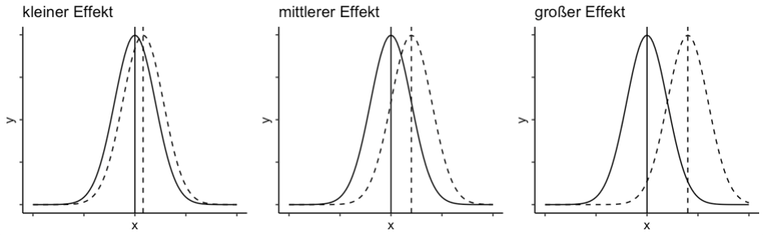
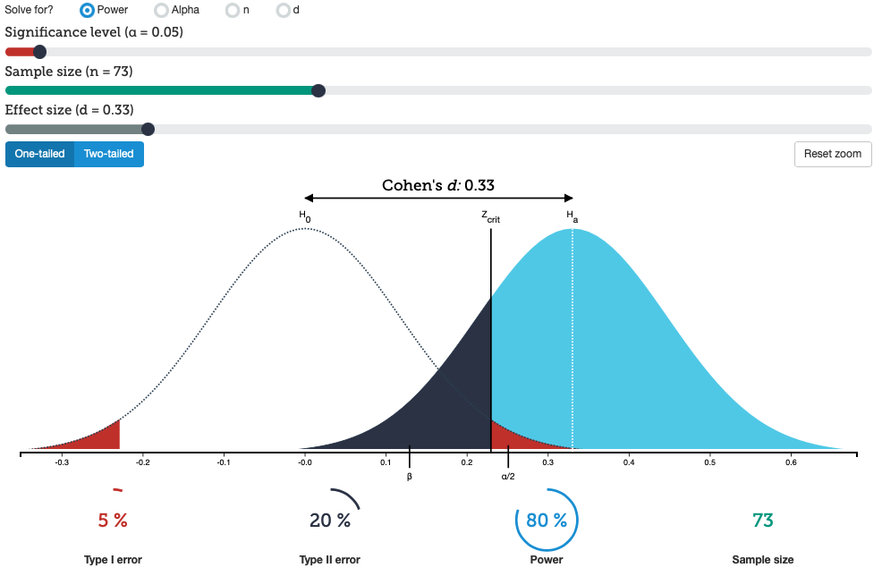
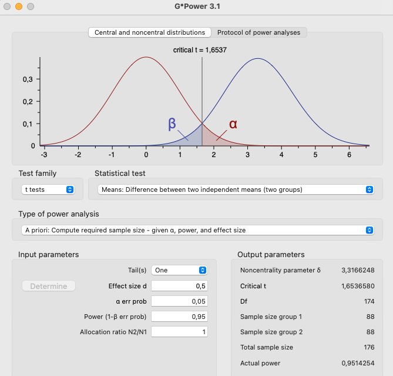

```{r setup, include=FALSE}
options(htmltools.dir.version = FALSE)

library(tidyverse)
library(kableExtra)
library(ggplot2)
library(plotly)
library(htmlwidgets)
library(MASS)
library(ggpubr)
library(xaringanthemer)
library(xaringanExtra)
library(gghighlight)

style_duo_accent(
  primary_color = "#621C37",
  secondary_color = "#EE0071",
  background_image = "blank.png"
)

xaringanExtra::use_xaringan_extra(c("tile_view"))

use_scribble(
  pen_color = "#EE0071",
  pen_size = 4
)

knitr::opts_chunk$set(
  fig.retina = TRUE,
  warning = FALSE,
  message = FALSE
)
```

name: Title slide
class: middle, left
<br><br><br><br><br><br><br>
# Statistik I
***
### Einheit 11: Effektstärke und Power
##### `r format(as.Date(data.frame(readxl::read_excel("Modul Quantitative Methoden I_Termine.xlsx"))$Datum), "%d.%m.%Y")[11]` | Prof. Dr. Stephan Goerigk

---
class: top, left

### Effektstärke und Powerberechnung

#### Was ist eine Effektstärke

* Indikator für die Stärke eines Treatments oder Phänomens, ähnlich wie der p-Wert ein Indikator für die Wahrscheinlichkeit eines beobachteten Wertes ist. 

* Effektstärken sind ein wichtiger Faktor in empirischen Studien 

* können verwendet werden, um die Stichprobengröße für künftige Studien zu bestimmen und die Stärke des Effekts über mehrere Studien hinweg zu vergleichen. 

* Sind standardisierte Maße (unabhängig von der Einheit der Variablen)

Effektstärken können in zwei Kategorien eingeteilt werden: 

  * d-Familie, die Unterschiede zwischen Gruppen betrachtet
  * r-Familie, die den Zusammenhang zwischen Daten misst.

---
class: top, left

### Effektstärke und Powerberechnung

#### Effektstärke und Power

* Eine größere Teilnehmerzahl in einem Experiment führt zu einer höheren Wahrscheinlichkeit, dass die Null-Hypothese abgelehnt wird und das Ergebnis statistisch signifikant ist. 

* Je eher dies geschieht, desto größer ist die Power des statistischen Verfahrens.

* Ein Testverfahren mit einer hohen Power hat eine geringe Wahrscheinlichkeit, einen Effekt zu übersehen, auch wenn dieser klein ist. 

* Andererseits wird bei einem Verfahren mit einer hohen Teststärke jeder relativ kleine Effekt schnell signifikant, auch wenn er keine praktische Bedeutung hat. 

$\rightarrow$ Unter Statistikern existiert daher auch die Meinung nicht mehr nur p-Werte, sondern verstärkt Effektstärken zu betrachten, um den Nutzen von Ergebnissen einzuordnen


---
class: top, left

### Effektstärke und Powerberechnung

#### Cohen’s d

* Cohen's d ist die bekannteste und gängigste Methode zur Bestimmung der Effektstärke. 

* Es wird verwendet, um den Effekt von Studien zu vergleichen, auch wenn die abhängige Variable unterschiedlich gemessen wird. 

* Es ähnelt genau der Formel für die z-Standardisierung und wird daher von einigen Autoren auch als standardisierte Effektstärke bezeichnet. 

* Kann  alle reelle Zahlen von $-∞$ bis $+∞$ annehmen

* Das Vorzeichen gibt zwar die Richtung des Effekts an, spielt allerdings für die Interpretation der Stärke des Effekts keine Rolle

$$d=\frac{\mu_1- \mu_2}{\sigma}$$

---
class: top, left

### Effektstärke und Powerberechnung

#### Cohen’s d

```{r echo=FALSE, out.width="450px", out.height="450px"}
# ggarrange(ggplot(data.frame(x = c(-5, 5)), aes(x = x)) +
#         stat_function(fun = dnorm, args = list(mean = 0, sd = 1)) +
#   geom_vline(xintercept = 0) +
#   stat_function(fun = dnorm, args = list(mean = 0.4, sd = 1), linetype = "dashed") +
#   geom_vline(xintercept = 0.4, linetype = "dashed") +
#   theme_classic() +
#     theme(axis.text = element_blank())+
#     ggtitle("kleiner Effekt") ,
#   ggplot(data.frame(x = c(-5, 5)), aes(x = x)) +
#         stat_function(fun = dnorm, args = list(mean = 0, sd = 1)) +
#   geom_vline(xintercept = 0) +
#   stat_function(fun = dnorm, args = list(mean = 1, sd = 1), linetype = "dashed") +
#   geom_vline(xintercept = 1, linetype = "dashed") +
#   theme_classic()+ 
#     theme(axis.text = element_blank())+
#     ggtitle("mittlerer Effekt"),
#   ggplot(data.frame(x = c(-5, 5)), aes(x = x)) +
#         stat_function(fun = dnorm, args = list(mean = 0, sd = 1)) +
#   geom_vline(xintercept = 0) +
#   stat_function(fun = dnorm, args = list(mean = 2, sd = 1), linetype = "dashed") +
#   geom_vline(xintercept = 2, linetype = "dashed") +
#   theme_classic()+
#     theme(axis.text = element_blank())+
#     ggtitle("großer Effekt"), ncol = 3)
```

.center[
```{r eval = TRUE, echo = F, out.width = "950px"}

```
]

* Für Cohen’s d definiert sich die Effektstärke über die Mittelwertsdifferenz

* diese wird relativ zur Streuung angegeben

---
class: top, left

### Effektstärke und Powerberechnung

#### Cohen’s d - Probleme der Standardabweichung

* Es gibt ein Problem bezüglich der Definition der Standardabweichung in Cohen's Originalarbeit (Cohen, 1988). 

* In der Publikation wird nicht angegeben, wie die Standardabweichung genau definiert werden soll. 

* Cohen schreibt, dass man entweder eine der beiden Standardabweichungen für $σ$ verwenden kann, da angenommen wird, dass beide gleich sind. 

* Andere Forscher definieren Cohen's d expliziter und nutzen den Mittelwert beider Varianzen (gepoolte Standardabweichung) als Wurzel.

* manche Autoren verwenden die Notation $d_s$ für Cohen’s d mit gepoolter Standardabweichung

$$d=\frac{\bar{x}_1 - \bar{x}_2}{\sqrt{\frac{s^2_1 + s^2_2}{2}}}$$

---
class: top, left
### $t$-Test

#### Cohen’s d - Beispiel (bekannt von t-Test Vorlesung)

.pull-left[

* Eine Psychologiestudentin möchte Versuchspersonen nach Teilnahme an ihrem Experiment mit einem kleinen Geldbetrag vergüten.

* Sie möchte wissen, ob in Abhängigkeit der Höhe des Betrags Unterschiede in der Zufriedenheit der Teilnehmer:innen bestehen.

* Höhere Werte zeigen höhere Zufriedenheit an.

* Ihre Ergebnisse stehen in der nachfolgenden Tabelle:
]
.pull-right[
.center[
```{r echo = F}
df = data.frame(G1 = c(4,2,3,5,4),
                G2 = c(6,4,7,8,8))

names(df) = c("Gruppe 1: erhält 10€", "Gruppe 2: erhält 50€")

df %>%
  kbl() %>%
  kable_styling(font_size = 18) %>%
  kable_classic(full_width = F)
```

]
* $\bar{x}_{G1}= `r round(mean(df[,1]),2)`$

* $\bar{x}_{G2}= `r round(mean(df[,2]),2)`$

* $s^2_{G1}= `r round(var(df[,1]),2)`$

* $s^2_{G2}= `r round(var(df[,2]),2)`$
]

---
class: top, left
### $t$-Test

#### Cohen’s d - Beispiel (bekannt von t-Test Vorlesung)

* $\bar{x}_{G1}= `r round(mean(df[,1]),2)`$
* $\bar{x}_{G2}= `r round(mean(df[,2]),2)`$
* $s^2_{G1}= `r round(var(df[,1]),2)`$
* $s^2_{G2}= `r round(var(df[,2]),2)`$

$$d=\frac{\bar{x}_1 - \bar{x}_2}{\sqrt{\frac{s^2_1 + s^2_2}{2}}}$$

$$d=\frac{3.6 - 6.6}{\sqrt{\frac{1.3 + 2.8}{2}}}=\frac{3}{1.43}=2.10$$
Nach Cohen liegt ein großer Effekt vor (s.u.).
---
class: top, left

### Effektstärke und Powerberechnung

#### Hedge’s g (oft auch einfach nur d)

* Eine Variation von Cohen's d ist Hedge's g, welche ähnlich berechnet wird. 

* Der Unterschied besteht darin, dass bei der Berechnung von Hedge's g die Varianzen nicht nur miteinander verbunden, sondern auch durch die Bessel-Korrektur (n-1) korrigiert werden. 

* Diese Korrektur reduziert insbesondere bei kleinen Stichproben (n < 20) den Fehler der Schätzung.

$$g=\frac{\bar{x}_1 - \bar{x}_2}{\sqrt{\frac{(n_1-1)  \cdot s^2_1 + (n_2-1)  \cdot s^2_2}{n_1 + n_2 - 2}}}$$
---
class: top, left

### Effektstärke und Powerberechnung

#### Glass’s $Δ$

* Glass’s delta gehört zu der gleichen Familie, wie die bereits vorgestellten Formeln von Cohen und Hedge. 

* Glass’s Δ wurde unsprünglich für experimentelle Studien entwickelt. Anstatt eine gepoolte oder Besselkorrigierte Standardabweichung zu verwenden, wird einfach die Standardabweichung der Kontrollgruppe verwendet. 

* Die Idee dahinter ist, dass die Kontrollgruppe kein Treatment bekommen hat und daher die Standardabweichung der Grundgesamtheit eher wiedergibt.

$$Δ=\frac{\bar{x}_1 - \bar{x}_2}{\sigma_{control}}$$

---
class: top, left

### Effektstärke und Powerberechnung

#### Cohen’s d berechnet aus der t-Statistik

Zwischen dem t-Wert bei unabhängigen Stichproben und Cohen’s d besteht ein Zusammenhang

Somit können wir einfache Art und Weise Cohen’s d aus dem t-Wert berechnen

Dies ist insbesondere bei Meta-Analyse nützlich, wenn wir keine Originaldaten, sondern die Ergebnisse aus bereits gerechneten Hypothesentests vorliegen haben

$$d=\frac{2t}{\sqrt{df}}$$

---
class: top, left

### Effektstärke und Powerberechnung

#### Unterschiedliche Bezeichnung für Maße der Effektstärke

* Vorsicht: Unterschiedliche Bezeichnung für Maße der Effektstärke!

* Es gibt eine hohe Verwirrung bei Autoren wissenschaftlicher Literatur bezüglich der Verwendung von Terminologie für bestimmte Formeln (Ellis, 2010). 

* Die Verwendung der Bezeichnungen ist oft inkonsistent und widersprüchlich. 

* Manche Autoren bezeichnen etwas als "g", was von Hedge und Olkin als "d" bezeichnet wurde und umgekehrt. 

* Dies liegt daran, dass viele dieser Effektstärken-Maße ihren Ursprung in den 1980er Jahren haben, als "g" das Standardmaß der Effektstärke war, das von Cohen erfunden und von Glass verfeinert wurde (g steht für Glass). 

* Allerdings wird seitdem "g" synonym mit der Formel von Hedge verwendet - nicht mit Glass’s "g". (Deswegen heißt es auch Hedge’s "g" und nicht Hedge’s "h", es wurde nach Glass benannt, obwohl es von Hedge entwickelt wurde.)

---
class: top, left

### Effektstärke und Powerberechnung

#### Interpretation von d

* Die drei wichtigsten Indizes der d-Familie (Cohen’s, Glass’s Δ und Hedge’s g) vermitteln Informationen über die Größe des Effekts bezogen auf die Standardabweichung. 

* Ein Wert von .50 entspricht einer halben Standardabweichung, während ein Wert von .75 dreiviertel einer Standardabweichung entspricht. 
 
* Je höher der Effektstärkenwert, desto größer ist der Effekt. Effektstärken sind standardisiert, was bedeutet, dass sie über verschiedene Studien hinweg verglichen werden können. 
 
* Wenn zwei Studien jeweils eine Effektstärke von .40 angeben, haben sie Effekte in gleicher Größe gefunden.

---
class: top, left

### Effektstärke und Powerberechnung

#### Interpretation von d - Faustregeln

<small>

* Cohen (1988) lieferte auch gleich eine Faustregel zur Interpretation der Ergebnisse aus seiner Formel. 

* Demnach fängt ein kleiner Effekt ab 0.2 an, ein mittlerer ab 0.5 und ein großer ab 0.8. 

* Hier ist zu beachten, dass Cohen’s d durchaus auch negativ werden kann.

* Dies bedeutet lediglich, dass der Effekt in die umgekehrte Richtung geht. 

* Die Faustregeln hierfür bleiben die gleichen. 

* Die Formel nach Cohen ist allerdings anders zu interpretieren als der Korrelationskoeffizient: sie kann auch Werte größer 1 oder kleiner -1 einnehmen (Cohen’s d ist definiert von -∞ bis +∞). In diesem Fall handelt es sich einfach nur um einen ausgesprochen großen Effekt.

</small>

```{r echo=F}
df <- data.frame(Effektstärke = c("Kleiner Effekt", "Mittlerer Effekt", "Großer Effekt"),
                 d = c("|0.2|", "|0.5|", "|0.8|"))

kable(df[,])%>%
  kable_styling(font_size = 18)
```

---
class: top, left

### Effektstärke und Powerberechnung

#### Interpretation von d - Vorsicht bei Faustregeln

* Es ist bequem, die Cohen-Regeln zur Interpretation der Effektstärke zu verwenden, aber es gibt Situationen, in denen kleine Effektstärken dennoch große Auswirkungen haben können. 

* Thompson (2007) empfiehlt, in diesen Fällen nicht die Regeln von Cohen zu nutzen, sondern stattdessen direkt und explizit die berechnete Effektstärke mit Effektstärken aus vergleichbaren Studien zu vergleichen. 

* Als Beispiel nennt er folgende Interventionen 

  * schwer zu behandelnde Krankheiten wie Essstörungen 

  * Veränderungen, die sich nur allmählich über einen längeren Zeitraum auswirken, wie eine Intervention in einem Kindergarten, die zwar zum damaligen Zeitpunkt nur geringe Auswirkungen hatte, aber sich später positiv auf das gesamte Leben der Kinder auswirken wird. 

---
class: top, left

### Effektstärke und Powerberechnung

#### Korrelationskoeffizienten

<small>

* $r$ quantifiziert die Stärke und Richtung des Zusammenhangs zwischen zwei Variablen. 

* Im Gegensatz zu Cohen’s d, ist der Wertebereich von $r$ beschränkt. 

* $r$ kann Werte zwischen -1 und 1 annehmen. 

  * Ein Wert von 1 bedeutet eine perfekte positive Beziehung zwischen zwei Variablen
  * Ein Wert von -1 bedeutet eine perfekte negative Beziehung zwischen zwei Variablen
  * 0 hingegen bedeutet, dass gar keine Beziehung zwischen den Variablen besteht.

.pull-left[

WICHTIG: 
* Der Korrelationskoeffizient $r$ und darauf basierende Maße sind standardisiert. 
* Das bedeutet, dass ein Effekt, der in $r$ angegeben wurde, mit jedem anderen verglichen werden kann.
* $r$ kann demnach direkt als Effektstärke genutzt werden
]

.pull-right[
<br>
```{r echo = F}
d = data.frame("r" = c("|>0.1|",
                       "|>0.3|",
                       "|>0.5|"),
               Interpretation = c("kleiner Effekt",
                                  "mittlerer Effekt",
                                  "großer Effekt"))
kable(d)%>%
  kable_styling(font_size = 18)
```
]
</small>

---
class: top, left

### Effektstärke und Powerberechnung

#### Cohen’s d in den Korrelationskoeffizienten $r$ umrechnen

* McGrath und Meyer (2006) publizierten eine Formel zum Umrechnen von d in den Korrelationskoeffizienten $r$, bei ungleicher Größe der Gruppen $n_1$ und $n_2$:

$$r=\sqrt{\frac{d^2}{d^2 + \frac{(n_1 + n_2)^2 - 2 \cdot (n_1 + n_2)}{{n_1 \cdot n_2}}}}$$

---
class: top, left

### Effektstärke und Powerberechnung

#### Aufgeklärte Varianz

<small>

* Der Beziehung zwischen zwei Variablen wird oft in Form der aufgeklärten Varianz, auch als gemeinsame Varianz bekannt, beschrieben. 

* Maße für aufgeklärte Varianz weisen oft eine Potenz von 2 auf (²). 

* Beispielsweise kann die aufgeklärte Varianz bei einer Korrelation aus dem Korrelationskoeffizienten berechnet werden, indem dieser quadriert wird: $R^2$. 

  * Dies wird auch als Determinationskoeffizient bezeichnet. 
  * Wenn zwei Variablen beispielsweise eine Korrelation von -.40 haben, beträgt der Determinationskoeffizient (-.40)² = .16.

* Eine aufgeklärte Varianz von .16 bedeutet, dass 16% der Streuung durch die Beziehung zwischen den beiden Variablen erklärbar sind. 

* Je mehr Varianz die Variablen gemeinsam haben, desto stärker kovariieren sie und desto stärker ist der Effekt sowie die aufgeklärte Varianz.

* Maße für die aufgeklärte Varianz bewegen sich zwischen 0 und 1.

[**Visualisierung Aufgeklärte Varianz**](https://daze02-stephan-goerigk.shinyapps.io/Regression/)

</small>

---
class: top, left

### Effektstärke und Powerberechnung

#### Referenzwerte verschiedener Maße der Effektstärke - Referenzwerte von Cohen, abgewandelt nach Ellis (2010).

```{r echo = F}
Testart <- c("Vergleich zweier unabhängiger Stichproben", 
             "Vergleich von zwei Korrelationen", 
             "Korrelationskoeffizient", 
             "Determinationskoeffizient", 
             "Kreuztabelle", 
             "ANOVA", 
             "η²part", 
             "Multiple Regression", 
             "")
Maß_der_Effektstärke <- c("d, Δ, Hedge’s g", "q", "r", "r²", "Cohen’s w, φ, Cramer’s V, C", 
                         "f", "η²part", "R²", "Cohen’s f²")
Klein <- c("|0.20|", 0.10, "|0.10|", 0.01, "|0.10|", 0.10, 0.01, 0.02, 0.02)
Mittel <- c("|0.50|", 0.30, "|0.30|", 0.09, "|0.30|", 0.25, 0.06, 0.13, 0.15)
Groß <- c("|0.80|", 0.50, "|0.50|", 0.25, "|0.50|", 0.40, 0.14, 0.26, 0.35)

df <- data.frame(Testart, Maß_der_Effektstärke, Klein, Mittel, Groß)
names(df)[2] = "Maß der Effektstärke"

kable(df[,])%>%
  kable_styling(font_size = 18)
```

---
class: top, left

### Effektstärke und Powerberechnung

#### Statistische Power (Teststärke)

<small>

* Statistische Power ist die Wahrscheinlichkeit, dass ein Effekt entdeckt wird, wenn der Effekt auch tatsächlich existiert. 

* (Statistische) Power wird definiert als die Wahrscheinlichkeit, korrekterweise eine falsche Nullhypothese zurückzuweisen. 

* Im Deutschen wird auch oft der Begriff Teststärke verwendet, der Synonym mit statistischer Power ist.

* Wenn die statistische Power hoch ist, sinkt die Wahrscheinlichkeit, einen Typ-II-Fehler zu begehen oder festzustellen, dass es keinen Effekt gibt, wenn es tatsächlich einen gibt. 

* Power = 1 − β (β = die Wahrscheinlichkeit ist, einen Fehler 2. Art zu begehen) 

* Statistische Power ist eine Funktion der Effektstärke, der Stichprobengröße (N), des verwendeten statistischen Verfahrens und des Signifikanzniveaus (Wahrscheinlichkeit einen Fehler 1. Art zu begehen).

* In den letzten 20 Jahren hat die statistische Power und ihre Bedeutung für wissenschaftliche Studien mehr Aufmerksamkeit erhalten, und mehr Journals, Stakeholder und Reviewer verlangen von Forschern Power-Analysen.

</small>

---
class: top, left

### Effektstärke und Powerberechnung

#### Poweranalyse

<small>

* Poweranalyse ist eine Methode zur Schätzung der Stichprobengröße in psychologischen Studien, um eine ausreichende statistische Power zu gewährleisten.

* Sollte vor der Durchführung einer Studie durchgeführt werden, um eine angemessene Stichprobengröße zu bestimmen und die Güte der Studie zu verbessern.

* Es bestimmt, wie groß die Stichprobe sein muss, um bei angenommenre Effektstärke signifikante Ergebnisse zu erzielen und das Risiko eines Type-II-Fehlers zu minimieren.

* Folgende Faktoren werden bei einer Poweranalyse immer berücksichtigt:
  * Signifikanzniveau (i.d.R. $\alpha=.05)$
  * gewünschte Power $1-\beta$ (i.d.R. mindestens 0.8)
  * vermutete **Effektstärke**

$\rightarrow$ Zur Planung einer neuen Studie, sollte eine angenommene Effektstärke mit berücksichtigt werden

$\rightarrow$ Problem: Effektstärke aus Vorstudien (oder Pilotstudien) nicht immer verfügbar (manchmal muss einfach geschätzt werden)

</small>

---
class: top, left

### Effektstärke und Powerberechnung

#### Poweranalyse

.center[
```{r eval = TRUE, echo = F, out.width = "550px"}

```
]

[**Visualisierung Poweranalyse**](https://rpsychologist.com/d3/nhst/)

---
class: top, left

### Effektstärke und Powerberechnung

#### Poweranalyse

* Eine Poweranalyse wird in der Regel computersisiert berechnet

* Für gängige statistische Tests wird of folgende Software eingesetzt
  * Das Programm G*Power 
    * frei verfügbar von der Universität Düsseldorf ([**Link**](https://www.psychologie.hhu.de/arbeitsgruppen/allgemeine-psychologie-und-arbeitspsychologie/gpower))
  * Das R Paket "pwr"

* Komplexere Verfahren wie Mehrebenenmodelle oder multivariate Verfahren (z.B. Strukturgleichungsmodelle) erfordern Simulation (z.B. Monte-Carlo Simulation)

---
class: top, left

### Effektstärke und Powerberechnung

#### Poweranalyse - Berechnung mit G*Power

.center[
```{r eval = TRUE, echo = F, out.width = "500px"}

```
]


