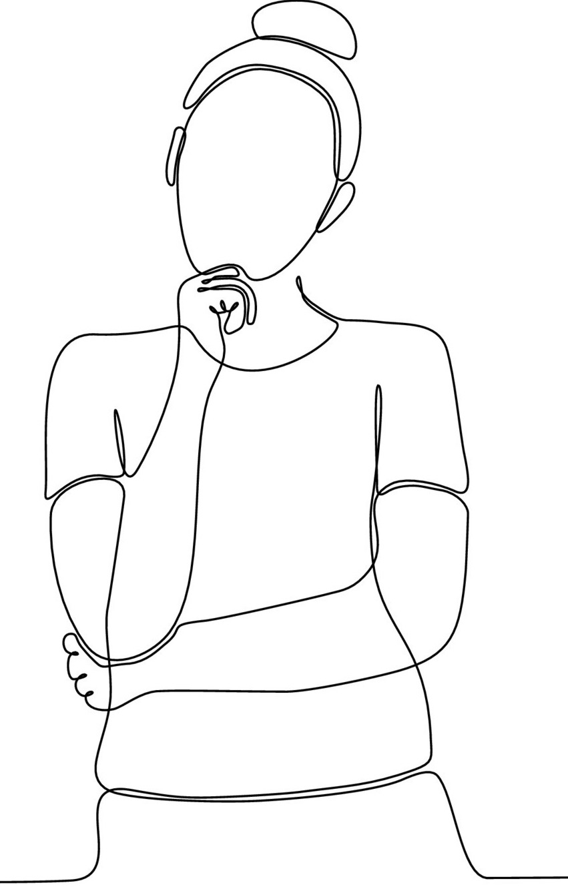

```{r setup, include=FALSE}
options(htmltools.dir.version = FALSE)

library(tidyverse)
library(kableExtra)
library(ggplot2)
library(plotly)
library(htmlwidgets)
library(MASS)
library(ggpubr)
library(xaringanthemer)
library(xaringanExtra)

style_duo_accent(
  primary_color = "#621C37",
  secondary_color = "#EE0071",
  background_image = "blank.png"
)

xaringanExtra::use_xaringan_extra(c("tile_view"))

use_scribble(
  pen_color = "#EE0071",
  pen_size = 4
  )

knitr::opts_chunk$set(
  fig.retina = TRUE,
  warning = FALSE,
  message = FALSE
)
```

name: Title slide
class: middle, left
<br><br><br><br><br><br><br>
# Statistik I
***
### Einheit 1: Grundlagen der Datenanalyse
##### `r format(as.Date(data.frame(readxl::read_excel("Modul Quantitative Methoden I_Termine.xlsx"))$Datum), "%d.%m.%Y")[1]` | Prof. Dr. Stephan Goerigk

---
class: top, left
name: Contact Slide

### Kontakt

.pull-left[
Prof. Dr. phil. Stephan Goerigk 

Psychologische Methodenlehre

Infanteriestraße 11a · 80797 München · 

[stephan.goerigk@charlotte-fresenius-uni.de](mailto:stephan.goerigk@charlotte-fresenius-uni.de)

***

Zoom Sprechstunde (bitte per Email anmelden): 

Meeting-ID: 284 567 8838

Kenncode: 807174

***

[Publikationen](https://scholar.google.at/citations?user=nlvO-e4AAAAJ&hl=de)

[Commitment to Research Transparency](http://www.researchtransparency.org)
]

.pull-right[
.center[
<br><br><br>
.bottom[]
]
]

---
class: top, left
### Übersicht Lehrveranstaltung 

Termine:
* 13 Termine
* Donnerstag 14:45 - 16:15

Begleitendes Seminar:

* Dozentin: M.Sc. Birgit Probst ([birgit.probst@charlotte-fresenius-uni.de](mailto:birgit.probst@charlotte-fresenius-uni.de))

Materialien:
* werden auf [**studynet**](https://studynet.hs-fresenius.de/ilias.php?baseClass=ilrepositorygui&ref_id=31946) bereitgestellt

Prüfungsleistung:
* Klausur 90 min
* 1/3 geschlossene Fragen (z.B. MC) & 2/3 offene Fragen und Rechnungen
* Taschenrechner benötigt!
* Ausgedruckte Formelsammlung wird gestellt
* Handgeschriebene Formelsammlung

---
class: top, left
### Termine

```{r echo = F}
df = readxl::read_xlsx("Modul Quantitative Methoden I_Termine.xlsx", sheet = "Tabellenblatt1")[1:13, 1:3]
df$Datum = format(as.Date(df$Datum), "%d.%m.%Y")
df %>%
  kbl() %>%
  kable_classic(full_width = T, 
                font_size = 16,
                position = "left")
```

---
class: top, left
### Material (bitte mitbringen)

Es werden händische Berechnungen durchgeführt.

* Taschenrechner

* Lineal

* Bleistift

* kariertes Papier/Tablet

***

Vertieftest Üben:

* Folien ersetzen nicht den Vorlesungsbesuch

* learnr Übungsaufgaben (studynet)

* Statistik Trainer (studynet)

---
class: top, left
### Prüfung: Hinweise zu Rechenaufgaben

<small>

* Endergebnis (auf 2 Nachkommastellen gerundet) zählt für die Benotung
  - Angabe von Nachkommastellen ist bei ganzen Zahlen nicht notwendig, z.B. $12$ statt $12,00$ ist ok
  - Aufschreiben des Rechenwegs ist aber empfohlen um ggf. Teilpunkte erhalten zu können
  
* 2 Möglichkeiten zum Umgang mit Nachkommastellen bei Zwischenergebnissen: 
  - a) exakte Zahlen verwenden (d.h. Zwischenergebnis ungerundet im Taschenrechner speichern und zum Weiterrechnen benutzen, oder (Zwischen-)Ergebnis auf Basis von Rohwerten ausrechnen lassen *falls entsprechend richtige Formel im Taschenrechner hinterlegt*)
  - b) Zwischenergebnis auf 2 Nachkommastellen runden ( $\geq$ x.xx45 wird aufgerundet, < x.xx45 wird abgerundet)

  $\rightarrow$ Innerhalb einer Aufgabe konsistent für eine der beiden Möglichkeiten entscheiden! 

  $\rightarrow$ Bei Angabe des Rechenwegs: Notieren wenn man mit exakten Zahlen gerechnet hat, aber für den Rechenweg gerundete Zahlen angegeben hat

**Als Beispiel folgende Rechenaufgabe: ** $7 \div 3 \cdot 1000$
* Ergebnis mit exakten Zahlen: $2333,33$
* Ergebnis mit gerundetem Zwischenschritt: $2330$ bzw. $2330,00$ (Schritt 1: $7 \div 3 = 2,33$; Schritt 2: $2,33 \cdot 1000$)

$\rightarrow$ Beide Ergebnisse sind für die Prüfung richtig!

---
class: top, left
### Warum Quantitative Methoden und Statistik?

#### Eine Forschungsgeschichte:

.center[

Das ist **Dr. Charlotte**. 

Sie ist ambitionierte Forscherin und möchte etwas bahnbrechendes entdecken.

Nur was?

```{r eval = TRUE, echo = F, out.width = "200px"}

```
]

---
class: top, left
### Warum Quantitative Methoden und Statistik?

#### Eine Forschungsgeschichte:

.center[

**Charlotte** macht sich an die **Recherche**. 

Sie sucht nach einer Fragestellung, die noch nicht gelöst wurde und ihr machbar erscheint.

Sie liest eine Menge Bücher und die neuesten Paper..

```{r eval = TRUE, echo = F, out.width = "300px"}

```
]

---
class: top, left
### Warum Quantitative Methoden und Statistik?

#### Eine Forschungsgeschichte:

.center[

**Charlotte** findet heraus, dass Menschen sich im Durchschnitt 5 - 7 Dinge merken können. 

Das ist die so genannte **Gedächtniskapazität**.

Das erscheint ihr etwas wenig...

Sie entschließt sich, ein **Mittel zur Erhöhung der Gedächtniskapazität** zu entwickeln.

```{r eval = TRUE, echo = F, out.width = "300px"}

```
]

---
class: top, left
### Warum Quantitative Methoden und Statistik?

#### Eine Forschungsgeschichte:

.center[

Nach einer Menge Arbeit...

```{r eval = TRUE, echo = F, out.width = "250px"}

```

Ist **Charlotte** mit dem Resultat zufrieden.

```{r eval = TRUE, echo = F, out.width = "140px"}
knitr::include_graphics("bilder/success.png")
```
]

---
class: top, left
### Warum Quantitative Methoden und Statistik?

#### Eine Forschungsgeschichte:

.center[

Nun muss sie das Mittel testen. Ihre Versuchsperson ist ihre Freundin **Anna**.
]

.pull-left[
.center[
Annas Gedächtnisleistung im Spiel Memory: **5 Paare**

```{r eval = TRUE, echo = F, out.width = "150px"}

```

**Nach dem Trinken** spielt Anna noch einmal.

```{r eval = TRUE, echo = F, out.width = "150px"}

```
]
]

.pull-right[

Dann gibt **Charlotte** Anna das Mittel zum Trinken.

```{r eval = TRUE, echo = F, out.width = "150"}

```

Das Ergebnis: Anna merkt sich **8 Paare**.
]

---
class: top, left
### Warum Quantitative Methoden und Statistik?

#### Eine Forschungsgeschichte:

.center[

Charlotte ist begeistert! Ihr Mittel erhöht die Leistung um **3 Punkte**.
]

.pull-left[
Mit dem Ergebnis geht sie zum Chef ihres Labors.

.center[
```{r eval = TRUE, echo = F, out.width = "300px"}

```
]
]
.pull-right[
.center[
"Das Mittel wirkt vielleicht nur bei Anna. Zufall?"
```{r eval = TRUE, echo = F, out.width = "320px"}

```
]
]

---
class: top, left
### Warum Quantitative Methoden und Statistik?

#### Eine Forschungsgeschichte:

.center[

Charlotte sieht ein, dass ihre Entdeckung nur Bestand hat, wenn es bei mehr Leuten als Anna funktioniert.
]

.pull-left[
Aber sie kann unmöglich prüfen, ob das Mittel bei jedem funktioniert

Dazu gibt es zu viele Menschen...

.center[
```{r eval = TRUE, echo = F, out.width = "200px"}

```
]
]
.pull-right[
.center[
Wenn Charlotte nicht alle Menschen testen kann..

..dann zumindest eine kleinere Gruppe.

```{r eval = TRUE, echo = F, out.width = "320px"}
knitr::include_graphics("bilder/Population.png")
```
]
]

---
class: top, left
### Warum Quantitative Methoden und Statistik?

#### Eine Forschungsgeschichte:

.center[

Charlotte macht sich an die Arbeit... 
]

.pull-left[

Sie wiederholt ihr Experiment bei 100 Leuten.

.center[
```{r eval = TRUE, echo = F, out.width = "300px"}

```
]
]
.pull-right[
.center[
Und trägt alle Daten in eine Tabelle ein.

```{r eval = TRUE, echo = F, out.width = "320px"}

```
]
]

---
class: top, left
### Warum Quantitative Methoden und Statistik?

#### Eine Forschungsgeschichte:

.center[

Nach langer Arbeit hat Charlotte ihre Stichprobe fertig erhoben.
]

.pull-left[
Mit den 100 Zahlen geht sie zu ihrem Chef.

.center[
```{r eval = TRUE, echo = F, out.width = "300px"}

```
]
]
.pull-right[
.center[
Die vielen Zahlen verwirren den Chef. 

```{r eval = TRUE, echo = F, out.width = "280px"}

```

Bei einigen wird das Gedächtnis besser, bei anderen nicht..
Wirkt das Mittel nun, oder nicht?
]
]

---
class: top, left
### Warum Quantitative Methoden und Statistik?

#### Eine Forschungsgeschichte:

.center[

Charlotte macht sich an die Arbeit... 
]

.pull-left[

Sie muss die Daten irgendwie zusammenfassen.

.center[
```{r eval = TRUE, echo = F, out.width = "200px"}

```
]
]
.pull-right[
.center[
Aus den 100 Werten berechnet sie den Durchschnitt.

```{r eval = TRUE, echo = F, out.width = "200px"}

```

Im Schnitt wird ihre Stichprobe um 2.5 Worte besser.
]
]

---
class: top, left
### Warum Quantitative Methoden und Statistik?

#### Eine Forschungsgeschichte:

.center[

Mit dem Ergebnis geht Charlotte zu ihrem Chef.
]

.pull-left[
"Chef, die Leute werden 2.5 Worte besser."

.center[
```{r eval = TRUE, echo = F, out.width = "300px"}

```
]
]
.pull-right[
.center[
Der Chef ist sich unsicher, wie verlässlich die Schätzung aus der Stichprobe ist. 

```{r eval = TRUE, echo = F, out.width = "250px"}

```

Wäre es nicht besser, sie hätten mehr Leute gefragt?
]
]

---
class: top, left
### Warum Quantitative Methoden und Statistik?

#### Eine Forschungsgeschichte:

.center[

Jetzt wird es kompliziert... 
]

.pull-left[

Wann ist ein Stichprobenwert eine verlässliche Schätzung für alle Menschen?

.center[
```{r eval = TRUE, echo = F, out.width = "200px"}

```
]
]
.pull-right[
.center[
Charlotte trifft einige Entscheidungen

1. Sie will zumindest 95% sicher sein

2. Je mehr Leute sie testet, desto sicherer ist sie (Stichprobengröße)

3. Je näher die Ergebnisse der Testpersonen an 2.5 dran sind, desto sicherer ist sie (Streuung)

In einer Formel kann sie ein Konfidenzintervall berechnen, in das diese Infos eingehen:

$$\bar{x} \pm z  \cdot \frac{\sigma}{\sqrt{n}} = 1.5; 3$$

]
]

---
class: top, left
### Warum Quantitative Methoden und Statistik?

#### Eine Forschungsgeschichte:

.center[

Mit dem Ergebnis geht Charlotte zu ihrem Chef.
]

.pull-left[
"Chef, die Leute werden 2.5 Worte besser und dieser Wert liegt mit 95% Sicherheit zwischen 1.5 und 3."

.center[
```{r eval = TRUE, echo = F, out.width = "300px"}

```
]
]
.pull-right[
.center[
Der Chef ist zufrieden. Er kann sich zu 95% sicher sein, dass die Verbessung nicht 0 oder schlechter ist. 

```{r eval = TRUE, echo = F, out.width = "180px"}

```
]
]

---
class: top, left
### Quantitative Methoden im Forschungsprozess

.center[
```{r eval = TRUE, echo = F, out.width = "560px"}
knitr::include_graphics("bilder/Forschungsprozess.png")
```
]

---
class: top, left
### Prozess statistische Studienauswertung

.center[
```{r eval = TRUE, echo = F, out.width = "580px"}

```
]

---
class: top, left
### Begriffsklärung

* **Daten:** Beobachtungen der gesamten zu interessierenden Eigenschaften

* **Datensatz:** Zusammenstellung der bebobachteten Daten (häufig im Matrixformat)

* **Datenbank:** bereits existierende archivierte Datenansammlungen (z.B. UK Biobank)

* **Statistik:** Verfahren zur Datenzusammenfassung & -analyse

Ausschnitt Datensatz:
.center[
```{r eval = TRUE, echo = F, out.width = "1200px"}

```
]

---
class: top, left
### Anwendung von Statistik

* In dieser Übung werden wir auch Statistik **per Hand** rechnen

* Notwendigkeit zum mathematischen Verständnis der Verfahren

* In der Praxis wird beinahe nur noch digital gearbeitet (**Statistiksoftware**)

  * schneller
  * fehlerfreier
  * manche Verfahren zu komplex
  * Datensätze zu groß (Big Data)
  * bestimmte Verfahren basieren auf **Iteration** (z.B. Monte-Carlo Simulation teils 10.000x wiederholt)
  
  $\rightarrow$ würde per Hand Jahre dauern

* Bekannte Statistiksoftware:
  * R (wird an der CFH genutzt)
  * SPSS
  * JASP
  * Python


---
class: top, left
### Variablen

**Ziel empirischer Forschung:**

Registrierte Merkmalsunterschiede (= **Variabilität**) zu analysieren und zu erklären.

* **Variable** = Interessierendes Merkmal, das unterschiedliche Ausprägungen annehmen kann

* Beispiele für Variablen: 
  * Geschlecht
  * Lieblingsfarbe
  * Länge

* **Merkmalsausprägung** = konkrete Erscheinungsform einer Variable

* Beispiele für Merkmalsausprägungen: 
  * Geschlecht [männlich, weiblich, divers]
  * Lieblingsfarbe [rot, gelb, grün, blau]
  * Länge [1 cm, 1.5 cm, 3 cm,...]

---
class: top, left
### Variablen

#### Arten von Variablen

Variablen können anhand unterschiedlicher Eingeschaften unterteilt werden:

* nach Art der Merkmalsausprägungen

* nach empirischer Zugänglichkeit

* nach Stellenwert in der Untersuchung

---
class: top, left
### Variablen

Arten von Variablen – nach Art der Merkmalsausprägungen

* **stetig** (kontinuierlich): jedes Intervall besitzt unendlich viele Merkmalsausprägungen (z.B. Länge, Zeit, Masse)
  
* **diskret** (diskontinuierlich): Intervall mit endlich vielen Ausprägungen z.B. Geschlecht, Lieblingsfarbe

  * **dichotom** (binär) = 2 Abstufungen (0, 1) 
  * **polytom** = mehrfach gestuft
  * **konstant** = nur 1 Merkmalsausprägung
  
$\rightarrow$ Art der Variable bestimmt das statistische Verfahren (z.B. stetig $\rightarrow$ Regression, binär $\rightarrow$ logistische Regression)

.center[
```{r echo = F, fig.height=3,  fig.width=9, out.width = "700px"}
set.seed(123)
d = data.frame(x = rnorm(1:100000))
e = data.frame(x = rep(c(-1, 1), each = 12000)) 
f = data.frame(x = rep(c(0), each = 12000)) 

cowplot::plot_grid(
  ggplot(d, aes(x)) +
    geom_density() +
    labs(y = "", x = "stetig") +
    scale_x_continuous(limits = c(-3, 3), breaks = c(-3,-2,-1, 0, 1, 2 ,3)) +
    theme_classic() +
  theme(axis.text = element_blank(), axis.ticks = element_blank()),
  ggplot(d, aes(x)) +
    geom_histogram(fill = "black") +
    labs(y = "", x = "diskret (polytom)") +
    scale_x_continuous(limits = c(-3, 3), breaks = c(-3,-2,-1, 0, 1, 2 ,3)) +
    theme_classic() +
  theme(axis.text = element_blank(), axis.ticks = element_blank()),
   ggplot(e, aes(x)) +
    geom_histogram(fill = "black") +
    labs(y = "", x = "binär") +
    scale_x_continuous(limits = c(-3, 3), breaks = c(-3,-2,-1, 0, 1, 2 ,3)) +
    theme_classic() +
  theme(axis.text = element_blank(), axis.ticks = element_blank()),
  ggplot(f, aes(x)) +
    geom_histogram(fill = "black") +
    labs(y = "", x = "konstant") +
    scale_x_continuous(limits = c(-3, 3), breaks = c(-3,-2,-1, 0, 1, 2 ,3)) +
    theme_classic() +
  theme(axis.text = element_blank(), axis.ticks = element_blank()), ncol = 4)
```
]
---
class: top, left
### Variablen

Arten von Variablen – nach empirischer Zugänglichkeit

* **manifest** = direkt beobachtbar (Bsp. Raucher sein, Alter)

* **latent** = nicht unmittelbar beobachtbar; hypothetisches Konstrukt (Bsp. Intelligenz)

---
class: top, left
### Variablen

Arten von Variablen – nach Stellenwert in der Untersuchung

Variablen haben im empirischen Forschungskontext unterschiedliche funktionale Bedeutungen:

* abhängige Variable

* unabhängige Variable

* Störvariable

* Kontrollvariable

---
class: top, left
### Variablen

#### Abhängige & unabhängige Variable (AV & UV)

Die Veränderung einer AV soll durch den Einfluss der UV erklärt werden.

**Beispiel:**

.center[

Dosis des Schlafmittel (**UV**) $\rightarrow$ Schlafdauer (**AV**) 

$\downarrow$

**UV** gehört zum „Wenn-Teil“ bzw. dem „Je-Teil“ einer Hypothese

**AV** gehört zum „Dann-Teil“ bzw. „Desto-Teil“

$\downarrow$

Wenn man mehr Schlafmittel nimmt, schläft man länger.
]

.center[
```{r eval = TRUE, echo = F, out.width = "500px"}
knitr::include_graphics("bilder/UVAV.png")
```
]

---
class: top, left
### Variablen

#### Störvariable

* alle Einflussgrößen auf die AV, die in einer Untersuchung nicht erfasst werden 

* egal ob nicht bekannt oder vergessen

.center[
```{r eval = TRUE, echo = F, out.width = "500px"}
knitr::include_graphics("bilder/Stoervariable.png")
```
]
---
class: top, left
### Variablen

#### Kontrollvariable

* Störvariable deren Ausprägungen erhoben (gemessen) wurde 

* Einfluss kann kontrolliert werden (z.B. mittels statistischer Methoden)

.center[
```{r eval = TRUE, echo = F, out.width = "500px"}
knitr::include_graphics("bilder/Kontrollvariable.png")
```
]

---
class: top, left
### Begriffsklärungen

.pull-left[
**Population:**

* Menge aller potenziellen Untersuchungsobjekte (z.B. Personen), über die etwas ausgesagt werden soll 

* **Grundgesamtheit**

* Ist im Allgemeinen zu groß

* Vollerhebung praktisch nicht möglich 

* z.B. Grundgesamtheit aller Studierenden (auf der Welt)
]
.pull-right[
**Stichprobe:**

*  Auswahl aus einer Population, die untersucht wird

*  Wird nach verschiedenen Prinzipien **gezogen** (idealerweise **Zufall**)

* die Auswahl hat massive Konsequenzen auf die Ergebnisse (Bsp. **Verzerrungseffekte**) 

* **Repräsentativität:** Stichprobe ist der Population in entscheidenden Charakteristika möglichst ähnlich

* je repräsentativer, desto gesicherter die **Verallgemeinerung** auf die Population
]

---
class: top, left
### Deskriptive Statistik

#### Was macht Deskriptive Statistik?

* Bereitet Informationen über erfasste Merkmale auf

* Einzelwerte werden zu statistischen Kennwerten **zusammengefasst**

* Ziel: Beschreibung der Daten mittels Kennwerten, Graphiken, Tabellen, Diagrammen

* Bezieht sich auf die  konkret untersuchte Stichprobe

**Beispiel:**

Daten: 
```{r echo=FALSE}
d = c(1, 23, 5, 6, 7, 8, 4, 43, 4, 5, 6, 5, 43, 34, 20, 6, 5, 34, 5, 6, 7, 7, 5, 4, 5, 3, 4, 5, 54, 43, 5, 54, 3, 4, 5, 5)
df = as.data.frame(d)
df = as.data.frame(t(df))
rownames(df) = NULL
kable(df[,], col.names = NULL)
```


.center[
$\downarrow$

Mittelwert (aka. Durchschnitt) = `r round(mean(c(1, 23, 5, 6, 7, 8, 4, 43, 4, 5, 6, 5, 43, 34, 20, 6, 5, 34, 5, 6, 7, 7, 5, 4, 5, 3, 4, 5, 54, 43, 5, 54, 3, 4, 5, 5)), 2)`
]

---
class: top, left
### Deskriptive Statistik

#### Beispiele

*  Betrachtung der Verteilung von Häufigkeiten

*  Maße der zentralen Tendenz 

  * können Informationen über die durchschnittliche Ausprägung in einer Stichprobe liefern
  
  * Modalwert (diejenige Merkmalausprägung, die die meisten Elemente enthält)
  
  * Median (Wert bis zu dem 50% aller Werte liegen)
  
  * Arithmetisches Mittel (Mittelwert)
  
* Streuungsmaße 

  * Varianz

  * Standardabweichung
  
  * Quartilabstand
 
---
class: top, left
### Inferenzstatistik

#### Was macht Inferenzstatistik?

* Synonym: schließende oder induktive Statistik

* "Schließen" von Stichprobe auf die Population

* Ziel: In der Stichprobe berechnete Statistik (z.B. Deskriptivstatistik) soll auf Population **verallgemeinert** werden

* Achtung: Habe ich die Möglichkeit, jedes Individuum meiner Population zu messen brauche ich keine Inferenzstatistik

* Methode: **Statistische Hypothesenprüfung** (Grundidee der **Signifikanztestung**)


---
class: top, left
### Voraussetzung für Quantitative Methoden: wissenschaftliche Hypothesen

#### Was sind Hypothesen?

Hypothese (griech.) = Unterstellung, Vermutung

Eine Vermutung/Annahme ist dann als wissenschaftliche Hypothese zu verstehen wenn sie folgende 4 Kriterien erfüllt:

Wenn sie...
1. ...sich auf reale Sachverhalte bezieht, die empirisch untersuchbar sind. (**Empirie**)

2. ...allgemein gültig ist und über den Einzelfall bzw. ein singuläres Ereignis hinausgeht. (**All-Satz**)

3. ...zumindest implizit die Form eines Konditionalsatzes hat. (**wenn-dann, je-desto**)

4. ...durch Erfahrungen potenziell widerlegbar ist. (**Falsifizierbarkeit**)

5. ...(theoretisch begründbar ist)

---
class: top, left
### Alltagsvermutungen und wissenschaftliche Hypothesen

.pull-left[
#### Beispiele für Hypothesen:

* Frauen sind kreativer als Männer

* Mit zunehmender Müdigkeit sinkt die Konzentrationsfähigkeit

* Je schöner das Wetter, desto besser die Stimmung

* Jungen und Mädchen lesen unterschiedlich viel in ihrer Freizeit

Behauptungen erfüllen alle genannten Kriterien: sind daher Hypothesen
]

.pull-right[
```{r eval = TRUE, echo = F, out.width = "300px"}
knitr::include_graphics("bilder/obelix.png")
```
]

---
class: top, left
### Alltagsvermutungen und wissenschaftliche Hypothesen

#### Hypothesen: JA oder NEIN?

* Bei starkem Zigarettenkonsum kann es zu Herzinfarkt kommen

* Wenn es regnet, kann die Sonne scheinen.

* Es gibt Kinder, die niemals weinen.

* SchülerInnen aus Gymnasien zeigen gute Leistungen

---
class: top, left
### Alltagsvermutungen und wissenschaftliche Hypothesen

#### Hypothesen: JA oder NEIN?

* Bei starkem Zigarettenkonsum kann es zu Herzinfarkt kommen

$\rightarrow$ Kann-Sätze sind nicht falsifizierbar

* Wenn es regnet, kann die Sonne scheinen.

$\rightarrow$ Kann-Sätze sind nicht falsifizierbar

* Es gibt Kinder, die niemals weinen.

$\rightarrow$ kein All-Satz, nicht falsifizierbar

* Schüler:innen aus Gymnasien zeigen gute Leistungen

$\rightarrow$ Wenn-dann Struktur nicht gegeben, daher nicht
falsifizierbar

---
class: top, left
### Alltagsvermutungen und wissenschaftliche Hypothesen

#### Hypothesen: JA oder NEIN?

* Die Konzentrationsfähigkeit hängt mit der Blutalkoholkonzentration zusammen.

* Positive Verstärkung durch Lehrer:innen kann zu guten Leistungen bei Schüler:innen führen.

* Positives Feedback beeinflusst die Arbeitsleistung.

* Viele Studierende mögen Methodenlehrveranstaltungen.

---
class: top, left
### Alltagsvermutungen und wissenschaftliche Hypothesen

#### Hypothesen: JA oder NEIN?

* Die Konzentrationsfähigkeit hängt mit der Blutalkoholkonzentration zusammen.

$\rightarrow$ JA

* Positive Verstärkung durch Lehrer:innen kann zu guten Leistungen bei Schüler:innen führen.

$\rightarrow$ NEIN

* Positives Feedback beeinflusst die Arbeitsleistung.

$\rightarrow$ JA

* Viele Studierende mögen Methodenlehrveranstaltungen.

$\rightarrow$ NEIN

---
class: top, left
### Alltagsvermutungen und wissenschaftliche Hypothesen

#### Richtung von Hypothesen

Je nach Erkenntnisstand kann eine ungerichtete oder eine gerichtete Hypothese formuliert werden.

**Ungerichtete Hypothese:**

Die Konzentrationsfähigkeit hängt mit der Blutalkoholkonzentration zusammen.

$\rightarrow$ Eher wenig theoretisches Vorwissen.

**Gerichtete Hypothese:**

Je höher die Blutalkoholkonzentration, desto niedriger die Konzentrationsfähigkeit.

$\rightarrow$ Mehr theoretisches Vorwissen notwendig.

---
class: top, left
###  Statistische Hypothesen

#### Ableitung von statistisch-prüfbaren Hypothesen aus wiss. Hypothese

* Die Hypothese muss in numerische Ausdrücke umgewandelt werden.

* Man spricht von einem **Hypothesenpaar:**

  * **Nullhypothese $(H_0)$:** Der hypothetisierte Effekt besteht nicht.

  * **Alternativhypothese $(H_1)$:** Der hypothetisierte Effekt besteht

* In der Forschung hofft man oft, dass die $H_1$ zufrifft (Hier steckt der angenommene Effekt drin)

* Man versucht, **"Die $H_0$ zu verwerfen"** (Hypothesentest kommt später)

---
class: top, left
###  Statistische Hypothesen

#### Ableitung von statistisch-prüfbaren Hypothesen aus wiss. Hypothese

Beispiel: **(Ungerichtete) Forschungshypothese:**

"Männer und Frauen sind im Schnitt unterschiedlich groß."

* ** $H_0$ ** Es besteht **kein Unterschied** zwischen der durchschnittlichen Größe der Männer (Mittelwert) und der durchschnittlichen Größe der Frauen.

* ** $H_1$ ** Es besteht **ein Unterschied** zwischen der durchschnittlichen Größe der Männer (Mittelwert) und der durchschnittlichen Größe der Frauen.

**Ableitung statistische Hypothese:**

* ** $H_0$ ** Mittelwert Männer - Mittelwert Frauen $=$ 0

$\rightarrow$ **In Zahlen:** Wenn kein Unterschied besteht ist Differenz  = 0  (z.B. 10 - 10 = 0)

* ** $H_1$ ** Mittelwert Männer - Mittelwert Frauen $\neq$ 0

$\rightarrow$ **In Zahlen:** Wenn ein Unterschied besteht ist Differenz $\neq$  0 (z.B. 15 - 10 = 5)

---
class: top, left
### Inferenzstatistik

#### Beispiele:

* Binomialtest: Auftretenshäufigkeit $\rightarrow$ 1. Semester

* $\chi^2$-Test: Unterschiede in Verteilungen $\rightarrow$ 1. Semester

* unabhängiger t-Test: Unterschiede in Gruppenmittelwerten $\rightarrow$ 1. Semester

* abhängiger t-Test: Unterschiede in Mittelwerten zwischen Zeitpunkten $\rightarrow$ 1. Semester

* Korrelation: Zusammenhänge $\rightarrow$ 1. Semester

* F-Test (ANOVA): Unterschiede in Varianzen $\rightarrow$ 2. Semester

* Regression: Vorhersagen $\rightarrow$ 2. Semester

---
class: top, left
### Statistische Notation

* **N** Anzahl der Personen in der Stichprobe (Stichprobenumfang).

* Notation von Stichprobenvariablen: hiert nutzt man oft Großbuchstaben, z.B. $X$

* Hat man 2 Variablen nutzt man für die UV oft $X$ und für die AV $Y$

*  Merkmalsausprägungen der einzelnen Personen in der Stichprobe bei Variable X (beobachtete Werte)

  $x_1,...x_2,...,x_n$  
  
* $i$ steht für **Index**: Platzhalter für beliebige Zahl $x_1,...x_i,...,x_n$ 
  
* $k$ wird oft für die Anzahl von Variablen oder Gruppen genutzt

---
class: top, left
### Notation von Daten

#### Nur 1 Merkmal erhoben 

* Notation der Befragungsergebnisse in einer Beobachtungsreihe (**Urliste**)
* Eine Zahlenreihe nennt man auch **Vektor** (eindimensional)

Beispiel:

* Erhobene Variable $X$: Alter in Jahren
* Stichprobenumfang $N=10$

```{r echo = F}
set.seed(123)
N = 10
df = data.frame(x = paste0("x", rep(1:N)),
              Alter = sample(20:80, 10, replace = T)
)
df = as.data.frame(t(df))
rownames(df) = NULL
kable(df[,], col.names = NULL)
```

$\rightarrow$ $x3$ = 70 bedeutet, dass die Urliste an dritter Stelle eingetragene Person 70 Jahre alt ist.

---
class: top, left
### Notation von Daten

#### Nur 1 Merkmal erhoben 

* Notation der Befragungsergebnisse in einer Beobachtungsreihe (**Urliste**)
* Eine Zahlenreihe nennt man auch **Vektor** (eindimensional)

Beispiel:

* Erhobene Variable $X$: Geschlecht
* Kategorien werden in der Statistik **codiert**: $1=weiblich$, $2=männlich$
* Stichprobenumfang $N=10$

```{r echo = F}
set.seed(123)
N = 10
df = data.frame(x = paste0("x", rep(1:N)),
              geschlecht = sample(1:2, 10, replace = T)
)
df = as.data.frame(t(df))
rownames(df) = NULL
kable(df[,], col.names = NULL)
```

$\rightarrow$ $x3$ = 1 bedeutet, dass die Urliste an dritter Stelle eingetragene Person weiblich ist.

---
class: top, left
### Notation von Daten

#### Nur 1 Merkmal erhoben 

* Notation der Befragungsergebnisse in einer Beobachtungsreihe (**Urliste**)
* Eine Zahlenreihe nennt man auch **Vektor** (eindimensional)

Beispiel:

* Erhobene Variable $X$: Name
* Wörter, die keine Kategorien sind müssen nicht **codiert** werden
* Stichprobenumfang $N=5$

```{r echo = F}
set.seed(123)
N = 5
df = data.frame(x = paste0("x", rep(1:N)),
              geschlecht = c("Max", "Anna", "Leo", "Nina", "John")
)
df = as.data.frame(t(df))
rownames(df) = NULL
kable(df[,], col.names = NULL)
```

$\rightarrow$ $x3$ = Leo bedeutet, dass der Name der in der Urliste an dritter Stelle eingetragenen Person "Leo" ist.

---
class: top, left
### Notation von Daten

#### Mehrere Merkmale erhoben

* Notation der Befragungsergebnisse in einer **Datenmatrix**

* **Matrix:** Reihen und Spalten (zweidimensional)

* **Variablen in Spalten** dargestellt (engl. Columns)

* **Personen in Reihen** dargestellt (engl. Rows)

* Die Matrix besteht aus $n$ Zeilen und $p$ Spalten (aka $n × p$−Matrix)

* Einzelwerte (z.B. 1. Spalte, 1. Reihe) stehen in **Zellen**

---
class: top, left
### Notation von Daten

#### Mehrere Merkmale erhoben


.pull-left[
Beispiel Datenmatrix (3 Variablen):

* Alter
* Geschlecht $[1=weiblich, 2=männlich]$
* Anzahl Kinder
* Stichprobenumfang $N=10$
]

.pull-right[
```{r echo = F}
set.seed(123)
N = 10
df = data.frame(ID = paste0(rep(1:N)),
              Geschlecht = sample(1:2, 10, replace = T),
              Alter = sample(20:80, 10, replace = T),
              Kinder = sample(0:3, 10, replace = T)
)
rownames(df) = NULL
kable(df[,])
```
]

---
class: top, left
### Notation von Daten

#### Aufgabe 1

Erstellen Sie eine **Datenmatrix** mit den folgenden Variablen

* Vorname

* Haarfarbe $[1=schwarz, 2=braun, 3=blond, 4=rot]$

* Lieblingspsycholog:in (Nachname)

* Minitest: Wie viele Psycholog:innen kann die Person in 10 Sekunden nennen

Stichprobe: Personen in Ihrer Sitzreihe $N=...$

---
class: top, left
### Summenzeichen

* In der Statistik benötigt man sehr oft die Summe von Messwerten

* z.B. Gesamtwert der Stichprobe (oder Teilstichprobe auf einer Variable)

Beispiel:

Summe aller Messwerte $xi$ für $i = 1$ bis $n$.

$$x1 +x2 +x3 +...+xn$$

Hat eine Summe sehr viele Summanden, ist es zweckmäßig, das Summenzeichen (griech. Sigma) zu verwenden.

$$\sum\limits _{i=1}^{n}x_{i}$$
* $i$ = Startwert
* $n$ = Endwert

---
class: top, left
### Summenzeichen

<small>

**Beispiel 1**:

Summe der Variable "Anzahl Kinder" aller Personen aus unserer Datenmatrix:

$\sum\limits _{i=1}^{n}x_{i}$ = `r paste(df$Kinder, collapse = " + ")` = `r sum(df$Kinder)`

**Beispiel 2**:

Summe der Variable "Anzahl Kinder" für die ersten 5 Personen aus unserer Datenmatrix:

$\sum\limits _{i=1}^{5}x_{i}$ = `r paste(df$Kinder[1:5], collapse = " + ")` = `r sum(df$Kinder[1:5])`

**Beispiel 3**:

Summe der Variable "Anzahl Kinder" für die letzten 5 Personen aus unserer Datenmatrix:

$\sum\limits _{i=6}^{10}x_{i}$ = `r paste(df$Kinder[6:10], collapse = " + ")` = `r sum(df$Kinder[6:10])`

---
class: top, left
### Summenzeichen

Es gelten die allgemeinen Rechenregeln für Additionen

**Beispiel 1**:

$\sum\limits _{i=1}^{n}a-x_{i} = (a-x1+a-x2+...+a-xn)$

***

**Beispiel 2**:

$\sum\limits _{i=1}^{n}ax_{i} = (ax1+ax2+...+axn) = a(x1+x2+...+xn) = a\sum\limits _{i=1}^{n}x_{i}$

---
class: top, left
### Summenzeichen

#### Aufgabe 2:

Berechnen Sie mit korrekter Notation (Summenzeichen) die Gesamtzahl der genannten Psychologen (Mehrfachnennungen erlaubt) in Ihrer selbst erstellten Datenmatrix.

***

#### Aufgabe 3:

$X$ = [1, 2, 3, 4, 5, 6, 7, 8, 9, 10]

Berechnen Sie folgenden Ausdruck:

$\sum\limits _{i=1}^{n}11-x_{i}$

```{r eval=FALSE, include=FALSE}
x = 1:10

sum(11-x)

55
```


---
class: top, left
### Häufigkeitstabelle

* Ziel: Daten effizient zusammenfassen

* **Häufigkeit:** Anzahl der Ausprägungen eines Merkmals

* z.B. zur Beschreibung der Stichprobe in klinischer Studie

* Man unterscheidet **absolute** $(n)$ vs. **relative** $(\%)$ Häufigkeit

Beispiel: Urliste Lieblingstier $N=10$

```{r echo = F}
set.seed(123)
N = 10
df = data.frame(x = paste0("x", rep(1:N)),
              Tier = c("Hund", "Katze", "Hund", "Elefant", "Hund", "Adler", "Katze", "Delphin", "Maulwurf", "Goldfisch")
)
df = as.data.frame(t(df))
rownames(df) = NULL
kable(df[,], col.names = NULL)
```

Häufigkeitstabelle (absolute Häufigkeiten):

```{r echo = F}
set.seed(123)
N = 10
df = data.frame(x = paste0("x", rep(1:N)),
              Tier = c("Hund", "Katze", "Hund", "Elefant", "Hund", "Adler", "Katze", "Delphin", "Maulwurf", "Goldfisch")
)
t = as.data.frame(t(as.data.frame(table(df$Tier))))
rownames(t) = NULL
kable(t, col.names = NULL)
```

---
class: top, left
### Häufigkeitstabelle

Beispiel: Urliste Lieblingstier $N=10$

```{r echo = F}
set.seed(123)
N = 10
df = data.frame(x = paste0("x", rep(1:N)),
              Tier = c("Hund", "Katze", "Hund", "Elefant", "Hund", "Adler", "Katze", "Delphin", "Maulwurf", "Goldfisch")
)
df = as.data.frame(t(df))
rownames(df) = NULL
kable(df[,], col.names = NULL)
```

Häufigkeitstabelle (absolute Häufigkeiten):

```{r echo = F}
set.seed(123)
N = 10
df = data.frame(x = paste0("x", rep(1:N)),
              Tier = c("Hund", "Katze", "Hund", "Elefant", "Hund", "Adler", "Katze", "Delphin", "Maulwurf", "Goldfisch")
)
t = as.data.frame(t(as.data.frame(table(df$Tier))))
rownames(t) = NULL
kable(t, col.names = NULL)
```

Häufigkeitstabelle (relative Häufigkeiten $(absolut / N) * 100$):

```{r echo = F}
set.seed(123)
N = 10
df = data.frame(x = paste0("x", rep(1:N)),
              Tier = c("Hund", "Katze", "Hund", "Elefant", "Hund", "Adler", "Katze", "Delphin", "Maulwurf", "Goldfisch")
)
t = as.data.frame(t(as.data.frame(paste0(prop.table(table(df$Tier))* 100, "%"))))
rownames(t) = NULL
# colnames(t) = c("Adler", "Delphin", "Elefant", "Goldfisch", "Hund", "Katze", "Maulwurf")
kable(t, col.names = NULL)
```

---
class: top, left
### Häufigkeitstabelle

* Absolute und relative Häufigkeit **beide wichtig** für das Verständnis von Daten

* **In Publikationen** werden i.d.R. beide angegeben und oft im Format $N (\%)$ berichtet

Beispiel: Urliste Lieblingstier $N=10$

```{r echo = F}
set.seed(123)
N = 10
df = data.frame(x = paste0("x", rep(1:N)),
              Tier = c("Hund", "Katze", "Hund", "Elefant", "Hund", "Adler", "Katze", "Delphin", "Maulwurf", "Goldfisch")
)
df = as.data.frame(t(df))
rownames(df) = NULL
kable(df[,], col.names = NULL)
```

Häufigkeitstabelle:

```{r echo = F}
set.seed(123)
N = 10
df = data.frame(x = paste0("x", rep(1:N)),
              Tier = c("Hund", "Katze", "Hund", "Elefant", "Hund", "Adler", "Katze", "Delphin", "Maulwurf", "Goldfisch")
)

t = as.data.frame(prop.table(table(df$Tier))* 100)
t$Freq = paste0(table(df$Tier), " (", prop.table(table(df$Tier))* 100 ,")")
t = as.data.frame(t(t))
rownames(t) = NULL
kable(t, col.names = NULL)
```

---
class: top, left
### Häufigkeitstabelle

#### Aufgabe 4

* Erstellen Sie eine Urliste für folgende Variable

* Vorliebe Psychotherapie Leitlinienverfahren $[1=Psychoanalyse, 2=Verhaltentherapie, 3=Tiefenpsychologisch, 4= Systemisch]$

* Erstellen Sie aus der Urliste eine Häufigkeitstabelle für die Ausprägungen der Variable in der Schreibweise $N (\%)$.

---
class: top, left
### Take-aways

.full-width[.content-box-gray[

* Unterscheidung: **Deskriptiv- vs. Inferenzstatistik**

* Deskriptivstatistik: Stichprobendaten **zusammenfassen** (z.B. Mittelwert)

* Inferenzstatistik nutzen wir, um Ergebnisse unter Wahrscheinlichkeitsannahmen auf Population zu **verallgemeinern** (z.B. Konfidenzintervall)

* Quantitative Methoden: Erkenntnisgewinn durch **Hypothesentesten**

* Variablen werden i.d.R. in einer **Datenmatrix** erfasst

* Auprägungen von Variablen können mit **Häufigkeitstabelle** zusammengefasst werden

* Wichtige Deskriptivstatistiken: **Relative und absolute Häufigkeiten** 
]

]


