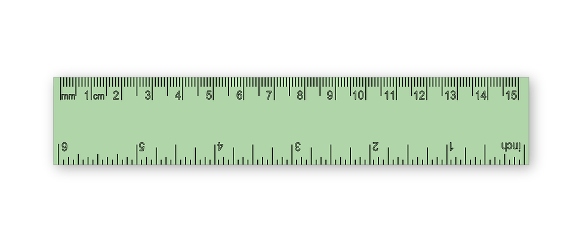
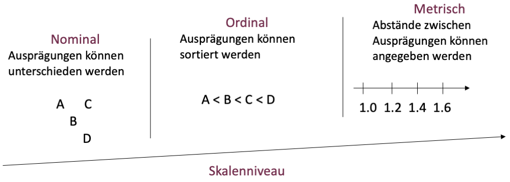
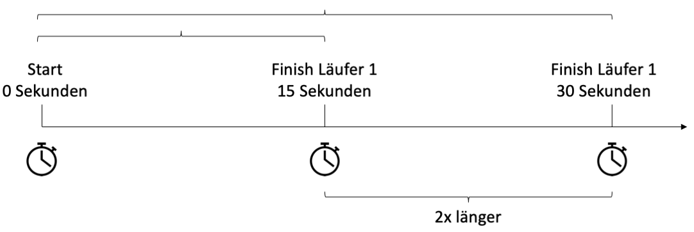
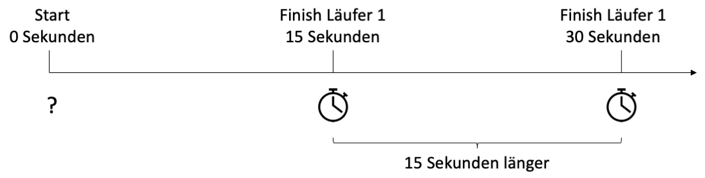

```{r setup, include=FALSE}
options(htmltools.dir.version = FALSE)

library(tidyverse)
library(kableExtra)
library(ggplot2)
library(plotly)
library(htmlwidgets)
library(MASS)
library(ggpubr)
library(xaringanthemer)
library(xaringanExtra)

style_duo_accent(
  primary_color = "#621C37",
  secondary_color = "#EE0071",
  background_image = "blank.png"
)

xaringanExtra::use_xaringan_extra(c("tile_view"))

use_scribble(
  pen_color = "#EE0071",
  pen_size = 4
)

knitr::opts_chunk$set(
  fig.retina = TRUE,
  warning = FALSE,
  message = FALSE
)
```

name: Title slide
class: middle, left
<br><br><br><br><br><br><br>
# Statistik I
***
### Einheit 2: Skalenniveaus und statistische Kennwerte
##### `r format(as.Date(data.frame(readxl::read_excel("Modul Quantitative Methoden I_Termine.xlsx"))$Datum), "%d.%m.%Y")[2]` | Prof. Dr. Stephan Goerigk

---
class: top, left
### Wiederholung Einheit 1 - Was können wir bereits?

* Wir kennen unterschiedliche Variablenarten
  * stetig vs. diskret
  * manifest vs. latent
  * AV vs. UV
  * Drittvariablen: Stör- und Kontrollvaribable, Moderator, Mediator

* Wir kennen Kriterien wissenschaftlicher Hypothesen (ungerichtet vs. gerichtet)

**Kompetenzen:**

* Erfassung **einer** Variable in eine **Urliste/Vektor**

* Kombination **mehrer** Variablen in einer **Datenmatrix**

* Berechnen von **absoluten/relativen Häufigkeiten** und Darstelltung in **Häufigkeitstabelle**

* Berechnen von Summen und Notation mit **Summenzeichen**.

---
class: top, left
### Agenda für Heute:

#### Ziel: Effiziente Beschreibung **einer** Variablen (**univariate** Statistik)

**Was wir danach wissen werden:**

* Kenntnis der **Skalenniveaus**

* Kenntnis univariater **statistischer Kennwerte**

**Was wir danach können werden:**

* **Darstellung** einer Variable

* Zuordnung von Variablen zu einem **Skalenniveau**

* Zusammenfassung/Beschreibung einer Variablen mit **statistischen Kennwerten** (Deskriptivstatistik)

---
class: top, left
### Skalenniveaus und statistische Kennwerte

#### Darstellung einer Variable

* Mit der **Häufigkeitstabelle** kennen wir bereits eine Möglichkeit, die Ausprägungen einer Variable darzustellen

**Urliste** $(N=30)$: Anzahl korrekt gelöster Aufgaben in einem Intelligenztest (10 Fragen)

```{r echo = F}
set.seed(123)
N = 30
df = data.frame(ID = paste0(rep(1:N)),
                IQ = c(round(rnorm(N, 5.5, 2.5)))
)
df = as.data.frame(t(df))
#rownames(df) = NULL
kable(df[,], col.names = NULL)
```

**Häufigkeitstabelle:**

```{r echo = F}
set.seed(123)
N = 30
df = data.frame(ID = paste0(rep(1:N)),
                IQ = c(round(rnorm(N, 5.5, 2.5)))
)
t = as.data.frame(prop.table(table(df$IQ))* 100)
t$Freq = paste0(table(df$IQ), " (", round(prop.table(table(df$IQ))* 100, 2) ,")")
t = as.data.frame(t(t))
rownames(t) = NULL
kable(t, col.names = NULL)
```

$\rightarrow$ Wie wir sehen, schaffen es die meisten Probanden eine mittlere Anzahl von Fragen zu lösen [ca. 4-7]

---
class: top, left
### Skalenniveaus und statistische Kennwerte

#### Darstellung einer Variable

Häufigkeiten lassen sich auch graphisch darstellen, mit einem **Histogramm** (Säulendiagramm):

.pull-left[
**Häufigkeitstabelle:**
```{r echo = F}
set.seed(123)
N = 30
df = data.frame(ID = paste0(rep(1:N)),
                IQ = c(round(rnorm(N, 5.5, 2.5)))
)
t = as.data.frame(prop.table(table(df$IQ))* 100)
t$Freq = paste0(table(df$IQ), " (", round(prop.table(table(df$IQ))* 100, 2) ,")")
t = as.data.frame(t(t))
rownames(t) = NULL
kable(t, col.names = NULL)
```

* **X-Achse:** Ausprägungen der Variablen
* **Y-Achse:** Absolute Häufigkeiten dieser Ausprägungen
* Ziel: Visualisierung der Datenstruktur (aka der **Verteilung**) der Variable
]

.pull-right[
.right[
```{r echo = F, out.width = "400px"}
set.seed(123)
N = 30
df = data.frame(ID = paste0(rep(1:N)),
                IQ =  c(round(rnorm(N, 5.5, 2.5)))
)
ggplot(data = df, aes(x = IQ)) +
  geom_bar(fill = "black", width = .5) +
  scale_x_continuous(breaks = 0:10) +
  labs(y = "Häufigkeit (N)") +
  theme_classic() +
  theme(text = element_text(size = 25))
```
]
]

---
class: top, left
### Skalenniveaus und statistische Kennwerte

#### Darstellung einer Variable

Auch **Kategorien** (Wörter) lassen sich so darstellen (dann heißt das Diagramm **Balkendiagramm**):

.pull-left[
**Häufigkeitstabelle: z.B. Diagnosen**

```{r echo = F}
set.seed(123)
N = 30
df = data.frame(ID = paste0(rep(1:N)),
                Diagnose = c(rep("Depression", 15), rep("Sucht", 9), rep("Psychose", 6))
)
t = as.data.frame(prop.table(table(df$Diagnose))* 100)
t$Freq = paste0(table(df$Diagnose), " (", round(prop.table(table(df$Diagnose))* 100, 2) ,")")
t = as.data.frame(t(t))
rownames(t) = NULL
kable(t, col.names = NULL)
```

* **X-Achse:** Ausprägungen der Variablen
* **Y-Achse:** Absolute Häufigkeiten dieser Ausprägungen
* Ziel: Visualisierung der Datenstruktur (aka der **Verteilung**) der Variable
]

.pull-right[
.right[
```{r echo = F, out.width = "400px"}
set.seed(123)
N = 30
df = data.frame(ID = paste0(rep(1:N)),
                Diagnose = c(rep("Depression", 15), rep("Sucht", 9), rep("Psychose", 6))
)
ggplot(data = df, aes(x = Diagnose)) +
  geom_bar(fill = "black", width = .5) +
  #scale_x_continuous(breaks = 0:10) +
  labs(y = "Häufigkeit (N)") +
  theme_classic() +
  theme(text = element_text(size = 25))
```
]
]

---
class: top, left
### Skalenniveaus und statistische Kennwerte

#### Darstellung einer Variable

##### Noch einmal zusammengefasst:

* Histogramm oder Blockdiagramm - Grafische Darstellung der Häufigkeitstabelle

* Beobachtete Ausprägungen geordnet auf der X-Achse

* Relative (r<sub>j</sub>) oder absolute Häufigkeiten (f<sub>j</sub>) auf der Y-Achse

* Rechtecksflächen sind gleich den r<sub>j</sub> oder f<sub>j</sub>

* Gesamtfläche des Histogramms ist gleich 1 (relative Häufigkeiten) bzw. $N$ (absolute Häufigkeiten)

* Maßstab auf der X-Achse beliebig und wird so gewählt, dass die Verteilung möglichst anschaulich wird (wichtig bei stetigen Variable mit ggf. tausenden Ausprägungen)

* Histogramm für numerische Variablen; Balkendiagramm für kategoriale Variablen

---
class: top, left
### Skalenniveaus und statistische Kennwerte

#### Darstellung einer Variable

##### Vorteile des Histogramms

* Visualisiert **Häufigkeitsverteilung** einer Variable

* Zeigt, welche Merkmalsausprägungen besonders **typisch/häufig** sind

* Zeigt, ob es exotische/untypische Werte in der Verteilung gibt (**Ausreißer**)

**Aufgabe:** Zeichnen Sie ein Histogramm für die folgende Variable $N=20$: **Alkoholkonsum** (Gläser/Woche)

```{r echo = F}
set.seed(123)
N = 20
df = data.frame(ID = paste0(rep(1:N)),
                Gläser = c(round(rnorm(N, 2, 1.2)))
)
df = as.data.frame(t(df))
#rownames(df) = NULL
kable(df[,], col.names = NULL)
```

**Tipp:**
* **Schritt 1:** Häufigkeitstabelle erstellen (absolute Häufigkeiten)
* **Schritt 2:** Histogramm zeichnen

---
class: top, left
### Skalenniveaus und statistische Kennwerte

#### Darstellung einer Variable

##### Lösung:

.pull-left[
**Häufigkeitstabelle: Alkoholkonsum** (Gläser/Woche)

```{r echo = F}
set.seed(123)
N = 20
df = data.frame(ID = paste0(rep(1:N)),
                Gläser = c(round(rnorm(N, 2, 1.2)))
)
t = as.data.frame(prop.table(table(df$Gläser))* 100)
t$Freq = paste0(table(df$Gläser), " (", round(prop.table(table(df$Gläser))* 100, 2) ,")")
t = as.data.frame(t(t))
rownames(t) = NULL
kable(t, col.names = NULL)
```
]

.pull-right[
.right[
```{r echo = F, out.width = "400px"}
set.seed(123)
N = 20
df = data.frame(ID = paste0(rep(1:N)),
                Gläser = c(round(rnorm(N, 2, 1.2)))
)
ggplot(data = df, aes(x = Gläser)) +
  geom_bar(fill = "black", width = .5) +
  #scale_x_continuous(breaks = 0:10) +
  labs(y = "Häufigkeit (N)") +
  theme_classic() +
  theme(text = element_text(size = 25))
```
]
]

---
class: top, left
### Skalenniveaus und statistische Kennwerte

#### Skalenniveaus

* Um mit Variablen rechnen zu können, müssen wir sie zunächst in Zahlen darstellen (**quantifizieren**)

* Dieser Vorgang heißt in der Wissenschaft **"Messen"**

* **Definition:** Messen = homomorphe Abbildung eines empirischen Relativs in ein numerisches Relativ

**Wie funktioniert Messen?**

* einzelnen Ausprägungen werden Messwerte (Zahlen) auf einer **Skala** zugeordnet

* **Skala** = Vorschrift, die jeder Person der Stichprobe einen Beobachtungswert zuordnet

* Variablen lassen sich unterschiedlich differenziert in Zahlen abbilden (**Messniveau aka Skalenniveau**)

.center[
```{r eval = TRUE, echo = F, out.width = "300px"}

```
]

---
class: top, left
### Skalenniveaus und statistische Kennwerte

#### Skalenniveaus

* **Skalenniveau:** eine der wichtigsten statistischen Eigenschaften einer Variable

* bestimmt welche Rechenoperationen (statistische Tests) mit der Variable **zulässig** sind

* Je höher das Skalenniveau, desto mehr Vergleichsaussagen und Rechenoperationen sind möglich

Es gibt 3 hierarchisch geordnete Skalenniveaus:

1. **Nominal** (kategorial)

2. **Ordinal** (kategorial)

3. **Metrisch**

  3.1. **Intervallskala**

  3.2. **Verhältnisskala**

---
class: top, left
### Skalenniveaus und statistische Kennwerte

#### Skalenniveaus

.center[
```{r eval = TRUE, echo = F, out.width = "800px"}

```
]

Einordnung des Skalenniveaus abhängig von: 

1. **Eigenschaften** des zu messenden Merkmals selbst

2. Art der Abbildung durch das **Messinstrument**

---
class: top, left
### Skalenniveaus und statistische Kennwerte

#### Nominalskala

* **niedrigstes** Skalenniveau in der Statistik (niedrigster Informationsgehalt) 

* Ausprägungen der Variablen können **unterschieden** werden (nur Beziehungen "gleich", "ungleich" möglich)

* eine logische Reihenfolge ist nicht möglich (Reihenfolge der Ausprägungen ist **austauschbar**)

* Erlauben **eindeutige Transformationen**

* **Codierung:** Zuweisung von Zahlen zu verbalen Kategorien 

**Beispiele:**

```{r echo = F}
df = data.frame(Geschlecht = c("1 = männlich", "2 = weiblich", "3 = divers", ""),
                Beruf = c("1 = Dachdecker", "2 = Psychologe", "3 = Polizist", "4 = Koch"),
                Geburtsort = c("1 = Berlin", "2 = Frankfurt", "3 = Paris", "4 = New York"))

df %>%
  kbl() %>%
  kable_classic(full_width = T)
```

---
class: top, left
### Skalenniveaus und statistische Kennwerte

#### Ordinalskala

* Kann auch nominale Aussagen abbilden (Gleichheit/Verschiedenheit) 

* Zusätzlich: **Größer-Kleiner-Relationen** (eine Rangfolge kann gebildet werden)

* Wird auch **Rangskala** genannt

* Aussage über den absoluten Abstand zwischen zwei Werten ist nicht möglich

* Erlauben **monotone Transformationen**

**Beispiele:**

```{r echo = F}
df = data.frame(Schulnote = c("1 = Note 1", "2 = Note 2", "3 = Note 3", "..."),
                Wettlauf = c("1 = Erster", "2 = Zweiter", "3 = Dritter", "..."),
                Alkoholkonsum = c("1 = täglich", "2 = einmal pro Woche", "3 = einmal pro Monat", "4 = nie"))

df %>%
  kbl() %>%
  kable_classic(full_width = T)
```

---
class: top, left
### Skalenniveaus und statistische Kennwerte

#### Metrische Variablen

* Merkmalsausprägungen können verglichen und sortiert werden

* Zusätzlich: **Abstände** zwischen den Ausprägungen können berechnet werden

* Gleich große Abstände zwischen zugeordneten Zahlen repräsentieren gleich große Einheiten des Kontrukts (Differenzen und Summen können sinnvoll gebildet werden)

* Es werden **Intervallskala** und **Verhältnisskala** unterschieden

**Beispiele:**

```{r echo = F}
df = data.frame(Einkommen = c("3522 €", "4225 €", "8327 €", "2174 €"),
                Körpergröße = c("175 cm", "156 cm", "192 cm", "181 cm"),
                IQ = c("102", "98", "121", "106"))

df %>%
  kbl() %>%
  kable_classic(full_width = T)
```

---
class: top, left
### Skalenniveaus und statistische Kennwerte

#### Metrische Variablen

##### Intervallskala vs. Verhältnisskala

<small>

.pull-left[
**Intervallskala**

* **Wichtigste** Skala in den Sozialwissenschaften

* Macht Aussagen über Größe der Unterschiede zwischen Merkmalsausprägungen

* Erlaubt **lineare Transformationen** $y_i= a + b \cdot x_i$
]

.pull-right[
**Verhältnisskala**

* eine Annahme mehr: Skala hat **absoluten Nullpunkt**

* Nullpunkt lokalisiert, wo die Variable aufhört zu **existieren**

* **Selten** in Sozialwissenschaften (Variablen wie Intelligenz, Neurotizimus... haben keine sinnvolle 0)

* macht somit Aussagen über das Verhältnis von Merkmalsausprägungen

* Erlaubt **Ähnlichkeitstransformationen** $y_i= b \cdot x_i$
]

---
class: top, left
### Skalenniveaus und statistische Kennwerte

#### Metrische Variablen

**Beispiel Verhältnisskala:**

.center[
```{r eval = TRUE, echo = F, out.width = "600px"}

```
]

**Beispiel Intervallskala:**

.center[
```{r eval = TRUE, echo = F, out.width = "600px"}

```
]

---
class: top, left
### Skalenniveaus und statistische Kennwerte

#### Zusammenfassung (Rasch, 2008)

```{r echo = F}
df = data.frame(Skalenniveau = c("Nominalskala", "Ordinalskala", "Intervallskala", "Verhältnisskala"),
                Aussagen = c("Gleichheit/Verschiedenheit", "Größer-Kleiner Relation", "Gleichheit von Differenzen", "Gleichheit von Verhältnissen"),
                Beispiele = c("Diagnosen, Nationalität, Gruppenzugehörigkeit", "Schulabschlüsse, Bundesligatabelle, Medaillenfarbe", "IQ, Persönlichkeit", "Gewicht, Länge"),
                Transformationen = c("wenn x1 ungleich x2 dann y1 ungleich y2", "wenn x1 > x2 > x3 dann y1 > y2 > y3 oder y1 < y2 < y3", "$y_i= a + b \\cdot x_i$", "$y_i= b \\cdot x_i$"))

df %>%
  kbl(escape = F) %>%
  kable_classic(full_width = T)
```

---
class: top, left
### Skalenniveaus und statistische Kennwerte

#### Veränderung des Skalenniveaus:

* Variablen lassen sich abwärts der Hierarchie des Skalenniveaus **runterskalieren**

* **Aggregation:** Zusammenfassen auf das nächst-gröbere Level

* von grob nach fein, also nominal $\rightarrow$ ordinal $\rightarrow$ intervall ist jedoch **nicht möglich**

* Beispiel Körpergröße in cm $(N=10)$:

.center[
```{r echo = F}
set.seed(123)
N = 10
df = data.frame(ID = paste0(rep(1:N)),
                 metrisch = c(151, 170, 161, 192, 182, 201, 188, 162, 174, 180),
                ordinal = c("10.", "7.", "9.", "2.", "4.", "1.", "3.", "8.", "6.", "5."),
                nominal = c("klein", "klein", "klein", "groß", "groß", "groß", "groß", "klein", "klein", "groß")
)
x = df$X
n = length(x)
df = as.data.frame(t(df))
#rownames(df) = NULL
kable(df[,], col.names = NULL)
```
]

---
class: top, left
### Skalenniveaus und statistische Kennwerte

#### Festlegung des Skalenniveaus:

* **Praxis:** es kommt vor, dass eingesetzte Messinstrumente Daten auf niedrigerem Skalleniveau erfassen, als theoretisch möglich (z.B. aus Sparsamkeit)

* **Statistischer Nachweis** des Messniveaus (z.B. eines Intelligenztests) oft sehr aufwändig (eigene Disziplin: **Messtheorie**)

* Psychologie: **Likertskala** wird häufig für Fragebogenitems (Einzelfragen) eingesetzt (z.B. 1 = stimmt nicht zu, 2 = stimme etwas zu...)

* **Einzelwert** des Items auf der Likerskala i.d.R. ordinalskaliert

* **Gesamtfragebogenwert** (Summe der der Einzelitems) wird als metrisch behandelt

* Scores gut konstruierter **psychologischer Tests**: Intervallskalenniveau wird angenommen (Steier & Eid, 1999)

---
class: top, left
### Skalenniveaus und statistische Kennwerte

#### Beispiele:

```{r echo = F}
df = data.frame(Beispiel = c("Wohnorte in Deutschland", 
                             "Hotelbewertung auf einer Skala von 1 bis 5 (Likert-Skala von sehr schlecht bis sehr gut)", 
                             "Religionsbekenntnis", 
                             "CO2-Ausstoss im Jahr",
                             "Motivationsscore von Arbeitnehmern",
                             "Zeugnisnoten von 1 bis 6",
                             "Telefonnummern von Befragten",
                             "Pflegestufe eines Patienten",
                             "Wohnfläche in m2",
                             "Arbeitszufriedenheit auf einer Skala von 1 bis 4 (Likert-Skala von sehr unmotiviert bis sehr motiviert)"),
                Skalenniveau = c("Nominalskala",
                                 "Ordinalskala",
                                 "Nominalskala",
                                 "metrisch, Verhältnisskala",
                                 "metrisch, Intervallskala",
                                 "Ordinalskala",
                                 "Nominalskala",
                                 "Ordinalskala",
                                 "metrisch, Verhältnisskala",
                                 "Ordinalskala"))
df$Skalenniveau = "?"
df %>%
  kbl(escape = F) %>%
  kable_classic(full_width = T)
```

---
class: top, left
### Skalenniveaus und statistische Kennwerte

#### Beispiele:

```{r echo = F}
df = data.frame(Beispiel = c("Wohnorte in Deutschland", 
                             "Hotelbewertung auf einer Skala von 1 bis 5 (Likert-Skala von sehr schlecht bis sehr gut)", 
                             "Religionsbekenntnis", 
                             "CO2-Ausstoss im Jahr",
                             "Motivationsscore von Arbeitnehmern",
                             "Zeugnisnoten von 1 bis 6",
                             "Telefonnummern von Befragten",
                             "Pflegestufe eines Patienten",
                             "Wohnfläche in m2",
                             "Arbeitszufriedenheit auf einer Skala von 1 bis 4 (Likert-Skala von sehr unmotiviert bis sehr motiviert)"),
                Skalenniveau = c("Nominalskala",
                                 "Ordinalskala",
                                 "Nominalskala",
                                 "metrisch, Verhältnisskala",
                                 "metrisch, Intervallskala",
                                 "Ordinalskala",
                                 "Nominalskala",
                                 "Ordinalskala",
                                 "metrisch, Verhältnisskala",
                                 "Ordinalskala"))
# df$Skalenniveau = ""
df %>%
  kbl(escape = F) %>%
  kable_classic(full_width = T)
```

---
class: top, left
### Skalenniveaus und statistische Kennwerte

#### Statistische Kennwerte

##### Wozu statistische Kennwerte?

* Bestimmte Eigenschaften einer Verteilung numerisch wiedergeben 

* Aus vielen Einzelwerten wenige Werte bilden, die gesamte Verteilung beschreiben

* Werte idealerweise so bestimmen, dass Verteilung aus den Kennwerten rekonstruiert werden könnte

Zwei häufige Arten statistischer Kenntwerte:

1. **Maße der zentralen Tendenz** (aka. Lagemaße)

  * repräsentieren alle Einzelwerte der Verteilung zusammenfassend

2. **Streuungsmaße** (aka. Dispersionsmaße)

  * geben Auskunft über Variation der Messwerte

---
class: top, left
### Skalenniveaus und statistische Kennwerte

#### Statistische Kennwerte

##### Zentrale Tendenz und Streuung

.pull-left[
.center[
**Unterschiedliche Lagemaße, gleiche Streuung**

```{r echo=FALSE, out.width="350px"}
x = rnorm(100, mean = 0, sd = 1)
ggplot(data = data.frame(x = c(-5 * sd(x) + mean(x), 9 * sd(x) + mean(x))), aes(x)) +
  stat_function(fun = dnorm, n = 101, args = list(mean = mean(x), sd = sd(x))) + 
  stat_function(fun = dnorm, geom = "point", n = 101, args = list(mean = mean(x), sd = sd(x))) +
  stat_function(fun = dnorm, n = 101, args = list(mean = mean(x)+2, sd = sd(x))) + 
  stat_function(fun = dnorm, geom = "point", n = 101, args = list(mean = mean(x)+2, sd = sd(x))) + 
  stat_function(fun = dnorm, n = 101, args = list(mean = mean(x)+4, sd = sd(x))) + 
  stat_function(fun = dnorm, geom = "point", n = 101, args = list(mean = mean(x)+4, sd = sd(x))) + 
  ylab("Häufigkeit (N)") +
  xlab("Variable") +
  scale_x_continuous(breaks = NULL) +
  scale_y_continuous(breaks = NULL) +
  theme_classic() +
  theme(text = element_text(size = 30))
```
]
]
.pull-right[
.center[
**Gleiche Lagemaße, unterschiedliche Streuung**

```{r echo=FALSE, out.width="350px"}
x = rnorm(100, mean = 0, sd = 1)
ggplot(data = data.frame(x = c(-9 * sd(x) + mean(x), 9 * sd(x) + mean(x))), aes(x)) +
  stat_function(fun = dnorm, n = 101, args = list(mean = mean(x), sd = sd(x))) + 
    stat_function(fun = dnorm, geom = "point", n = 101, args = list(mean = mean(x), sd = sd(x))) + 
  stat_function(fun = dnorm, n = 101, args = list(mean = mean(x), sd = sd(x)+1)) + 
    stat_function(fun = dnorm, geom = "point", n = 101, args = list(mean = mean(x), sd = sd(x)+1)) + 
  stat_function(fun = dnorm, n = 101, args = list(mean = mean(x), sd = sd(x)+2)) + 
    stat_function(fun = dnorm, geom = "point", n = 101, args = list(mean = mean(x), sd = sd(x)+2)) + 
  ylab("Häufigkeit (N)") +
  xlab("Variable") +
  scale_x_continuous(breaks = NULL) +
  scale_y_continuous(breaks = NULL) +
  theme_classic() +
  theme(text = element_text(size = 30))
```
]
]

---
class: top, left
### Skalenniveaus und statistische Kennwerte

#### Statistische Kennwerte

.pull-left[
**Gängige Maße der zentralen Tendenz:**

* Modalwert

* Arithmetisches Mittel (Mittelwert)

* Median
]

.pull-right[
**Gängige Streuungsmaße:**

* Spannweite

* Varianz und Standardabweichung

* Quartilabstand
]

---
class: top, left
### Skalenniveaus und statistische Kennwerte

#### Statistische Kennwerte

**Glossar Symbole:**

* Auf Stichprobenebene werden **lateinische Buchstaben** verwendet

* Auf Populationsebene werden **griechische Buchstaben** verwendet

```{r echo=FALSE}
d = data.frame(
  Statistik = c("Mittelwert",
                "Median",
                "Varianz",
                "Standardabweichung",
                "Korrelationskoeffizient",
                "Regressionskoeffizient"),
  Stichprobenebene = c("$\\bar{x}$",
                       "$Md$",
                       "$s^2$",
                       "$s$",
                       "$r$",
                       "$b$"),
  Populationsebene = c("$\\mu$",
                       "$\\eta$",
                       "$\\sigma^2$",
                       "$\\sigma$",
                       "$\\rho$",
                       "$\\beta$"),
  Populationsschätzer = c("$\\hat{\\mu}$",
                       "$\\hat{\\eta}$",
                       "$\\hat{\\sigma^2}$",
                       "$\\hat{\\sigma}$",
                       "$\\hat{\\rho}$",
                       "$\\hat{\\beta}$")
)

kable(d)%>%
  kable_styling(font_size = 18)
```


---
class: top, left
### Skalenniveaus und statistische Kennwerte

#### Statistische Kennwerte

##### Maße der zentralen Tendenz:

**Modalwert** (aka Modus)

* Der am **häufigsten vorkommende** Wert einer Verteilung

* folglich auch der **wahrscheinlichste** Wert (bei zufälligem Ziehen aus der Verteilung)

* Berechnung erfordert lediglich **Nominalskalenniveau**

* Wert mit höchster absoluter Häufigkeit $(f_j)$

* Graphen mit nur einem Modus heißen **unimodal** (aka eingipfelig)

* 2 Modi = **bimodale** Verteilung; mehrere Maximalwerte nebeneinander = **breitgipfelige** Verteilung

---
class: top, left
### Skalenniveaus und statistische Kennwerte

#### Statistische Kennwerte

##### Maße der zentralen Tendenz:

.pull-left[

**Modalwert** (aka Modus)

Beispiel, Verteilung mit Modalwert = 10

```{r echo = F}
set.seed(123)
N = 10
df = data.frame(ID = paste0(rep(1:N)),
                 X = c(10, 11, 9, 10, 12, 10, 10, 11, 8, 9)
)
df = as.data.frame(t(df))
#rownames(df) = NULL
kable(df[,], col.names = NULL)
```
]

.pull-right[
.center[
```{r echo = F, out.width = "400px"}
set.seed(123)
N = 10
df = data.frame(ID = paste0(rep(1:N)),
                 X = c(10, 11, 9, 10, 12, 10, 10, 11, 8, 9)
)
ggplot(data = df, aes(x = X)) +
  geom_bar(fill = "black", width = .5) +
  scale_x_continuous(breaks = 0:12) +
  labs(y = "Häufigkeit (N)") +
  theme_classic() +
  theme(text = element_text(size = 25))
```
]
]

---
class: top, left
### Skalenniveaus und statistische Kennwerte

#### Statistische Kennwerte

##### Maße der zentralen Tendenz:

<small>

**Mittelwert** (aka arithmetisches Mittel)

* gebräuchlichstes Maß der zentralen Tendenz

* **Durchschnittswert** einer Verteilung

* nur für metrische Variablen sinnvoll (**mindestens Intervallskalenniveau**)

* Der Mittelwert einer Variable $x$ wird geschrieben als $\bar{x}$

* **Berechnung:** Summe aller Werte dividiert durch den Stichprobenumfang N

Formel: $$\bar{x}=\frac{\sum\limits _{i=1}^{n}x_{i}}{n}$$

---
class: top, left
### Skalenniveaus und statistische Kennwerte

#### Statistische Kennwerte - Maße der zentralen Tendenz:

**Rechenbeispiel Mittelwert:** Mittelwert aus Variable $X$ $(N=10)$

.center[
```{r echo = F}
set.seed(123)
N = 10
df = data.frame(ID = paste0(rep(1:N)),
                 X = c(10, 11, 9, 10, 12, 10, 10, 11, 8, 9)
)
x = df$X
n = length(x)
df = as.data.frame(t(df))
#rownames(df) = NULL
kable(df[,], col.names = NULL)
```
]

Formel: $$\bar{x}=\frac{\sum\limits _{i=1}^{n}x_{i}}{n}$$

Lösungsweg: $$\bar{x}=\frac{`r paste(x, collapse = " + ")`}{`r n`}=\frac{`r sum(x)`}{`r n`}=`r mean(x)`$$

---
class: top, left
### Skalenniveaus und statistische Kennwerte

#### Statistische Kennwerte - Maße der zentralen Tendenz:

**Aufgabe Mittelwert:** Berechnen Sie das Durschnittsalter folgender Stichprobe (in Jahren) $(N=12)$

.center[
```{r echo = F}
set.seed(123)
N = 12
df = data.frame(ID = paste0(rep(1:N)),
                 Alter = c(21, 44, 52, 15, 27, 52, 63, 16, 99, 24, 56, 40)
)
x = df$Alter
n = length(x)
df = as.data.frame(t(df))
#rownames(df) = NULL
kable(df[,], col.names = NULL)
```
]

Formel: $$\bar{x}=\frac{\sum\limits _{i=1}^{n}x_{i}}{n}$$

---
class: top, left
### Skalenniveaus und statistische Kennwerte

#### Statistische Kennwerte - Maße der zentralen Tendenz:

**Aufgabe Mittelwert:** Berechnen Sie das Durschnittsalter folgender Stichprobe (in Jahren) $(N=12)$

.center[
```{r echo = F}
set.seed(123)
N = 12
df = data.frame(ID = paste0(rep(1:N)),
                 Alter = c(21, 44, 52, 15, 27, 52, 63, 16, 99, 24, 56, 40)
)
x = df$Alter
n = length(x)
df = as.data.frame(t(df))
#rownames(df) = NULL
kable(df[,], col.names = NULL)
```
]

Formel: $$\bar{x}=\frac{\sum\limits _{i=1}^{n}x_{i}}{n}$$

Lösungsweg: $$\bar{x}=\frac{`r paste(x, collapse = " + ")`}{`r n`}=\frac{`r sum(x)`}{`r n`}=`r round(mean(x), 2)`$$

---
class: top, left
### Skalenniveaus und statistische Kennwerte

#### Statistische Kennwerte - Maße der zentralen Tendenz:

**Mathematische Eigenschaften des Mittelwerts:** 

* Die Summe der Differenzen aller Werte vom Mittelwert ist 0

$\rightarrow$ positive bzw. negative Abweichungen vom Mittelwert heben sich auf

$$\sum\limits _{i=1}^{n}(x_{i}-\bar{x})=0$$

* Die Summe der quadrierten Differenzen aller Werte zum Mittelwert ist ein Minimum 

$\rightarrow$ Minimum = Wert ist kleiner als die Summe der quadrierten Differenzen aller Werte zu einem anderen Wert

$$\sum\limits _{i=1}^{n}(x_{i}-\bar{x})^2=Min$$

**Aufgabe:** Überprüfen Sie diese Eigenschaften für sich (z.B. mit dem leichten Beispiel der Werte: 1, 2, 3, 4)

---
class: top, left
### Skalenniveaus und statistische Kennwerte

#### Statistische Kennwerte - Maße der zentralen Tendenz:

**Berechnung des Mittelwerts auf Grundlage der Häufigkeitstabelle:** 

* Liegt bereits eine Häufigkeitstabelle vor, sparen wir uns Tipparbeit (nicht alle Messwerte müssen einzeln eingegeben werden)

* jede Merkmalsausprägung mit ihrer absoluten Häufigkeit multiplizieren und die Summe über alle Merkmalsausprägungen bilden:

Formel: $$\bar{x}=\frac{\sum\limits _{j=1}^{k}x'_{j} \cdot f_{j}}{n}$$

* $x'_{j}$ = mögliche Merkmalsausprägungen; $f_{j}$ = absolute Häufigkeit der jeweiligen Merkmalsausprägung

---
class: top, left
### Skalenniveaus und statistische Kennwerte

#### Statistische Kennwerte - Maße der zentralen Tendenz:

**Berechnung des Mittelwerts auf Grundlage der Häufigkeitstabelle** 

Beispiel von vorher: **Häufigkeitstabelle:** korrekt gelöste Aufgaben in einem Intelligenztest (10 Fragen) $N=30$
```{r echo = F}
set.seed(123)
N = 30
df = data.frame(ID = paste0(rep(1:N)),
                IQ = c(round(rnorm(N, 5.5, 2.5)))
)
x = df$IQ
t = as.data.frame(prop.table(table(df$IQ))* 100)
t$Freq = paste0(table(df$IQ), " (", round(prop.table(table(df$IQ))* 100, 2) ,")")
t = as.data.frame(t(t))
rownames(t) = NULL
kable(t, col.names = NULL)
```

Formel: $$\bar{x}=\frac{\sum\limits _{j=1}^{k}x'_{j} \cdot f_{j}}{n}$$

Lösungsweg: $$\bar{x}=\frac{1\cdot2+2\cdot1+3\cdot3+4\cdot7+4\cdot2+6\cdot5+7\cdot4+8\cdot1+9\cdot3+10\cdot2}{30}=\frac{`r  1*2+2*1+3*3+4*7+4*2+6*5+7*4+8*1+9*3+10*2`}{30} = `r round(mean(x), 2)`$$

---
class: top, left
### Skalenniveaus und statistische Kennwerte

#### Statistische Kennwerte - Maße der zentralen Tendenz:

**Aufgabe Mittelwert:** Eine **Häufigkeitstabelle** für die Anzahl an unternommenen Reisen pro Jahr in einer Stichprobe liegt vor $(N=40)$. Berechnen Sie die durchschnittliche Zahl von Reisen pro Jahr:

```{r echo = F}
set.seed(123)
N = 40
df = data.frame(ID = paste0(rep(1:N)),
                Reisen = c(round(rnorm(N, 2, 0.5)))
)
x = df$Reisen
t = as.data.frame(prop.table(table(df$Reisen))* 100)
t$Freq = paste0(table(df$Reisen), " (", round(prop.table(table(df$Reisen))* 100, 2) ,")")
t = as.data.frame(t(t))
rownames(t) = NULL
kable(t, col.names = NULL)
```

Formel: $$\bar{x}=\frac{\sum\limits _{j=1}^{k}x'_{j} \cdot f_{j}}{n}$$

---
class: top, left
### Skalenniveaus und statistische Kennwerte

#### Statistische Kennwerte - Maße der zentralen Tendenz:

**Aufgabe Mittelwert:** Eine **Häufigkeitstabelle** für die Anzahl an unternommenen Reisen pro Jahr in einer Stichprobe liegt vor $(N=40)$. Berechnen Sie die durchschnittliche Zahl von Reisen pro Jahr:

```{r echo = F}
set.seed(123)
N = 40
df = data.frame(ID = paste0(rep(1:N)),
                Reisen = c(round(rnorm(N, 2, 0.5)))
)
x = df$Reisen
t = as.data.frame(prop.table(table(df$Reisen))* 100)
t$Freq = paste0(table(df$Reisen), " (", round(prop.table(table(df$Reisen))* 100, 2) ,")")
t = as.data.frame(t(t))
rownames(t) = NULL
kable(t, col.names = NULL)
```

Formel: $$\bar{x}=\frac{\sum\limits _{j=1}^{k}x'_{j} \cdot f_{j}}{n}$$

Lösungsweg: $$\bar{x}=\frac{1\cdot6+2\cdot29+3\cdot5}{40}=\frac{`r  1*6+2*29+3*5`}{40} = `r round(mean(x), 2)`$$

---
class: top, left
### Skalenniveaus und statistische Kennwerte

#### Statistische Kennwerte - Maße der zentralen Tendenz:

**Berechnung des Mittelwerts für 2 oder mehr Datensätze (Gruppen):** 

* **Voraussetzungen:** es liegen für die selbe Variable Daten aus 2 Gruppen/Stichproben vor

* Die Mittelwerte der beiden Gruppen sind **bereits berechnet** worden

Berechnung des gemeinsamen Mittelwerts $\bar{\bar{x}}$:

* $\bar{x}_{1}$ und $\bar{x}_{2}$ addieren

* Mittelwerte zusätzlich mit den Stichprobengrößen der beiden Gruppen gewichten

$$\bar{\bar{x}}=\frac{n_{1} \cdot \bar{x}_{1} + n_{2} \cdot \bar{x}_{2}}{n_{1} + n_{2}}$$

---
class: top, left
### Skalenniveaus und statistische Kennwerte

#### Statistische Kennwerte

##### Maße der zentralen Tendenz:

**Median** 

<small>

* Wert, der in der Mitte der Verteilung liegt (halbiert die Verteilung)

* es liegen genau so viele Messwerte über wie unter dem Median

* Bestimmung bei ungerader Anzahl von Werten:

  * ordnen der Werte der Größe nach $\rightarrow$ mittlerer Wert = Median
  * z.B. [1, 3, 4, 6, 9] $\rightarrow$ Median = 4
  
* Bestimmung bei gerader Anzahl von Werten:

  * einfach: ordnen der Werte der Größe nach $\rightarrow$ numerische Mitte aus beiden mittleren Werten = Median
  * z.B. [1, 3, 4, 5, 6, 9] $\rightarrow$ Median = (4+5) / 2 = 4.5
  
* Bildet nur größer-kleiner Relationen ab $\rightarrow$ erfordert lediglich Ordinalskalenniveau

---
class: top, left
### Skalenniveaus und statistische Kennwerte

#### Statistische Kennwerte - Maße der zentralen Tendenz:

**Median - Rechenbeispiel:** Median aus Variable $X$ $(N=10)$

.center[
```{r echo = F}
set.seed(123)
N = 10
df = data.frame(ID = paste0(rep(1:N)),
                 X = c(10, 11, 9, 10, 12, 10, 10, 11, 8, 9)
)
x = df$X
n = length(x)
df = as.data.frame(t(df))
#rownames(df) = NULL
kable(df[,], col.names = NULL)
```
]

<small>

Formel: $$\def\arraystretch{1.2} \textit{Md} = \Bigg\{\begin{array}{@{}c@{}}\frac{x_{(\frac{n}{2})}+x_{(\frac{n}{2}+1)}}{2} \quad \textrm{falls }n \textrm{ gerade}\\[6pt] x_{(\frac{n+1}{2})}\quad \textrm{falls }n \textrm{ ungerade}\end{array}$$

Lösungweg: 

$$x_{sortiert}= `r paste(x[order(x)], collapse = ";")`$$

$$\textit{Md} = \frac{x_{(\frac{`r n`}{2})}+x_{(\frac{`r n`}{2}+1)}}{2}=`r median(x)`$$

---
class: top, left
### Skalenniveaus und statistische Kennwerte

#### Statistische Kennwerte - Maße der zentralen Tendenz:

**Median - Aufgabe:** Berechnen Sie den Median für die Variable Monatseinkommen $(N=8)$

.center[
```{r echo = F}
set.seed(123)
N = 8
df = data.frame(ID = paste0(rep(1:N)),
                 Einkommen = c(2300, 5332, 4272, 982, 1048, 8261, 2037, 3000)
)
x = df$Einkommen
n = length(x)
df = as.data.frame(t(df))
#rownames(df) = NULL
kable(df[,], col.names = NULL)
```
]

Formel: $$\def\arraystretch{1.2} \textit{Md} = \Bigg\{\begin{array}{@{}c@{}}\frac{x_{(\frac{n}{2})}+x_{(\frac{n}{2}+1)}}{2} \quad \textrm{falls }n \textrm{ gerade}\\[6pt] x_{(\frac{n+1}{2})}\quad \textrm{falls }n \textrm{ ungerade}\end{array}$$

---
class: top, left
### Skalenniveaus und statistische Kennwerte

#### Statistische Kennwerte - Maße der zentralen Tendenz:

**Aufgabe Median:** Berechnen Sie den Median für die Variable Monatseinkommen $(N=8)$

.center[
```{r echo = F}
set.seed(123)
N = 8
df = data.frame(ID = paste0(rep(1:N)),
                 Einkommen = c(2300, 5332, 4272, 982, 1048, 8261, 2037, 3000)
)
x = df$Einkommen
n = length(x)
df = as.data.frame(t(df))
#rownames(df) = NULL
kable(df[,], col.names = NULL)
```
]

Formel: $$\def\arraystretch{1.2} \textit{Md} = \Bigg\{\begin{array}{@{}c@{}}\frac{x_{(\frac{n}{2})}+x_{(\frac{n}{2}+1)}}{2} \quad \textrm{falls }n \textrm{ gerade}\\[6pt] x_{(\frac{n+1}{2})}\quad \textrm{falls }n \textrm{ ungerade}\end{array}$$

Lösungweg: 

$$x_{sortiert}= `r paste(x[order(x)], collapse = ";")`$$

$$\textit{Md} = \frac{x_{(\frac{`r n`}{2})}+x_{(\frac{`r n`}{2}+1)}}{2}=`r median(x)`$$
---
class: top, left
### Skalenniveaus und statistische Kennwerte

#### Statistische Kennwerte

##### Maße der zentralen Tendenz:

**Vorteile Median gegenüber Mittelwert:** 

* kann auch bei rangskalierten Merkmalen verwendet werden
* Werte, die weit von allen übrigen entfernt liegen (**Ausreißer**), beeinflussen den Median kaum
* Bei schiefen Verteilungen (hohe und niedrige Werte ungleich häufig) bildet Median zentrale Tendenz besser ab

.pull-left[
.center[
```{r eval = TRUE, echo = F, out.width = "550px"}
knitr::include_graphics("bilder/symmetrisch.png")
```
]
]
.pull-right[
.center[
```{r eval = TRUE, echo = F, out.width = "450px"}
knitr::include_graphics("bilder/schief.png")
```
]
]

---
class: top, left
### Skalenniveaus und statistische Kennwerte

#### Statistische Kennwerte

##### Maße der zentralen Tendenz:

**Vorteile Median gegenüber Mittelwert:** 

**Beispiel für Robustheit gegenüber Extremwerten:** 10. Wert der Variable $X$ ist ein Ausreißer

.center[
```{r echo = F}
set.seed(123)
N = 10
df = data.frame(ID = paste0(rep(1:N)),
                 X = c(10, 11, 9, 10, 12, 10, 10, 11, 8, 500)
)
x = df$X
n = length(x)
df = as.data.frame(t(df))
#rownames(df) = NULL
kable(df[,], col.names = NULL)
```
]

Mittelwert: $$\bar{x}=\frac{`r paste(x, collapse = " + ")`}{`r n`}=\frac{`r sum(x)`}{`r n`}=`r mean(x)`$$

Median: $$\textit{Md} = \frac{x_{(\frac{`r n`}{2})}+x_{(\frac{`r n`}{2}+1)}}{2}=`r median(x)`$$


---
class: top, left
### Take-aways

.full-width[.content-box-gray[

* **Histogramm** und **Balkendiagramm** eigenen sich zur Darstellung der Verteilung einer Variable.

* Wir unterscheiden 3 Arten von **Skalenniveaus**: Nominal-, Ordinal-, Intervall- und Verhältnisskalenniveau.

* Die Skalenniveaus **entscheiden**, welche Statistiken wir rechnen dürfen.

* Der **Modalwert** ist der häufigste Wert einer Verteilung und erfordert mind. Nominalskalenniveau.

* Der **Mittelwert** ist der Durchschnitt einer Verteilung und erfordert mind. Intervallskalenniveau.

* Der **Median** trennt die Verteilung in der Mitte und erfordert mind. Ordinalskalenniveau.

* Der Median ist im Gegensatz zum Mittelwert **robust** gegenüber schiefen Verteilungen und Ausreißern.
]
]


