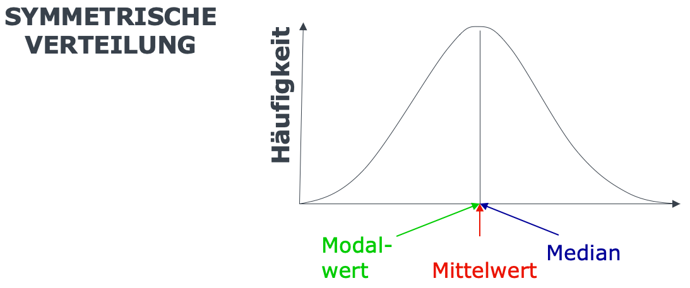

```{r setup, include=FALSE}
options(htmltools.dir.version = FALSE)

library(tidyverse)
library(kableExtra)
library(ggplot2)
library(plotly)
library(htmlwidgets)
library(MASS)
library(ggpubr)
library(xaringanthemer)
library(xaringanExtra)

style_duo_accent(
  primary_color = "#621C37",
  secondary_color = "#EE0071",
  background_image = "blank.png"
)

xaringanExtra::use_xaringan_extra(c("tile_view"))

use_scribble(
  pen_color = "#EE0071",
  pen_size = 4
)

knitr::opts_chunk$set(
  fig.retina = TRUE,
  warning = FALSE,
  message = FALSE
)
```

name: Title slide
class: middle, left
<br><br><br><br><br><br><br>
# Statistik I
***
### Einheit 3: Statistische Kennwerte (2)
##### `r format(as.Date(data.frame(readxl::read_excel("Modul Quantitative Methoden I_Termine.xlsx"))$Datum), "%d.%m.%Y")[3]` | Prof. Dr. Stephan Goerigk

---
class: top, left
### Wiederholung Einheit 2 - Was können wir schon?

* Kenntnis der **Skalenniveaus**

* Kenntnis univariater **Maße der zentralen Tendenz**

**Kompetenzen:**

* Berechnen von **absoluten/relativen Häufigkeiten** und Darstelltung in **Häufigkeitstabelle**

* Berechnen von Summen und Notation mit **Summenzeichen**.

* Berechnen von Modus, Mittelwert (mehrere Gruppen, aus Häufigkeitstabelle), Median.

---
class: top, left
### Agenda für Heute:

#### Ziel: Effiziente Beschreibung **einer** Variablen (**univariate** Statistik)

**Was wir danach wissen werden:**

* Kenntnis weiterer univariater **statistischer Kennwerte**

**Was wir danach können werden:**

* Berechnung von **Streuungsmaßen**

---
class: top, left
### Skalenniveaus und statistische Kennwerte

#### Statistische Kennwerte

##### Wozu statistische Kennwerte?

* Bestimmte Eigenschaften einer Verteilung numerisch wiedergeben 

* Aus vielen Einzelwerten wenige Werte bilden, die gesamte Verteilung beschreiben

* Werte idealerweise so bestimmen, dass Verteilung aus den Kennwerten rekonstruiert werden könnte

Zwei häufige Arten statistischer Kenntwerte:

1. **Maße der zentralen Tendenz** (Lagemaße)

  * repräsentieren alle Einzelwerte der Verteilung zusammenfassend

2. **Streuungsmaße** (Dispersionsmaße)

  * geben Auskunft über Variation der Messwerte

---
class: top, left
### Skalenniveaus und statistische Kennwerte

#### Statistische Kennwerte

##### Zentrale Tendenz und Streuung

.pull-left[
.center[
**Unterschiedliche Lagemaße, gleiche Streuung**

```{r echo=FALSE, out.width="350px"}
x = rnorm(100, mean = 0, sd = 1)
ggplot(data = data.frame(x = c(-5 * sd(x) + mean(x), 9 * sd(x) + mean(x))), aes(x)) +
  stat_function(fun = dnorm, n = 101, args = list(mean = mean(x), sd = sd(x))) + 
  stat_function(fun = dnorm, geom = "point", n = 101, args = list(mean = mean(x), sd = sd(x))) +
  stat_function(fun = dnorm, n = 101, args = list(mean = mean(x)+2, sd = sd(x))) + 
  stat_function(fun = dnorm, geom = "point", n = 101, args = list(mean = mean(x)+2, sd = sd(x))) + 
  stat_function(fun = dnorm, n = 101, args = list(mean = mean(x)+4, sd = sd(x))) + 
  stat_function(fun = dnorm, geom = "point", n = 101, args = list(mean = mean(x)+4, sd = sd(x))) + 
  ylab("Häufigkeit (N)") +
  xlab("Variable") +
  scale_x_continuous(breaks = NULL) +
  scale_y_continuous(breaks = NULL) +
  theme_classic() +
  theme(text = element_text(size = 20))
```
]
]
.pull-right[
.center[
**Gleiche Lagemaße, unterschiedliche Streuung**

```{r echo=FALSE, out.width="350px"}
x = rnorm(100, mean = 0, sd = 1)
ggplot(data = data.frame(x = c(-9 * sd(x) + mean(x), 9 * sd(x) + mean(x))), aes(x)) +
  stat_function(fun = dnorm, n = 101, args = list(mean = mean(x), sd = sd(x))) + 
    stat_function(fun = dnorm, geom = "point", n = 101, args = list(mean = mean(x), sd = sd(x))) + 
  stat_function(fun = dnorm, n = 101, args = list(mean = mean(x), sd = sd(x)+1)) + 
    stat_function(fun = dnorm, geom = "point", n = 101, args = list(mean = mean(x), sd = sd(x)+1)) + 
  stat_function(fun = dnorm, n = 101, args = list(mean = mean(x), sd = sd(x)+2)) + 
    stat_function(fun = dnorm, geom = "point", n = 101, args = list(mean = mean(x), sd = sd(x)+2)) + 
  ylab("Häufigkeit (N)") +
  xlab("Variable") +
  scale_x_continuous(breaks = NULL) +
  scale_y_continuous(breaks = NULL) +
  theme_classic() +
  theme(text = element_text(size = 20))
```
]
]

---
class: top, left
### Skalenniveaus und statistische Kennwerte

#### Statistische Kennwerte

##### Streuungsmaße:

* Maße der zentralen Tendenz können Verteilung nicht vollständig beschreiben

* Sehr unterschiedliche Verteilungen können das selbe Maß der zentralen Tendenz haben

* Streuungsmaße beschreiben, wie stark die einzelnen Werte einer Verteilung von der zentralen Tendenz abweichen

* Sind unimodale Verteilungen mit gleichem Mittelwert in ihrer Form verschieden, dann muss dies an der unterschiedlich starken Streuung der Variablen liegen

---
class: top, left
### Skalenniveaus und statistische Kennwerte

#### Statistische Kennwerte

##### Streuungsmaße:

.pull-left[
.center[
**Gleiche Lagemaße, unterschiedliche Streuung**

```{r echo=FALSE, out.width="350px"}
x = rnorm(100, mean = 0, sd = 1)
ggplot(data = data.frame(x = c(-9 * sd(x) + mean(x), 9 * sd(x) + mean(x))), aes(x)) +
  stat_function(fun = dnorm, n = 101, args = list(mean = mean(x), sd = sd(x))) + 
    stat_function(fun = dnorm, geom = "point", n = 101, args = list(mean = mean(x), sd = sd(x))) + 
  stat_function(fun = dnorm, n = 101, args = list(mean = mean(x), sd = sd(x)+1)) + 
    stat_function(fun = dnorm, geom = "point", n = 101, args = list(mean = mean(x), sd = sd(x)+1)) + 
  stat_function(fun = dnorm, n = 101, args = list(mean = mean(x), sd = sd(x)+2)) + 
    stat_function(fun = dnorm, geom = "point", n = 101, args = list(mean = mean(x), sd = sd(x)+2)) + 
  ylab("Häufigkeit (N)") +
  xlab("Variable") +
  scale_x_continuous(breaks = NULL) +
  scale_y_continuous(breaks = NULL) +
  theme_classic() +
  theme(text = element_text(size = 20))
```
]
]

.pull-right[
.center[
**Darstellung der Einzelpersonen**

```{r echo=FALSE, out.width="350px"}
df = data.frame(ID = rep(1:100,3),
                x = c(rnorm(100, mean = 0, sd = 1), rnorm(100, mean = 0, sd = 2), rnorm(100, mean = 0, sd = 3)),
                verteilung = c(rep("Verteilung 1", 100), rep("Verteilung 2", 100), rep("Verteilung 3", 100)))

cowplot::plot_grid(
  ggplot(data = df[df$verteilung == "Verteilung 1",], aes(x = ID, y= x)) +
geom_point() +
  geom_hline(yintercept = mean(df[df$verteilung == "Verteilung 1","x"]), linetype = "dashed", colour = "red") +
  ylab("") +
  xlab("ID") +
  scale_x_continuous(breaks = NULL) +
  scale_y_continuous(breaks = mean(df[df$verteilung == "Verteilung 1","x"]), labels = "M") +
  coord_cartesian(ylim = c(-10, 10)) +
  theme_classic() +
  theme(text = element_text(size = 20)),
ggplot(data = df[df$verteilung == "Verteilung 2",], aes(x = ID, y= x)) +
geom_point() +
  geom_hline(yintercept = mean(df[df$verteilung == "Verteilung 2","x"]), linetype = "dashed", colour = "red") +
  ylab("") +
  xlab("ID") +
  scale_x_continuous(breaks = NULL) +
  scale_y_continuous(breaks = mean(df[df$verteilung == "Verteilung 2","x"]), labels = "M") +
  coord_cartesian(ylim = c(-10, 10)) +
  theme_classic() +
  theme(text = element_text(size = 20)),
ggplot(data = df[df$verteilung == "Verteilung 3",], aes(x = ID, y= x)) +
geom_point() +
  geom_hline(yintercept = mean(df[df$verteilung == "Verteilung 3","x"]), linetype = "dashed", colour = "red") +
  ylab("") +
  xlab("ID") +
  scale_x_continuous(breaks = NULL) +
  scale_y_continuous(breaks = mean(df[df$verteilung == "Verteilung 3","x"]), labels = "M") +
  coord_cartesian(ylim = c(-10, 10)) +
  theme_classic() +
  theme(text = element_text(size = 20)),
ncol = 3
)
```
]
]

---
class: top, left
### Skalenniveaus und statistische Kennwerte

#### Statistische Kennwerte

##### Streuungsmaße:

**Spannweite $R$** (aka Variationsbreite, *engl. range*):

<small>

.pull-left[
* Größe des Bereichs in dem die Messwerte liegen

* Differenz aus größten und kleinsten Wert

]

.pull-right[
* stark von **Ausreißern** beeinflusst

* nur für **metrische** Variablen sinnvoll
]

Beispiel: Spannweite einer Variable $X$ mit $(N=10)$

.center[
```{r echo = F}
set.seed(123)
N = 10
df = data.frame(ID = paste0(rep(1:N)),
                 X = c(10, 11, 9, 10, 12, 10, 10, 11, 8, 9)
)
df = as.data.frame(t(df))
#rownames(df) = NULL
kable(df[,], col.names = NULL)
```
]

>Formel: $$R = x_{n}- x_{1}$$

$$R = 12- 8 = 4$$

---
class: top, left
### Skalenniveaus und statistische Kennwerte

#### Statistische Kennwerte

##### Streuungsmaße:

**Varianz $s^2$ bzw. $\sigma^2$ **  (*engl. variance*):

<small>

* **wichtigstes Streuungsmaß** in der Psychologie

* (wie Mittelwert) nur für **metrische Daten**

* Summe der Abweichungen um den Mittelwert

* Abweichungen werden vor dem summieren **quadriert** (2 Gründe)

  1. Positive und negative Werte heben sich nicht auf
  
  2. Größere Abweichungen werden stärker berücksichtigt (Potenzfunktion)

* Varianz nimmt größere Werte an, je stärker Messwerte vom Mittelwert abweichen

* **Problem der Varianz:** Durch das Quadrieren geht ursprüngliche Einheit der Variable verloren

---
class: top, left
### Skalenniveaus und statistische Kennwerte

#### Statistische Kennwerte

##### Streuungsmaße:

**Varianz $(s^2)$**:

Beispiel: Varianz einer Variable **erinnerte Items** in Gedächtnisaufgabe $(N=15)$

.pull-left[
.center[
```{r echo = F}
set.seed(123)
N = 15
df = data.frame(ID = paste0(rep(1:N)),
                 Items = round(rnorm(N, 10, 2))
)
df2 = df
df = as.data.frame(t(df))
#rownames(df) = NULL
kable(df[,], col.names = NULL)
```

.left[
>Formel:

]
<small>
$$s^2=\frac{\sum\limits _{i=1}^{n}(x_{i}-\bar{x})^2}{n}$$

$$\sigma^2=\frac{\sum\limits _{i=1}^{n}(x_{i}-\bar{x})^2}{n-1}$$
]
]
.pull-right[
.center[
```{r echo=F, message=FALSE, warning=FALSE, out.width="400px", out.height="320px"}
df2$ID = as.numeric(as.character(df2$ID))

ggplot(data = df2, aes(x = ID, y= Items)) +
geom_point() +
  geom_hline(yintercept = mean(df2$Items), linetype = "dashed", colour = "red") +
  ylab("Items") +
  xlab("ID") +
   scale_x_continuous(breaks = 1:15) +
  # scale_y_continuous(breaks = mean(df[df$verteilung == "Verteilung 1","x"]), labels = "M") +
  # coord_cartesian(ylim = c(-10, 10)) +
  theme_classic() +
  theme(text = element_text(size = 25))
```
]
]

---
class: top, left
### Skalenniveaus und statistische Kennwerte

#### Statistische Kennwerte

##### Streuungsmaße:

**Varianz $(s^2)$**:

Beispiel: Varianz einer Variable **erinnerte Items** in Gedächtnisaufgabe $(N=15)$

.pull-left[
.center[
```{r echo = F}
set.seed(123)
N = 15
df = data.frame(ID = paste0(rep(1:N)),
                 Items = round(rnorm(N, 10, 2))
)
df2 = df
df = as.data.frame(t(df))
#rownames(df) = NULL
kable(df[,], col.names = NULL)
```

.left[
>Formel:

] $$\sigma^2=\frac{\sum\limits _{i=1}^{n}(x_{i}-\bar{x})^2}{n-1}$$
]
]
.pull-right[
.center[
```{r echo=F, message=FALSE, warning=FALSE, out.width="400px", out.height="320px"}
df2$ID = as.numeric(as.character(df2$ID))

ggplot(data = df2, aes(x = ID, y= Items)) +
  geom_segment(aes(xend = ID, y= Items, yend = mean(df2$Items)), linetype = "dotted", colour = "black") +
  geom_point() +
  geom_hline(yintercept = mean(df2$Items), linetype = "dashed", colour = "red") +
  ylab("Items") +
  xlab("ID") +
  scale_x_continuous(breaks = 1:15) +
  # scale_y_continuous(breaks = mean(df[df$verteilung == "Verteilung 1","x"]), labels = "M") +
  # coord_cartesian(ylim = c(-10, 10)) +
  theme_classic() +
  theme(text = element_text(size = 25))
```
]
]

---
class: top, left
### Skalenniveaus und statistische Kennwerte

#### Statistische Kennwerte

##### Streuungsmaße:

**Varianz $(s^2)$**:

Beispiel: Varianz einer Variable **erinnerte Items** in Gedächtnisaufgabe $(N=5)$

.center[
```{r echo = F}
set.seed(123)
N = 5
df = data.frame(ID = paste0(rep(1:N)),
                 Items = round(rnorm(N, 10, 2))
)
x = df$Items
n = length(x)
df2 = df
df = as.data.frame(t(df))
#rownames(df) = NULL
kable(df[,], col.names = NULL)
```

.left[Lösungsweg:] 

$$\bar{x}=\frac{`r paste(x, collapse = " + ")`}{`r n`}=\frac{`r sum(x)`}{`r n`}=`r round(mean(x), 2)`$$
$$\sigma^2=\frac{`r paste(paste0("(",x, "-", round(mean(x),2),")^2"), collapse = " + ")`}{`r n`-1}=\frac{`r sum((x - mean(x))^2)`}{`r n-1`}=`r round(var(x), 2)`$$
]

---
class: top, left
### Skalenniveaus und statistische Kennwerte

#### Statistische Kennwerte

##### Streuungsmaße:

**Standardabweichung $s$ bzw. $\sigma$** (*engl. standard deviation*):

* positive Wurzel aus der Varianz 

* gibt Streuung in Einheit der Variable an (Vorteil gegenüber Varianz)

* Abstand des Mittelwerts zum **Wendepunkt** einer Normalverteilung (für NV siehe Folgevorlesung)

* zeigt ebenfalls wie stark Messwerte um Mittelwert streuen

* (wie Varianz und Mittelwert) nur für **metrische** Variablen

* **Ausreißer** beeinflussen die Varianz stark, da Bezugsgröße der Mittelwert ist

* s = 0 bedeutet, dass es keinerlei Unterschiede zwischen Messwerten gibt
---
class: top, left
### Skalenniveaus und statistische Kennwerte

#### Statistische Kennwerte

##### Streuungsmaße:

**Standardabweichung $(s)$**:

.pull-left[
.center[
```{r echo=FALSE, out.width="350px", out.height="350px"}
x = rnorm(100, mean = 0, sd = 1)
ggplot(data = data.frame(x = c(-9 * sd(x) + mean(x), 9 * sd(x) + mean(x))), aes(x)) +
  stat_function(fun = dnorm, n = 101, args = list(mean = mean(x), sd = sd(x)+2)) + 
    stat_function(fun = dnorm, geom = "point", n = 101, args = list(mean = mean(x), sd = sd(x)+2)) + 
  ylab("Häufigkeit (N)") +
  xlab("") +
  scale_x_continuous(breaks = c(mean(x) - (sd(x)+2), mean(x), mean(x) + (sd(x)+2)), labels = c("-s","", "+s")) +
  scale_y_continuous(breaks = NULL) +
  geom_vline(xintercept = mean(x), linetype = "dashed", colour = "red") +
  geom_vline(xintercept = sd(x) + 2, linetype = "dashed", colour = "red") +
    geom_vline(xintercept = mean(x) - (sd(x)+2), linetype = "dashed", colour = "red") +
  theme_classic() +
  theme(text = element_text(size = 25))
```
]
]

.pull-right[
```{r echo=FALSE, message=FALSE, warning=FALSE, out.height="350px", out.width="350px"}
df = data.frame(ID = rep(1:100,3),
                x = c(rnorm(100, mean = 0, sd = 1), rnorm(100, mean = 0, sd = 2), rnorm(100, mean = 0, sd = 3)),
                verteilung = c(rep("Verteilung 1", 100), rep("Verteilung 2", 100), rep("Verteilung 3", 100)))

  ggplot(data = df[df$verteilung == "Verteilung 2",], aes(x = ID, y= x)) +
geom_point() +
  geom_hline(yintercept = mean(df[df$verteilung == "Verteilung 2","x"]), linetype = "dashed", colour = "red") +
      geom_hline(yintercept = mean(df[df$verteilung == "Verteilung 2","x"]) + sd(df[df$verteilung == "Verteilung 2","x"]), linetype = "dashed", colour = "red") +
    geom_hline(yintercept = mean(df[df$verteilung == "Verteilung 2","x"]) - sd(df[df$verteilung == "Verteilung 2","x"]), linetype = "dashed", colour = "red") +
  ylab("") +
  xlab("ID") +
  scale_x_continuous(breaks = NULL) +
  scale_y_continuous(breaks = c(mean(df[df$verteilung == "Verteilung 2","x"]) - sd(df[df$verteilung == "Verteilung 2","x"]),
                                mean(df[df$verteilung == "Verteilung 2","x"]),
                                mean(df[df$verteilung == "Verteilung 2","x"]) + sd(df[df$verteilung == "Verteilung 2","x"])), labels = c("-s", "M", "+s")) +
  coord_cartesian(ylim = c(-10, 10)) +
  theme_classic() +
  theme(text = element_text(size = 20))
```
]

---
class: top, left
### Skalenniveaus und statistische Kennwerte

#### Statistische Kennwerte

##### Streuungsmaße:

**Standardabweichung $(s)$**:

68 - 95 - 99.7 Faustregel (gilt bei annähernd normalverteilten Daten):

>* 68% aller Daten liegen innerhalb 1 Standardabweichung vom Mittelwert

>* 95% aller Daten liegen innerhalb 2 Standardabweichungen vom Mittelwert

>* 99.7% aller Daten liegen innerhalb 3 Standardabweichungen vom Mittelwert

$\rightarrow$ Bei normalverteilten Daten reicht also ein kurzer Blick auf den Mittelwert und die Standardabweichung, um eine Vorstellung davon zu erhalten, in welchen Bereich sich die meisten Daten bewegen

---
class: top, left
### Skalenniveaus und statistische Kennwerte

#### Statistische Kennwerte

##### Streuungsmaße:

**Beispiel - Standardabweichung:**

<small>

Standardabweichung einer Variable **erinnerte Items** in Gedächtnisaufgabe $(N=5)$

.center[
```{r echo = F}
set.seed(123)
N = 5
df = data.frame(ID = paste0(rep(1:N)),
                 Items = round(rnorm(N, 10, 2))
)
x = df$Items
n = length(x)
df2 = df
df = as.data.frame(t(df))
#rownames(df) = NULL
kable(df[,], col.names = NULL)
```
]
.left[
>Formel:

]


$$s=\sqrt{\frac{\sum\limits _{i=1}^{n}(x_{i}-\bar{x})^2}{n}}$$
$$\sigma=\sqrt{\frac{\sum\limits _{i=1}^{n}(x_{i}-\bar{x})^2}{n-1}}$$

---
class: top, left
### Skalenniveaus und statistische Kennwerte

#### Statistische Kennwerte

##### Streuungsmaße:

**Beispiel - Standardabweichung:**

Standardabweichung einer Variable **erinnerte Items** in Gedächtnisaufgabe $(N=5)$

.center[
```{r echo = F}
set.seed(123)
N = 5
df = data.frame(ID = paste0(rep(1:N)),
                 Items = round(rnorm(N, 10, 2))
)
x = df$Items
n = length(x)
df2 = df
df = as.data.frame(t(df))
#rownames(df) = NULL
kable(df[,], col.names = NULL)
```

<small>

.left[Lösungsweg:] 

$$\bar{x}=\frac{`r paste(x, collapse = " + ")`}{`r n`}=\frac{`r sum(x)`}{`r n`}=`r round(mean(x), 2)`$$
$$\sigma^2=\frac{`r paste(paste0("(",x, "-", round(mean(x),2),")^2"), collapse = " + ")`}{`r n`-1}=\frac{`r sum((x - mean(x))^2)`}{`r n-1`}=`r round(var(x), 2)`$$
$$\sigma=\sqrt{`r round(var(x), 2)`} = `r round(sd(x), 2)`$$
]

---
class: top, left
### Skalenniveaus und statistische Kennwerte

#### Statistische Kennwerte

##### Streuungsmaße:

**Quartilabstand:**

* so wie der Median **robust** gegenüber Ausreißern (dann geeignetes Streuungsmaß)

* Berechnung des Quartilabstandes ist sinnvoll für mindestens **rangskalierte** Variablen

* Zwischen dem unteren und oberen Quartil liegen **50% aller Werte**

>Formel: $$q_{A}= \widetilde{x}_{0.75} - \widetilde{x}_{0.25}$$

---
class: top, left
### Skalenniveaus und statistische Kennwerte

#### Statistische Kennwerte

##### Streuungsmaße:

**Quartilabstand:**

Berechnung der Quantile:

* Der Median ist das Quantil mit α = 0.50 $(50\%$ Quantil $)$

* Die Quantile mit $α = 0.25$ und $α = 0.75$ heißen unteres bzw. oberes Quartil

>Formel:

.center[
```{r eval = TRUE, echo = F, out.width = "550px"}

```
]

---
class: top, left
### Skalenniveaus und statistische Kennwerte

#### Statistische Kennwerte

##### Streuungsmaße:

**Beispiel - Quartilabstand:** Stunden Smartphonenutzung pro Woche $(N=15)$

<small>

.center[
```{r echo = F}
set.seed(123)
N = 15
df = data.frame(ID = paste0(rep(1:N)),
                 Stunden = round(rnorm(N, 11, 4))
)
x = df$Stunden
n = length(x)
df2 = df
df = as.data.frame(t(df))
#rownames(df) = NULL
kable(df[,], col.names = NULL)
```
]
 <font size="-1">
Lösungweg: 

$$x_{sortiert}= `r paste(x[order(x)], collapse = ";")`$$

$$n \cdot \alpha = `r n` \cdot 0.25 = `r n * 0.25` \rightarrow I_{0.25} = 4$$
$$n \cdot \alpha = `r n` \cdot 0.75 = `r n * 0.75` \rightarrow I_{0.75} = 12$$

$$q_{0.25} = x_{(I_{0.25})} = x_{(4)} = 9$$
$$q_{0.75} = x_{(I_{0.75})} = x_{(12)} = 13$$
$$q_{A}= \widetilde{x}_{0.75} - \widetilde{x}_{0.25} = 13 - 9 = 4$$

</font>

---
class: top, left
### Skalenniveaus und statistische Kennwerte

#### Statistische Kennwerte

##### Streuungsmaße:

**Beispiel: Quartilabstand** Stunden Smartphonenutzung pro Woche $(N=20)$

.center[
```{r echo = F}
set.seed(123)
N = 20
df = data.frame(ID = paste0(rep(1:N)),
                 Stunden = round(rnorm(N, 11, 4))
)
x = df$Stunden
n = length(x)
df2 = df
df = as.data.frame(t(df))
#rownames(df) = NULL
kable(df[,], col.names = NULL)
```
]
 <font size="-1">

Lösungweg: 

$$x_{sortiert}= `r paste(x[order(x)], collapse = ";")`$$
$$n \cdot \alpha = `r n` \cdot 0.25 = `r n * 0.25` \rightarrow I_{0.25} = 5$$
$$n \cdot \alpha = `r n` \cdot 0.75 = `r n * 0.75` \rightarrow I_{0.75} = 15$$
$$q_{0.25} = \frac{x_{(I_{0.25})} + x_{(I_{0.25}+1)}}{2} = \frac{x_{(5)} + x_{(6)}}{2} = \frac{9 + 9}{2} = 9$$
$$q_{0.75} = \frac{x_{(I_{0.75})} + x_{(I_{0.75}+1)}}{2} = \frac{x_{(15)} + x_{(16)}}{2} = \frac{13 + 14}{2} = 13.5$$
$$q_{A}= \widetilde{x}_{0.75} - \widetilde{x}_{0.25} = 13.5 - 9 =  4.5$$

</font>


---
class: top, left
### Skalenniveaus und statistische Kennwerte

#### Statistische Kennwerte

##### Eingipfelige vs. mehrgipfelige Verteilung

```{r include=FALSE}
simulate <- function(lambda=0.3, mu=c(0, 4), sd=c(1, 1), n.obs=10^5) {
    x1 <- rnorm(n.obs, mu[1], sd[1])
   
}
data <- simulate()
d <- density(data)
v <- optimize(approxfun(d$x,d$y),interval=c(1,4))$minimum

library(tidyverse)

hd <- hist(data,plot=FALSE,right=TRUE)
(hd_df <- tibble(
    counts=hd$counts,
    density=hd$density,
    mids=hd$mids
))

(rel_range <-range(hd$counts)/range(hd$density))
(dens_to_c <- rel_range[1])
```

.pull-left[
```{r echo=FALSE, out.width = "420px"}
one = ggplot(data=hd_df,mapping = aes(x=mids)) +
    geom_col(mapping=aes(y=counts),
             color="black",fill="white")+
    geom_line(data=data.frame(dx=d$x,dy=d$y),
              mapping=aes(x=dx,y=dy*dens_to_c),
              linetype = "dashed", color = "red") +
  labs(y = "", x = "") +
  ggtitle("Eingipfelige Verteilung (klassische Lagemaße ok)") +
  theme_classic() +
  theme(text = element_text(size = 16))
one
```
]

```{r include=FALSE}
simulate <- function(lambda=0.3, mu=c(0, 4), sd=c(1, 1), n.obs=10^5) {
    x1 <- rnorm(n.obs, mu[1], sd[1])
    x2 <- rnorm(n.obs, mu[2], sd[2])    
    return(ifelse(runif(n.obs) < lambda, x1, x2))
}
data <- simulate()
d <- density(data)
v <- optimize(approxfun(d$x,d$y),interval=c(1,4))$minimum

library(tidyverse)

hd <- hist(data,plot=FALSE,right=TRUE)
(hd_df <- tibble(
    counts=hd$counts,
    density=hd$density,
    mids=hd$mids
))

(rel_range <-range(hd$counts)/range(hd$density))
(dens_to_c <- rel_range[1])
```

.pull-right[
```{r echo=FALSE, out.width = "420px"}
two = ggplot(data=hd_df,mapping = aes(x=mids)) +
    geom_col(mapping=aes(y=counts),
             color="black",fill="white")+
    geom_line(data=data.frame(dx=d$x,dy=d$y),
              mapping=aes(x=dx,y=dy*dens_to_c),
              linetype = "dashed", color = "red") +
  labs(y = "", x = "") +
  ggtitle("Zweigipfelige Verteilung (mehrere lokale Maxima)") +
  theme_classic()+
  theme(text = element_text(size = 16))
two
```
]

---
class: top, left
### Skalenniveaus und statistische Kennwerte

#### Statistische Kennwerte

##### **Schiefe** (*engl. curtosis*):

* Die Schiefe $g_1$ ist eine Maßzahl, die uns angibt, in welche Richtung eine Häufigkeitsverteilung schief ist.

* Ist $g_1=0$, so ist die Verteilung symmetrisch.

* Je stärker negativ/positiv $g_1$ ist, desto linksschiefer/rechtsschiefer ist die Verteilung.

* Die Schiefe ist sinnvoll für eingipfelige Verteilungen.

* ACHTUNG: Muss in Prüfung nicht berechnet werden.

>Formel:

.center[
```{r eval = TRUE, echo = F, out.width = "320px"}

```
]

---
class: top, left
### Skalenniveaus und statistische Kennwerte

#### Statistische Kennwerte

##### **Schiefe** (*engl. curtosis*):

.pull-left[
.center[
```{r eval = TRUE, echo = F, out.width = "550px"}

```
]
]
.pull-right[
.center[
```{r eval = TRUE, echo = F, out.width = "450px"}

```
]
]

---
class: top, left
### Skalenniveaus und statistische Kennwerte

#### Statistische Kennwerte

##### Wegweiser Maße der zentralen Tendenz:

.center[
```{r eval = TRUE, echo = F, out.width = "820px"}

```
]

---
class: top, left
### Skalenniveaus und statistische Kennwerte

#### Statistische Kennwerte

##### Wegweiser Streuungsmaße:

.center[
```{r eval = TRUE, echo = F, out.width = "820px"}

```
]


---
class: top, left
### Skalenniveaus und statistische Kennwerte

#### Übung: Erstellen einer Stichprobenbeschreibungstabelle (Tabelle 1 eines Papers)

**Muster Datenmatrix:**

.center[
```{r echo = F}
set.seed(123)
N = 6
df = data.frame(ID = paste0(rep(1:N)),
                 Geschlecht = c("weiblich", "weiblich", "weiblich", "weiblich", "männlich", "weiblich"),
                Alter = c(42, 55, 66, 19, 23, 41),
                BDI = c(8, 12, 41, 20, 14, 2),
                Behandlungsgruppe = c("A", "A", "A", "B", "B", "B")
)
x = df$Meter_m
n = length(x)
df2 = df
df = as.data.frame(t(df))
#rownames(df) = NULL
kable(df[,], col.names = NULL)
```
]

**Muster Stichprobenbeschreibungstabelle (zusammengefasste Daten):**

```{r echo = F}
meansd_function = function(x){
  paste0(round(mean(x, na.rm = T), 2), " (", round(sd(x, na.rm = T), 2), ")")
}

n_percent_function = function(x, positive, n){
  paste0(table(x)[positive], " (", round((table(x)[positive] / n) * 100, 2), ")")
}

tab = data.frame(Characteristic = c("Geschlecht, w, n (%)", "Alter, m (SD)", "BDI, m (SD)"),
                 A = NA,
                 B= NA)

tab$A = c(
  n_percent_function(df2$Geschlecht[df2$Behandlungsgruppe == "A"], positive = "weiblich", n = 3),
  meansd_function(df2$Alter[df2$Behandlungsgruppe == "A"]),
  meansd_function(df2$BDI[df2$Behandlungsgruppe == "A"])
)
tab$B = c(
  n_percent_function(df2$Geschlecht[df2$Behandlungsgruppe == "B"], positive = "weiblich", n = 3),
  meansd_function(df2$Alter[df2$Behandlungsgruppe == "B"]),
  meansd_function(df2$BDI[df2$Behandlungsgruppe == "B"])
)
tab$Total = c(
  n_percent_function(df2$Geschlecht, positive = "weiblich", n = 6),
  meansd_function(df2$Alter),
  meansd_function(df2$BDI)
)
names(tab) = c("Charakteristik", "A (N=3)", "B (N=3)", "Total (N=6)")

kable(tab)
```

---
class: top, left
### Skalenniveaus und statistische Kennwerte

#### Übung: Erstellen einer Stichprobenbeschreibungstabelle (Tabelle 1 eines Papers)

**Datenmatrix:**

.center[
```{r echo = F}
set.seed(123)
N = 6
df = data.frame(ID = paste0(rep(1:N)),
                 Geschlecht = c("männlich", "männlich", "weiblich", "weiblich", "männlich", "weiblich"),
                Alter = c(63, 52, 19, 31, 54, 32),
                BDI = c(44, 2, 3, 55, 12, 41),
                Behandlungsgruppe = c("B", "B", "B", "A", "A", "B")
)
x = df$Meter_m
n = length(x)
df2 = df
df = as.data.frame(t(df))
#rownames(df) = NULL
kable(df[,], col.names = NULL)
```
]

**Aufgabe:** Erstellen Sie für gegebene Datenmatrix eine Stichprobenbeschreibungstabelle!

(BDI = Beck Depression Inventory; Fragebogen zur Messung depressiver Symptomatik)
---
class: top, left
### Take-aways

.full-width[.content-box-gray[

* **Streuungsmaße** geben Variation der Messwerte um Maß der zentralen Tendez an.

* **Varianz** wichtigstes aber unpraktisches Maß der Streuung um den Mittelwert.

* **Standardabweichung** ist Wurzel aus Varianz und kann in Einheit der Variable interpretiert werden.

* Varianz und Standardabweichung nur bei **metrischen Daten ohne Ausreißer** sinnvoll.

* Bei Vorliegen von ordinal skalierten Daten und Ausreißern berechnen wir den **Quartilabstand**.

* Die erste Tabelle eines Papers ist i.d.R. eine **Stichprobenbeschreibung**. Diese enthält für kategoriale Variablen absolute/relative Häufigkeiten und für numerische Variablen Lagemaße/Streuungsmaße.
]
]


