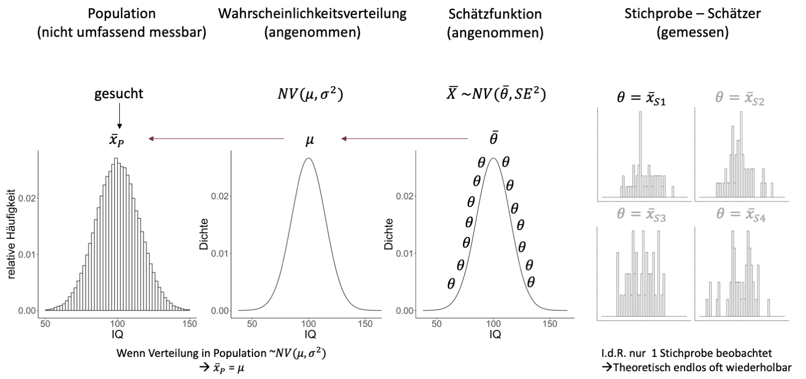
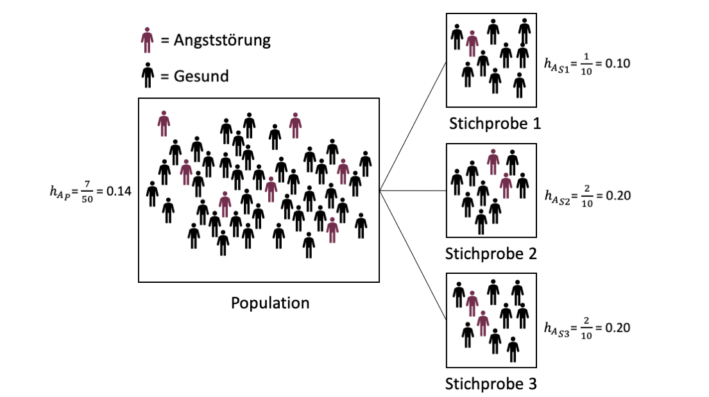
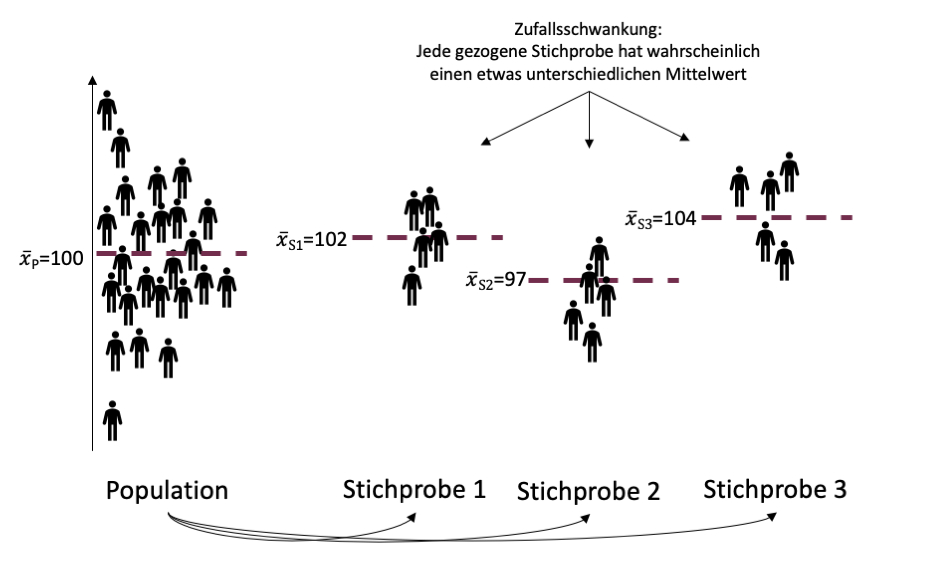

```{r setup, include=FALSE}
options(htmltools.dir.version = FALSE)

library(tidyverse)
library(kableExtra)
library(ggplot2)
library(plotly)
library(htmlwidgets)
library(MASS)
library(ggpubr)
library(xaringanthemer)
library(xaringanExtra)

style_duo_accent(
  primary_color = "#621C37",
  secondary_color = "#EE0071",
  background_image = "blank.png"
)

xaringanExtra::use_xaringan_extra(c("tile_view"))

use_scribble(
  pen_color = "#EE0071",
  pen_size = 4
)

knitr::opts_chunk$set(
  fig.retina = TRUE,
  warning = FALSE,
  message = FALSE
)
```

name: Title slide
class: middle, left
<br><br><br><br><br><br><br>
# Statistik I
***
### Einheit 6: Schätzungen und Stichprobenfehler
##### `r format(as.Date(data.frame(readxl::read_excel("Modul Quantitative Methoden I_Termine.xlsx"))$Datum), "%d.%m.%Y")[6]` | Prof. Dr. Stephan Goerigk

---
class: top, left
### Schätzungen und Stichprobenfehler

#### Wiederholung:

**Inferenzstatistik: **

* Umfasst alle statistischen Verfahren, die es erlauben, trotz der Informationsunvollständigkeit der Stichprobendaten Aussagen über eine Population zu treffen.

**Population: **

* Gesamtheit aller Merkmalsträger:innen, auf die eine Untersuchungsfrage gerichtet ist.

**Stichprobe: **

* Auswahl bestimmter Merkmalsträger:innen aus einer Population

---
class: top, left
### Schätzungen und Stichprobenfehler

#### Wiederholung:

**Problem:**

* Wenn nur ein Teil der Grundgesamtheit erfasst wird, z.B. 100 Personen, ist die **Informationslage** in Bezug auf die Untersuchungsfrage **unvollständig**. Wir können nicht einfach deskriptiv-statistische Methoden verwenden.

* Wie kann man trotzdem Aussagen treffen, die sich auf alle Personen der Grundgesamtheit beziehen, obwohl nur die Daten einer Stichprobe vorliegen?

***

**Idee:**

* Wir ziehen die Personen zufällig aus der Population in die Stichprobe.

* Wir greifen auf mathematische Methoden zur Formalisierung von Zufallsprozessen zurück $\rightarrow$ Wahrscheinlichkeitstheorie

* Aus diesen ergeben sich Methoden, die Rückschlüsse von der Stichprobe auf die Population erlauben $\rightarrow$ Inferenzstatistik

---
class: top, left
### Schätzungen und Stichprobenfehler

#### Logik des Schließens von Stichprobe auf Population (Einzelschritte folgen)

.center[
```{r eval = TRUE, echo = F, out.width = "900px"}

```
]

---
class: top, left
### Schätzungen und Stichprobenfehler

#### Einfache Zufallsstichprobe:

**Jetzt:** Zufällige Ziehung von n Personen aus einer Population von $N$ Personen (mit „Zurücklegen“).

* $n$ wird hierbei Stichprobenumfang genannt.

* Dieser Vorgang ist ein Zufallsexperiment:
  * Wir wissen im Voraus nicht, welche Personen gezogen werden
  * Die Ergebnismenge $Ω$ ist die Menge aller möglichen Stichproben mit $n$ Personen.

* Wir setzen voraus, dass jede Person in der Population bei jeder der $n$ Ziehungen die gleiche Wahrscheinlichkeit hat, in die Stichprobe gezogen zu werden.

* Wir setzen zudem voraus, dass die $n$ Personen unabhängig voneinander gezogen werden.
* Zufallsstichproben mit diesen beiden Eigenschaften nennt man einfache Zufallsstichproben.

---
class: top, left
### Schätzungen und Stichprobenfehler

#### Einfache Zufallsstichprobe - Probleme:

Leider werden in der Praxis oft keine einfachen Zufallsstichproben gezogen. Häufig auftretende Probleme:

**1. Fehlende Repräsentativität:**
<small>
* Eine bestimmte Teilgruppe von Personen in der Population hat eine höhere
Wahrscheinlichkeit, in die Stichprobe gezogen zu werden als andere Personen.
* Beispiel: Nur Personen die Psychologie studieren haben eine echt positive
Wahrscheinlichkeit gezogen werden.
* Folge: Die interessierende Maßzahl in der Population entspricht nicht mehr dem
Parameter der jeweiligen Wahrscheinlichkeitsverteilung. Inferenzstatistische Verfahren, die hierauf aufbauen, sind verzerrt.

</small>

**2. Abhängigkeit der Ziehungen:**
<small>
* Die Ziehungen der Personen sind nicht unabhängig voneinander.
* Beispiel: sog. geschachtelte Stichproben: Zufälliges Ziehen einer Schule, dann zufälliges Ziehen von Personen aus dieser Schule.
* Folge: Die Zufallsvariablen sind nicht unabhängig, Inferenzstatistische Verfahren die hierauf aufbauen, sind verzerrt.
* Falls die Art der Abhängigkeit bekannt ist, kann dies mithilfe statistischer Methoden (hierarchische Modellierung) ausgeglichen werden.

</small>

---
class: top, left
### Schätzungen und Stichprobenfehler

#### Zusammenfassung:

* Wenn wir herausfinden wollen, was der mittlere IQ in der Population ist, müssen wir lediglich herausfinden, welchen Wert der Parameter $𝜇$ hat.

* Wenn wir herausfinden wollen, was die empirische Varianz des IQs in der Population ist, müssen wir lediglich herausfinden, welchen Wert der Parameter $𝜎^2$ hat.

* Auch in diesem Fall können wir also das Problem der Bestimmung von deskriptivstatistischen Maßzahlen in der Population $(\bar{x}_{IQ}$ und $s^2_{empIQ})$ komplett in die
Wahrscheinlichkeitstheorie verlagern und somit alle Mittel verwenden, die uns diese zur Verfügung stellt.

$\rightarrow$ Um (nicht in Gänze messbare) Populationen zu beschreiben, reicht es die zentralen Parameter einer Wahrscheinlichkeitsverteilung zu kennen (solange die Variablen sich ihren Annahmen entsprechend verteilen).

**FRAGE:** Wie kommen wir an die Werte $𝜇$ und $𝜎^2$?

**ANTWORT:** Wir schätzen sie auf Basis der Stichprobe (Inferenzstatistik)!

---
class: top, left
### Schätzungen und Stichprobenfehler

#### Inferenzstatistik:

* Wir haben gesehen, dass sich Aussagen über Populationen im Fall von einfachen Zufallsstichproben auf Aussagen über Parameter von Wahrscheinlichkeitsverteilungen reduzieren lassen.

* **Aber:** Dies hat das Problem des Rückschlusses von Stichproben auf Populationen erst einmal nur in die Wahrscheinlichkeitstheorie verlagert.

* Es ist immer noch unklar, wie man von Stichproben zu Aussagen über Parameter von Wahrscheinlichkeitsverteilungen gelangt.

* Dies ist Gegenstand der Inferenzstatistik.

---
class: top, left
### Schätzungen und Stichprobenfehler

#### Inferenzstatistik:

Je nach Fragestellung, d.h. je nach Art der Aussage, die über einen Parameter getroffen werden soll, lassen sich inferenzstatistische Methoden zwei Gebieten zuordnen:

<small>

**1. Parameterschätzung:**
  * Fragestellung: Welchen konkreten Wert hat ein Parameter?
  * Beispiele:
    * Welchen Wert hat $𝜋$?
    * Welche Werte haben $𝜇$ und $𝜎^2$?
  * Resultate von Parameterschätzungen sind konkrete Zahlen oder Intervalle.
  
**2. Statistische Hypothesentests:**
  * Fragestellung: Entspricht ein Parameter einem vorgegebenen Wert oder liegt er in einem vorgegebenen Bereich?
  * Beispiele:
    * Ist $𝜋=0.5$?
    * Ist $𝜇= 100$?
    * Ist $𝜎^2>10$?
  * Das Resultat eines statistischen Hypothesentests ist eine Ja/Nein-Antwort.

</small>

---
class: top, left
### Schätzungen und Stichprobenfehler

#### Parameterschätzung:

Ziel der Parameterschätzung: Auf der Basis einer einfachen Zufallsstichprobe eine Aussage darüber treffen, welchen konkreten Wert ein Parameter hat.

Man unterscheidet in der Parameterschätzung zwischen

**1. Punktschätzung:**
  * Ergebnis einer Punktschätzung ist eine konkrete Zahl.
  * Beispiel: Wir gehen auf Basis unserer Stichprobe davon aus, dass der Parameter $𝜋$ gleich 0.45 ist.

**2. Intervallschätzung**
  * Ergebnis einer Intervallschätzung ist ein Intervall von Zahlen.
  * Beispiel: Wir gehen auf Basis unserer Stichprobe davon aus, dass der Parameter $𝜇$ im Bereich zwischen 101 und 108 liegt.

---
class: top, left
### Schätzungen und Stichprobenfehler

#### Parameterschätzung:

* Zur Erinnerung (sehr wichtig!): Aussagen über Parameter sind im Fall von einfachen Zufallsstichproben gleichbedeutend mit Aussagen über die uns eigentlich interessierenden deskriptivstatistischen Maßzahlen in der Population:

**Punktschätzung:**

* „Wir gehen auf Basis unserer Stichprobe davon aus, dass der Parameter $𝜋$ gleich 0.45 ist.“ ist gleichbedeutend mit „Wir gehen auf Basis unserer Stichprobe davon aus, dass die relative Häufigkeit der uns interessierenden Messwertausprägung in der Population gleich 0.45 ist.“

**Intervallschätzung**

* „Wir gehen auf Basis unserer Stichprobe davon aus, dass der Parameter $𝜇$ im Bereich zwischen 101 und 108 liegt.“ ist gleichbedeutend mit „Wir gehen auf Basis unserer Stichprobe davon aus, dass der Mittelwert der uns interessierenden stetigen Variable in der Population im Bereich zwischen 101 und 108 liegt.“

---
class: top, left
### Schätzungen und Stichprobenfehler

#### Schätzwerte:

Wir interessieren uns für eine deskriptivstatistische Maßzahl in einer Population. 

* Beispiel 1 (diskret):
  * die relative Häufigkeit $h_{A}$ der Angststörung in der Population
* Beispiel 2 (stetig):
  * den Mittelwert $\bar{x}_{IQ}$ des IQs in der Population
  * die empirische Varianz $s^2_{empIQ}$ des IQs in der Population 
  
* Wir ziehen eine einfache Zufallsstichprobe und betrachten die  Zufallsvariablen $𝑋_{1}, 𝑋_{2}, ..., 𝑋_{n}$ mit ihren Realisationen $x_{1}, x_{2}, ..., x_{n}$ (dies sind die Messwerte der Personen in der Stichprobe).

* Diese ZVs weisen eine Wahrscheinlichkeitsverteilung auf, deren Parameter jeweils den uns interessierenden deskriptivstatistischen Maßzahlen in der Population entsprechen:
  * Beispiel 1: $𝜋 = h_{A}$
  * Beispiel 2: $𝜇=\bar{x}_{IQ}$ und $𝜎^2=s^2_{empIQ}$

---
class: top, left
### Schätzungen und Stichprobenfehler

#### Schätzwerte:

* Wir wollen auf Basis der Realisationen der ZVs für jeden Parameter jeweils einen Schätzwert bestimmen

* Schätzwert = Wert, von dem wir auf der Basis unserer Stichprobe davon ausgehen, dass er „möglichst nahe“ an dem wahren Parameterwert bzw. dem wahren Wert der Maßzahl in der Population liegt.

**Naheliegende Idee:** 

* Wir verwenden als Schätzwert einfach zunächst die entsprechende deskriptivstatistische Maßzahl in der Stichprobe.

* Ob diese Schätzungen unseren qualitativen Ansprüchen genügen, muss sich aber noch herausstellen.

---
class: top, left
### Schätzungen und Stichprobenfehler

#### Schätzwerte:

.pull-left[
.center[
```{r echo=FALSE, out.width="450px", out.height="450px"}

df <- data.frame(PF = rnorm(100000, mean = 100, sd = 15))
ggplot(df, aes(x = PF)) + 
    # geom_histogram(aes(y =..density..),
    #                breaks = seq(50, 150, by = 2), 
    #                colour = "black", 
    #                fill = "white", bins = 100) +
  ggtitle("Wahrscheinlichkeitsfunktion \n (N~μ=?, σ=?)") +
  scale_x_continuous(breaks = 100, labels = c("μ = ?")) +
  stat_function(fun = dnorm, args = list(mean = mean(df$PF), sd = sd(df$PF))) +
  labs(x = "IQ", y = "relative Häufigkeit") +
   theme_classic() +
  theme(text = element_text(size = 25))
```
]
]

.pull-right[
.center[
```{r echo=FALSE, out.width="450px", out.height="450px"}

df <- data.frame(PF = rnorm(300, mean = 100, sd = 15))
ggplot(df, aes(x = PF)) + 
    geom_histogram(aes(y =..density..),
                   breaks = seq(50, 150, by = 2), 
                   colour = "black", 
                   fill = "white", bins = 100) +
  ggtitle("Werteverteilung in der  \nStichprobe") +
  geom_vline(xintercept = 100, colour = "red", linetype = "dashed") +
  scale_x_continuous( breaks = seq(50, 150, by = 50), labels = c("50", "x̄ = 100", "150")) +
  #stat_function(fun = dnorm, args = list(mean = mean(df$PF), sd = sd(df$PF))) +
  labs(x = "IQ", y = "relative Häufigkeit") +
   theme_classic() +
  theme(text = element_text(size = 25))
```
]
]

---
class: top, left
### Schätzungen und Stichprobenfehler

#### Schätzwerte:

Als naheliegender Schätzwert für $𝜋$ die relative Häufigkeit der Angststörung in der Stichprobe:

$$h_{A}=\frac{H_{A}}{n}$$

Als naheliegender Schätzwert für $𝜇$ den Mittelwert des IQs in der Stichprobe:

$$\bar{x}=\frac{\sum\limits _{i=1}^{n}x_{i}}{n}$$

Als naheliegender Schätzwert für $𝜎^2$ die empirische Varianz des IQs in der Stichprobe:

$$s^2=\frac{\sum\limits _{i=1}^{n}(x_{i}-\bar{x})^2}{n}$$
---
class: top, left
### Schätzungen und Stichprobenfehler

#### Schätzwerte:

* Wie können wir feststellen, ob diese Schätzwerte jeweils nahe an den wahren Parametern liegen?

* Antwort: Für eine einzelne Stichprobe können wir dies leider nicht.

* Um zu bestimmen, wie weit ein einzelner Schätzwert vom wahren Parameterwert entfernt ist, müssten wir ja den wahren Parameterwert schon kennen.

* Aber: Da die Ziehung der einfachen Zufallsstichprobe ein Zufallsexperiment ist, können wir uns anschauen, wie sich die Schätzwerte verhalten würden, falls wir wiederholt eine solche einfache Zufallsstichprobe ziehen und die Schätzwerte berechnen würden.

* Wir können auf diese Art und Weise herausfinden, wie gut unsere Schätzungen „im Durchschnitt“ sind.

---
class: top, left
### Schätzungen und Stichprobenfehler

#### Schätzwerte:

* Jedes Mal, wenn wir eine einfache Zufallsstichprobe der Größe $n$ aus der Population ziehen, gelangen andere Personen in unsere Stichprobe.

* Daher ergeben sich auch jedes Mal andere Realisationen $x_{1}, x_{2}, ..., x_{n}$ der Zufallsvariablen $𝑋_{1}, 𝑋_{2}, ..., 𝑋_{n}$ und daher auch andere Schätzwerte.

* Die Schätzwerte unterliegen also Zufallsschwankungen.

---
class: top, left
### Schätzungen und Stichprobenfehler

#### Schätzwerte:

**Zufallsschwankungen im Schätzwert (Beispiel 1 - Angsststörungen)**

.center[
```{r eval = TRUE, echo = F, out.width = "750px"}

```
]

---
class: top, left
### Schätzungen und Stichprobenfehler

#### Schätzwerte:

**Zufallsschwankungen im Schätzwert (Beispiel 1 - Angsststörungen)**

.pull-left[
* Die relative Häufigkeit der Angsststörung in dieser Population wäre $h_A=\frac{7}{50}=0.14$

* Angenommen, wir würden uns für $h_A$ in dieser Population interessieren, könnten die Population aber nicht direkt untersuchen, sondern nur einfache Zufallsstichproben der Größe $n = 10$ ziehen.

* Zur Erinnerung: In diesem Fall ist $h_A=𝜋$
]

.pull-right[
.center[
```{r eval = TRUE, echo = F, out.width = "650px"}

```
]
]

---
class: top, left
### Schätzungen und Stichprobenfehler

#### Schätzwerte:

**Zufallsschwankungen im Schätzwert (Beispiel 1 - Angsststörungen)**

.pull-left[
Beispiele für mögliche zufällig gezogene Stichproben der Größe $n = 10$ und jeweils resultierender Schätzwert $h_S$:

* Stichprobe 1:
  * Messwerte: $x_{1}=0, x_{2}=0, x_{3}=1...$
  * Schätzwert: $h_S=0.2$

* Jedes Mal würde aufgrund der zufälligen Ziehung der Personen ein zufälliger anderer Schätzwert resultieren!
]

.pull-right[
.center[
```{r eval = TRUE, echo = F, out.width = "650px"}

```
]
]

---
class: top, left
### Schätzungen und Stichprobenfehler

#### Schätzwerte:

**Zufallsschwankungen im Schätzwert (Beispiel 2 - IQ)**

.center[
```{r eval = TRUE, echo = F, out.width = "750px"}

```
]

---
class: top, left
### Schätzungen und Stichprobenfehler

#### Schätzfunktionen:

* Das Ziehen einer einfachen Zufallsstichprobe ist ein Zufallsexperiment.

* Das Ergebnis dieses Zufallsexperiments ist eine Stichprobe von $n$ Personen.

* Ein Schätzwert ist eine konkrete Zahl und kann für jede dieser Stichproben aus den Realisationen $x_{1}, x_{2}, ..., x_{n}$ der Zufallsvariablen $𝑋_{1}, 𝑋_{2}, ..., 𝑋_{n}$ berechnet werden.

* Wir können also eine Zufallsvariable definieren, die jedem möglichen Ergebnis des Zufallsexperiments – also jeder möglichen Stichprobe - den aus ihr berechneten Schätzwert zuweist.

* Eine solche Zufallsvariable heißt **Schätzfunktion**.

* Der konkrete **Schätzwert** ist dann die **Realisation dieser Schätzfunktion**.

---
class: top, left
### Schätzungen und Stichprobenfehler

#### Schätzfunktionen:

**Beispiel:**

Die zu dem Schätzwert

$$\bar{x}=\frac{\sum\limits _{i=1}^{n}x_{i}}{n}$$

gehörige Schätzfunktion für den Parameter $𝜇$ ist die Zufallsvariable

$$\bar{X}=\frac{\sum\limits _{i=1}^{n}X_{i}}{n}$$

Der konkrete Schätzwert $\bar{x}$ ist eine Realisation der Schätzfunktion $\bar{X}$.

---
class: top, left
### Schätzungen und Stichprobenfehler

#### Schätzfunktionen:

* Schätzwerte sind Funktionen der Realisationen $x_{i}$ der Zufallsvariablen $X_{i}$

* Schätzfunktionen sind Funktionen der Zufallsvariablen $X_{i}$ selbst

VORSICHT:

* Schätzfunktionen sind Zufallsvariablen, die allein dadurch zu Schätzfunktionen für einen Parameter werden, dass man sie zur Schätzung für diesen Parameter verwendet. Das heißt aber natürlich nicht, dass es sich dann automatisch um gute Schätzfunktionen für diesen Parameter handelt.

Wir werden in der Inferenzstatistik noch sehr häufig der folgenden Situation begegnen:
* Wir interessieren uns für einen Parameter einer Wahrscheinlichkeitsverteilung.
* Für diesen Parameter bestimmen wir eine Schätzfunktion.
* Wir ziehen eine einfache Zufallsstichprobe, in der sich die Schätzfunktion in einem konkreten Schätzwert für den Parameter realisiert.

---
class: top, left
### Schätzungen und Stichprobenfehler

#### Gütekriterien einer Schätzfunktion:

* Im Folgenden sei $𝜃$ ein beliebiger Parameter einer beliebigen Wahrscheinlichkeitsverteilung und $\hat{𝜃}$ eine Schätzfunktion für diesen Parameter.

* Wir können uns damit nun erst mal unabhängig von einer konkreten Funktion oder eines Parameters überlegen, was gegeben sein sollte, damit wir  $\hat{𝜃}$ als Schätzfunktion $𝜃$ verwenden.

Wir betrachten dafür folgende drei **Gütekriterien**:
  * Erwartungstreue (und Genauigkeit)
  * Effizienz
  * Konsistenz

---
class: top, left
### Schätzungen und Stichprobenfehler

#### Gütekriterien einer Schätzfunktion:

**Erwartungstreue:**

Je nachdem, welche konkrete Stichprobe zufällig gezogen wird, resultieren unterschiedliche Schätzwerte.

* Ein in einer konkreten Stichprobe berechneter Schätzwert wird daher in den seltensten Fällen genau dem wahren Parameterwert entsprechen.

* Wir können jedoch fordern, dass die Schätzwerte bei unendlicher Wiederholung des Zufallsexperiments - d.h. falls wir unendlich viele einfache Zufallsstichproben der Größe $n$ ziehen würden - zumindest im Mittel dem wahren Parameterwert entsprechen sollten. Dieses Kriterium wird **Erwartungstreue** genannt.

* Da die Schätzwerte Realisationen der Schätzfunktion sind, und der Mittelwert unendlich vieler Realisationen einer Zufallsvariable deren Erwartungswert ist, ergibt sich:

* Eine Schätzfunktion $\hat{𝜃}$ für einen Parameter $𝜃$ ist erwartungstreu, falls gilt:

$$E(\hat{𝜃})= 𝜃$$
---
class: top, left
### Schätzungen und Stichprobenfehler

#### Gütekriterien einer Schätzfunktion:

**Genauigkeit:**

* Wenn $E(\hat{𝜃})= 𝜃$ ist die Anforderung an eine Schätzfunktion, dass sie zu möglichst „präzisen“ oder „genauen“ Schätzungen führen sollte.

* Bei einer Schätzfunktion mit hoher „Genauigkeit“ würden wir erwarten, dass ihre Realisationen – die Schätzwerte - bei wiederholter Ziehung der Stichprobe nur in geringerem Ausmaß um den wahren Parameterwert streuen.

* In diesem Fall liefern nämlich viele der möglichen zufälligen Stichproben einen Schätzwert, der nahe an dem wahren Parameterwert liegt.

---
class: top, left
### Schätzungen und Stichprobenfehler

#### Gütekriterien einer Schätzfunktion:

**Genauigkeit:**

* Als Maß für die Genauigkeit einer Schätzfunktion kommen also prinzipiell alle Streuungsmaße für Zufallsvariablen infrage.

* Meistens wird die Standardabweichung $SD(\hat{𝜃})$ der Schätzfunktion $\hat{𝜃}$ betrachtet.
* Diese wird im Fall einer Schätzfunktion $\hat{𝜃}$ Standardfehler $SE(\hat{𝜃})$ von $\hat{𝜃}$ genannt:

$$SE(\hat{𝜃}) = SD(\hat{𝜃})$$

* Je geringer der Standardfehler, desto weniger streuen die Schätzwerte und desto genauer ist die Schätzfunktion (Erwartungstreue vorausgesetzt).

* Bemerkung: SE kommt von **S**tandard **E**rror, der englischen Bezeichnung für den Standardfehler.

---
class: top, left
### Schätzungen und Stichprobenfehler

#### Gütekriterien einer Schätzfunktion:

**Genauigkeit - Beispiel Standardfehler:**

* Der wahre Wert des Parameters sei $𝜃$ = 10

* Beispiel für die Schätzwerte, die aus einer erwartungstreuen Schätzfunktion $\hat{𝜃}$ für $𝜃$ mit **niedrigem** Standardfehler $SE(\hat{𝜃})$ resultieren könnten:

* Zufällige Stichprobe 1: $\hat{𝜃}_{Wert}$ = 10.3
* Zufällige Stichprobe 2: $\hat{𝜃}_{Wert}$ = 9.8
* Zufällige Stichprobe 3: $\hat{𝜃}_{Wert}$ = 10.1
* usw.

$\rightarrow$ Geringe Streuung der Schätzwerte $\rightarrow$ die meisten Schätzwerte liegen nahe um den wahren Wert $𝜃 = 10$.

---
class: top, left
### Schätzungen und Stichprobenfehler

#### Gütekriterien einer Schätzfunktion:

**Genauigkeit - Beispiel Standardfehler:**

<small>

* Der wahre Wert des Parameters sei $𝜃$ = 10

* Beispiel für die Schätzwerte, die aus einer erwartungstreuen Schätzfunktion $\hat{𝜃}$ für $𝜃$ mit **hohem** Standardfehler $SE(\hat{𝜃})$ resultieren könnten:

* Zufällige Stichprobe 1: $\hat{𝜃}_{Wert}$ = 52.3
* Zufällige Stichprobe 2: $\hat{𝜃}_{Wert}$ = -31.8
* Zufällige Stichprobe 3: $\hat{𝜃}_{Wert}$ = 25.1
* usw.

$\rightarrow$ Starke Streuung der Schätzwerte $\rightarrow$ die meisten Schätzwerte liegen fern vom wahren Wert $𝜃 = 10$.

* Da die Schätzfunktion erwartungstreu ist, ist der Mittelwert der Schätzwerte unendlich vieler Stichproben immer noch gleich dem wahren Wert.

*  Dies hilft uns jedoch nicht wirklich, da wir in der Realität nur eine Stichprobe und daher nur einen Schätzwert $\hat{𝜃}_{Wert}$ haben. Dieser kann sehr weit weg vom wahren Parameterwert liegen.

</small>

---
class: top, left
### Schätzungen und Stichprobenfehler

#### Gütekriterien einer Schätzfunktion:

**Effizienz:**

Nach diesen Vorüberlegungen können wir nun das Gütekriterium der Effizienz formulieren:

* Eine Schätzfunktion ist effizient, falls sie erwartungstreu ist und einen geringeren Standardfehler als alle anderen erwartungstreuen Schätzfunktionen aufweist.

* Eine effiziente Schätzfunktion ist also die „präziseste“ Schätzfunktion unter allen erwartungstreuen Schätzfunktionen.

---
class: top, left
### Schätzungen und Stichprobenfehler

#### Gütekriterien einer Schätzfunktion:

**Konsistenz:**

* Eine weitere wünschenswerte Eigenschaft von Schätzfunktionen ist, dass sie mit wachsendem Stichprobenumfang n immer „präziser“ werden.

* Das heißt: mit wachsendem Stichprobenumfang $n$ sollte der Standardfehler der Schätzfunktion immer kleiner werden und schließlich gegen Null gehen.

* Formal: Eine erwartungstreue Schätzfunktion $\hat{𝜃}$ für einen Parameter $𝜃$ ist konsistent, falls gilt:

$$\lim_{x \to \infty} SE(\hat{𝜃}) = 0]$$
---
class: top, left
### Schätzungen und Stichprobenfehler

#### Nutzen von Wahrscheinlichkeitsverteilungen zur Quantifizierung des Stichprobenfehlers:

Inferenzstatistik verwendet Stichprobenkennwerte (z.B. Stichprobenmittelwert, Stichprobenvarianz oder auch den Quotient zweier Stichprobenvarianzen) als Schätzfunktionen für die entsprechenden Populationsparameter.

* Zieht man immer wieder voneinander unabhängige Zufallsstichproben und berechnet die Kennwerte, werden die einzelnen Kennwerte aufgrund der zufälligen Zusammensetzung der Stichproben nicht ident sein 

* Sie streuen zufällig um den Erwartungswert. 

* Die Kennwerte einzelner Zufallsstichproben sind Realisierungen von Zufallsvariablen.

* Kenntnis der Verteilung dieser ZV (= Stichprobenverteilung) ist Grundlage für Inferenzstatistik, z.B. von Hypothesentests, Vertrauensbereichen für Schätzwerte.

---
class: top, left
### Schätzungen und Stichprobenfehler

#### Nutzen von Wahrscheinlichkeitsverteilungen zur Quantifizierung des Stichprobenfehlers:

.center[
```{r eval = TRUE, echo = F, out.width = "950px"}
knitr::include_graphics("bilder/ki1.png")
```
]

---
class: top, left
### Schätzungen und Stichprobenfehler

#### Nutzen von Wahrscheinlichkeitsverteilungen zur Quantifizierung des Stichprobenfehlers:

* Ziel: Quantifizieren wie gut der Stichprobenkenwert (z.B. Mittelwert) als Schätzer für die Population ist

* Anders gesagt: Wie **wahrscheinlich** ist das Ergebnis der Schätzfunktion relativ zu allen möglichen Ergebnissen

* Vorteil Wahrscheinlichkeitsfunktionen: Werte sind tabelliert und können abgelesen werden.


---
class: top, left
### Schätzungen und Stichprobenfehler

#### Konfidenzintervall

<small>

* Wir interessieren und für einen unbekannten wahren Parameter $θ$, der die Verteilung einer Zufallsvariable charakterisiert

* $θ$ wird durch eine Schätzfunktion $\hat{𝜃}$ aus einer (repräsentativen) Stichprobe mit Umfang $n$ geschätzt

* Es wird davon ausgegangen, dass die Stichprobe in etwa die Grundgesamtheit widerspiegelt, und dass deshalb die Schätzung in der Nähe des wahren Parameters liegen müsste

* Die Schätzfunktion ist selbst eine Zufallsvariable mit einer Verteilung, die den Parameter $θ$ enthält

* Bei der Schätzung von Parametern geht es nicht nur darum, Schätzfunktionen zu finden und deren Eigenschaften (Erwartungstreue, Konsistenz, etc.) abzuklären
* Man möchte auch Intervalle angeben, in welchen $θ$ mit einer gewissen Sicherheit liegt

* Es sei $α$ eine vorgegebene Irrtumswahrscheinlichkeit, und a bzw. b reelle Zahlen, mit a ≤ b. Die Schätzung des Bereiches $a ≤ θ ≤ b$ mit der Vertrauenswahrscheinlichkeit $(1 − α)$ nennen wir Konfidenzintervall des Parameters θ mit Irrtumswahrscheinlichkeit α

* $\hat{𝜃}$ Punktschätzung von $θ$, im Vergleich zur Intervallschätzung

</small>

---
class: top, left
### Schätzungen und Stichprobenfehler

#### Konfidenzintervall

* Wir konstruieren ein symmetrisches Konfidenzintervall auf Grundlage einer Schätzfunktionen $\hat{𝜃}$

* Von besonderem Interesse ist die Breite des Konfidenzintervalls. Diese bestimmt sich durch $SE(\hat{𝜃})$

* Erwünscht ist ein schmales Konfidenzintervall, denn dies weist auf eine genaue Schätzung hin

Wir werden folgende Konfidenzintervall rechnen lernen:

* Konfidenzintervall für den Erwartungswert $μ$ einer $N(μ,σ^2)$ Variable bei bekannter Varianz $σ^2$
* Konfidenzintervall für den Erwartungswert $μ$ einer $N(μ,σ^2)$ Variable bei unbekannter Varianz $σ^2$

---
class: top, left
### Schätzungen und Stichprobenfehler

#### KI für $μ$ einer $N(μ,σ^2)$ Variable bei bekannter $σ^2$

* Die Normalverteilung ist eine reproduzierende Verteilung

1.  Wir ziehen unabhängige Zufallsstichproben vom Umfang $n$ und berechnen in jeder Teilstichprobe den Mittelwert

2. Die Mittelwerte $\bar{x}_n$ aller Zufallsstichproben erzeugen eine Variable $\bar{X}=\frac{1}{n}(X_{1}+X_{2}+...+X_{n})$

3. $\bar{X}$ ist abgesehen von der multiplikativen Konstante $\frac{1}{n}$ eine Summe normalverteilter Variablen, und es gilt

$$\bar{X}~N(μ,\frac{σ^2}{n})$$

* Wenn $X$ normalverteilt ist, hat $\bar{X}$ wiederum Normalverteilung mit dem selben Erwartungswert, aber wesentlich kleinerer Varianz $\frac{σ^2}{n}$

* Durch ziehen der Wurzel aus der Varianz erhalten wir auch den Standardfehler $SE=\frac{σ}{\sqrt{n}}$

---
class: top, left
### Schätzungen und Stichprobenfehler

#### KI für $μ$ einer $N(μ,σ^2)$ Variable bei bekannter $σ^2$

* Wir verwenden die Verteilung von $\bar{X}$ um ein KI für $μ$ aufzustellen

* Standardisieren der normalverteilten Variable $\bar{X}$

$$Z=\frac{\bar{X}-μ}{\frac{σ}{\sqrt{n}}}$$

* Es gilt für $(1−α)$% aller Stichproben mit Umfang $n$

$$|\bar{x} - μ| \leq z_{1-\frac{α}{2}}\frac{σ}{\sqrt{n}}$$
* Durch Umstellen ergibt sich die Formel für die obere (+) und untere (-) Grenze des Konfidenzintervalls:

$$μ_{1,2}=\bar{x} \pm z_{1-\frac{α}{2}}\frac{σ}{\sqrt{n}}$$
---
class: top, left
### Schätzungen und Stichprobenfehler

#### KI für $μ$ einer $N(μ,σ^2)$ Variable bei bekannter $σ^2$

**Interpretation des KIs:**

* Die Breite des KI hängt von 3 Faktoren ab: 
  * von der Streuung der Variable $X$ bzw. $σ$
  * von $n$ 
  * von der Irrtumswahrscheinlichkeit $α$ (i.d.R. wählen wir $α=.05$)

Was passiert wenn...
* Je kleiner $σ$, desto enger das KI (geringere Schwankung $\rightarrow$ mehr Konfidenz)
* Je größer $n$, desto enger das KI (größere Stichprobe $\rightarrow$ mehr Konfidenz)
* Je kleiner α, desto breiter das KI (strengere Irrtumswarhscheinlichkeit $\rightarrow$ mehr Konfidenz)

---
class: top, left
### Schätzungen und Stichprobenfehler

#### KI für $μ$ einer $N(μ,σ^2)$ Variable bei bekannter $σ^2$

**Beispiel:**

<small>

* Eine Stichprobe von $n = 234$ 14-jährigen Schüler:innen wurde mit einem Intelligenztest, der für 14-18 jährige Jugendliche normiert wurde, getestet.

* In der Gesamtpopulation aller Jugendlichen wurde der Test so geeicht, dass die Messwerte normalverteilt mit $μ = 100$ und $σ = 15$ sind (das entspricht dem Standardmaß des IQ). $\rightarrow$ Varianz ist bekannt!

* Der Mittelwert der 14-jährigen, der in der Stichprobe gemessen wird, ist $\bar{x}=98.10$

$$μ_{1,2}=\bar{x} \pm z_{1-\frac{α}{2}}\frac{σ}{\sqrt{n}}$$

* Der z-Wert für $1-\frac{α}{2} = 1-\frac{.05}{2}=1.96$ muss in der z-Tabelle nachgesehen werden. $α$ wird halbiert, da sich die 5% Fehler auf die untere und obere Grenze des KIs aufteilen.

$$μ_{1,2}=98.10 \pm 1.96\frac{15}{\sqrt{234}}= 98.10 \pm 1.92$$

* $μ_{14}$ liegt mit einer Vertrauenswahrscheinlichkeit von .95 im Konfidenzintervall [96.18, 100.02].

</small>

---
class: top, left
### Schätzungen und Stichprobenfehler

#### KI für $μ$ einer $N(μ,σ^2)$ Variable bei unbekannter $σ^2$

* Unbekannte Varianz $σ^2$ wird aus den vorliegenden Daten geschätzt

$$\hat{\sigma}^2=s^2=\frac{\sum\limits _{i=1}^{n}(x_{i}-\bar{x})^2}{n-1}$$

Anstelle der Standardnormalverteilung...

$$Z=\frac{\bar{X}-μ}{\frac{σ}{\sqrt{n}}} \sim N(0,1)$$ 
...nutzen wir eine leicht abgewandelte Verteilung (T-Verteilung). Die T-Werte berechnen sich analog:

$$T=\frac{\bar{X}-μ}{\frac{\hat{σ}}{\sqrt{n}}} \sim t_{n-1}$$  

---
class: top, left
### Schätzungen und Stichprobenfehler

#### Exkurs t-Verteilung

* Ist Populationsvarianz jedoch nicht bekannt und muss geschätzt werden, dann ist der Quotient nicht standardnormalverteilt sondern t-verteilt

* Die t-Verteilung ist wie die NV eingipfelig und symmetrisch (schauen sich sehr ähnlich)

* Die Form der t-Verteilung ist mitbestimmt durch sog. Freiheitsgrade (df = degrees of freedom). Diese sind leicht zu berechnen:

$$df=n-1$$

* $E(T)=0$ (für $df\geq2$), und Varianz $n/(n−2)$ (für $df\geq3$)

* Mit wachsender Zahl der Freiheitsgrade (also größerem $n$) nähert sich die t-Verteilung der $N(0,1)$ (sie "approximiert die NV")

* Die Quantile der t-Verteilung können bei gegebenem $\alpha$ und $df$ aus der t-Tabelle abgelesen werden ([**Link zur t-Tabelle**](http://eswf.uni-koeln.de/glossar/tvert.htm))

---
class: top, left
### Schätzungen und Stichprobenfehler

#### KI für $μ$ einer $N(μ,σ^2)$ Variable bei unbekannter $σ^2$

* Das KI für $μ$ ergibt sich also aus

$$\frac{|\bar{X}-μ|}{\frac{\hat{σ}}{\sqrt{n}}} \leq t_{n-1}, df=n-1$$ 
* Mit Irrtumswahrscheinlichkeit $α$ gilt

$$|\bar{x} - μ| \leq t_{1-\frac{α}{2}}\frac{\hat{σ}}{\sqrt{n}}, df=n-1$$
* Durch Umstellen ergibt sich die Formel für die obere (+) und untere (-) Grenze des Konfidenzintervalls:

$$μ_{1,2}=\bar{x} \pm t_{1-\frac{α}{2}}\frac{\hat{σ}}{\sqrt{n}}, df=n-1$$
---
class: top, left
### Schätzungen und Stichprobenfehler

#### Beispiel:

* Der Subtest "Rechenaufgaben" eines Intelligenztests wird einer Zufallsstichprobe von $n = 87$ Münchner Student:innen vorgegeben

* Gesucht ist das Konfidenzintervall für den Erwartungswert $μ$ der Population aller Münchner Student:innen

* In der Stichprobe wird eine Mittelwert von $\bar{x}=25.48$ und eine Standardabweichung von $s=6.12$ gemessen

$$μ_{1,2}=25.48 \pm t_{1-\frac{α}{2}}\frac{6.12}{\sqrt{87}}, df=86$$

* Tabelle enthält keine Eintragung für $df = 86$, aber nächtgelegener Wert ist $df = 60$; $t_{0.975} = 2.00$

$$μ_{1,2}=25.48 \pm 2.00\frac{6.12}{\sqrt{87}}, df=86$$
* $μ_{25.48}$ liegt mit einer  Vertrauenswahrscheinlichkeit von $.95$ im Konfidenzintervall [24.17, 26.79].

---
class: top, left
### Take-aways

.full-width[.content-box-gray[
**Einfache Zufallsstichprobe**
* $n$ Personen werden unabhängig voneinander gezogen
* Jede Person hat die gleiche Wahrscheinlichkeit gezogen zu werden
* Grundlage für Zufallsvariablen

**Schätzfunktionen sind Zufallsvariablen**
* für die wir Erwartungswert und Standardabweichung (Standardfehler) berechnen
können
* die erwartungstreu, effizient und konsistent sein sollten
* mit deren Hilfe wir Parameter (gesuchter Parameter einer Verteilung entspricht interessierender Größe in der Population) aus Stichprobendaten schätzen

**Konfidenzintervall**
* gibt ein Intervall an, in welchem Parameter zur Schätzung des Populationswerts mit einer vorgegebenen Wahrscheinlichkeit (i.d.R. 95%) liegen
]
]


