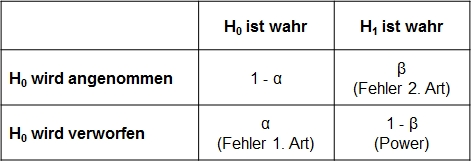
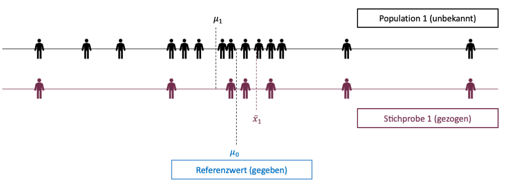

```{r setup, include=FALSE}
options(htmltools.dir.version = FALSE)

library(tidyverse)
library(kableExtra)
library(ggplot2)
library(plotly)
library(htmlwidgets)
library(MASS)
library(ggpubr)
library(xaringanthemer)
library(xaringanExtra)
library(gghighlight)

style_duo_accent(
  primary_color = "#621C37",
  secondary_color = "#EE0071",
  background_image = "blank.png"
)

xaringanExtra::use_xaringan_extra(c("tile_view"))

use_scribble(
  pen_color = "#EE0071",
  pen_size = 4
)

knitr::opts_chunk$set(
  fig.retina = TRUE,
  warning = FALSE,
  message = FALSE
)
```

name: Title slide
class: middle, left
<br><br><br><br><br><br><br>
# Statistik I
***
### Einheit 7: Hypothesen und Hypothesentests
##### `r format(as.Date(data.frame(readxl::read_excel("Modul Quantitative Methoden I_Termine.xlsx"))$Datum), "%d.%m.%Y")[7]` | Prof. Dr. Stephan Goerigk

---
class: top, left
### Hypothesen und Hypothesentests

#### Lernziele:

Sie lernen:

* Was ein Signifikanztest ist

* den Unterschied zwischen der Null- und der Alternativhypothese

* das Signifikanzniveau $\alpha$

* die Abgrenzung zwischen einem einseitigen und einem zweiseitigen Signifikanztest

---
class: top, left
### Hypothesen und Hypothesentests

#### Wiederholung:

**Inferenzstatistik: **

* Umfasst alle statistischen Verfahren, die es erlauben, trotz der Informationsunvollständigkeit der Stichprobendaten Aussagen über eine Population zu treffen.

* Wir wissen nun, dass wir einzelne Populationsparameter aus der Stichprobe schätzen können

ABER: 

* Das reine Schätzen eines Wertes ist noch keine wissenschaftliche Aussage

* Was für "Aussagen", die wir über die Population treffen, sind gemeint?

---
class: top, left
### Hypothesen und Hypothesentests

#### Hypothesen

* Statistisch zu prüfende Aussagen: Hypothesen (kennen wir bereits aus QM-1)

* Der Inhalt einer Hypothese muss quantifiziert werden, damit wir sie prüfen können

* Hypothese wird in eine prüfbare Gleichung (oder Ungleichung $\rightarrow$ größer-kleiner Verhältnisse) umgewandelt
  * inhaltlich: Männer sind im Durchschnitt größer als 173 cm
  * numerisch: $𝜇> 173$
  
* Die Entscheidung über die Gültigkeit der Hypothese erfolgt auf Basis unserer Wahrscheinlichkeitsverteilungen ("wie wahrscheinlich ist es, dass...")
  * "Wie wahrscheinlich ist es, dass unter Annahme, dass die Körpergröße normalverteilt ist, der erwartete Mittelwert der Männer größer ist als 173 cm."

* Trifft eine Hypothese zu spricht man oft vom Vorliegen eines **Effekts**


---
class: top, left
### Hypothesen und Hypothesentests

#### Hypothesentest - To-Do Liste

Zur erfolgreichen Durchführung eines Hypothesentests müssen folgende wichtige Schritte geschehen

1. Austellen von Nullhypothese und Alternativhypothese (Hypothesenpaar)

2. Bestimmung einer zugrundeliegenden Verteilung

3. Festlegung des Annahme- und Ablehnungsbereichs der Nullhypothese (kritischer Wert)

4. Beobachtungswert auf Wahrscheinlichkeitsverteilung abbilden
  * Binomialverteilung $\rightarrow$ Wahrscheinlichkeiten
  * z-Verteilung $\rightarrow$ Mittelwerte, wenn $\sigma$ in Population bekannt
  * t-Verteilung $\rightarrow$ Mittelwerte, wenn $\sigma$ in Population nicht bekannt
  * F-Verteilung $\rightarrow$ Varianzen
  * $\chi^2$-Verteilung $\rightarrow$ Häufigkeiten/Proportionen

5. Vergleich kritischer Wert und Teststatistik

6. Entscheidung: Test signifikant oder nicht signifikant

---
class: top, left
### Hypothesen und Hypothesentests

#### Hypothesen

Statistische Hypothese:

* Entscheidung basiert darauf, ob sich ein beobachteter Wert überzufällig stark von einem vorgegebenen Wert unterscheidet

* Das heißt einfach, dass man überprüft, ob die Abweichung des beobachteten Wertes vom hypothetisierten Wert zu groß ist, als dass sie noch zufällig sein kann.

* Um alle Wahrscheinlichkeiten für einen Ausgang des Hypothesentests abzudecken formuliert man ein Hypothesenpaar

  * $H_{0}$: Der hypothetisierte Effekt liegt nicht vor (Werte unterscheiden sich nicht)
  
  * $H_{1}$: Der hypothetisierte Effekt liegt vor (Werte unterscheiden sich)

---
class: top, left
### Hypothesen und Hypothesentests

#### Nullhypothese und Alternativhypothese

Nullhypothese $(H_{0})$:

* Gegenstück zur eigentlichen Untersuchungshypothese, der Alternativhypothese

* Die $H_{0}$ stellt meistens den aktuellen Zustand oder anders ausgedrückt den „Standard“ dar gegen den getestet wird 

Alternativhypothese $(H_{1})$: 

* Die Alternativhypothese beinhaltet oft die neue Annahme, den "Effekt". 

* Drückt eine "Unterschiedlichkeit" von einem Referenzwert aus

$\rightarrow$ Nur über das komplementäre Hypothesenpaar lässt sich eine komplementäre Gesamtwahrscheinlichkeit abdecken:

$$P_{H_{0}} + P_{H_{1}}=1$$


---
class: top, left
### Hypothesen und Hypothesentests

#### Signifikanzniveau

* Um das Ausmaß der Abweichung zu definieren, welches uns als strengen Wissennschaftler:innen ausreiichend "sicher" erscheint (kritischer Wert) legen wir eine **"Irrtumswahrscheinlichkeit"** fest

* Diese bezeichnet man als **Signifikanzniveau**  $\alpha$.

* Meistens wird $\alpha=.05$ gewählt (häufige Konvention aus der Wissenschaft)

* Das bedeutet, dass wir eine 5% Wahrscheinlichkeit erlauben unsere Hypothese fälschlicherweise anzunehmen

* Die 5% legen einen bestimmten Bereich auf der Wahrscheinlichkeitsverteilung fest (**Verwerfungsbereich**)
  * z-Verteilung
  * t-Verteilung
  * ...

---
class: top, left
### Hypothesen und Hypothesentests

#### Signifikanzniveau und Verwerfungsbereich

.pull-left[
.center[
```{r echo = F, out.width="400px"}
ggplot(data.frame(x = c(-4, 4)), aes(x)) +
    stat_function(fun = dnorm, geom = "area", fill = "steelblue", alpha = .3) +
    stat_function(fun = dnorm,geom = "area", fill = "steelblue", xlim = c(-4, qnorm(.05))) +
  labs(x = "", y = "") +
  annotate(geom = "text", x = -2.5, y = 0.05, label = "5%", size = 6) +
  ggtitle("Verwerfungsbereich:") +
   theme_classic() +
  theme(text = element_text(size = 25), axis.text.y = element_blank(), axis.ticks.y = element_blank())   
```
]
]

.pull-right[
* Die große Fläche der Verteilung entspricht der Annahme unserer $H_0$ 

* Der Erwartungswert ist 0 (kein Effekt $\rightarrow$ daher Null-Hypothese)

* Werte jenseits des "kritischen Werts" sind im **Verwerfungsbereich** der $H_0$ (dunkelblau).

* Diese sind unter Annahme der $H_0$ ausreichend unwahrscheinlich.

* Wir glauben nicht mehr an einen Zufall!

* Die $H_0$ wird verworfen.

]
---
class: top, left
### Hypothesen und Hypothesentests

#### p-Wert

* In Statistik-Softwareprodukten wird zusammen mit der Teststatistik eines statistischen Tests ein sogenannter **p-Wert** ausgegeben

* Der p-Wert gibt die **Wahrscheinlichkeit für den Fehler erster Art** an, also die Wahrscheinlichkeit, eine gültige $H_{0}$ zu verwerfen aufgrund der beobachteten Daten

* **Vorteil** des p-Wertes liegt darin, dass bei der Entscheidung keine Tabelle der Verteilung der Teststatistik benötigt wird

* Wird der zweiseitige p-Wert angegeben und die $H_{1}$ ist gerichtet, muss man den p-Wert **durch 2 dividieren** und mit $α$ vergleichen.

* Bei einseitigen Hypothesen ist die zusätzliche überprüfung notwendig, ob die Teststatistik tatsächlich im Verwerfungsbereich der $H_{0}$ liegt

---
class: top, left
### Hypothesen und Hypothesentests

#### Fehler beim Hypothesentest

* Beim Treffen von Entscheidungen können Menschen nicht nur in ganz alltäglichen Situationen Fehler unterlaufen

* Konkret gibt es bei Hypothesentests **vier Möglichkeiten**, wie die Entscheidung ausfallen kann

  * Fehler 1. Art bzw. $\alpha$-Fehler: Wenn die Nullhypothese fälschlicherweise verworfen wird und die Alternativhypothese angenommen wird
  * Fehler 2. Art bzw. $\beta$-Fehler: Wenn die Nullhypothese fälschlicherweise beibehalten wird, obwohl die Alternativhypothese wahr ist 
.center[
```{r eval = TRUE, echo = F, out.width = "550px"}

```
]

---
class: top, left
### Hypothesen und Hypothesentests

#### Fehler beim Hypothesentest

* Die Wahrscheinlichkeit, einen Fehler 1. Art zu begehen, entspricht immer maximal dem Signifikanzniveau

* Je kleiner $α$, umso kleiner der Fehler 1. Art $(H_{0}$ irrtümlich zu verwerfen)

* → $α$ möglichst klein wählen, z.B. $α = 0.001$?

* Entscheiden für Signifikanzniveau ist vergleichbar mit dem Abschluss einer Versicherung. Umso besser der Versicherungsschutz gegen einen $α$-Fehler, umso höher die Kosten.

Kosten eines kleinen (strengen) Signifikanzniveaus:
* Größerer Fehler 2. Art $(β$-Fehler = $H_{0}$ irrtümlich beizubehalten)  
* geringere Teststärke $1 − β$ (Macht oder Power = Wahrscheinlichkeit, $H_{0}$ zugunsten einer $H_{1}$ zu verwerfen, wenn tatsächlich $H_{1}$ gilt)

---
class: top, left
### Hypothesen und Hypothesentests

#### Beziehungen zwischen Statistischen Fehlern

**Dilemma**

* Versicherung gegen $α$-Fehler hat die Kosten eines höheren $β$-Fehlers und geringerer Macht des Tests

* Versicherung gegen $β$-Fehler hat die Kosten eines höheren $α$-Fehlers

* Kompromiss in der Praxis: $α =.05$ oder  $α = .01$ je nachdem, welchen Fehler man eher riskieren möchte

---
class: top, left
### Hypothesen und Hypothesentests

#### Ein- und Zweiseitige Hypothesen

**Einseitige Hypothese:**

* Der beobachtete Wert ist größer oder kleiner als ein Referenzwert 
* Man spricht von einer gerichteten Hypothese
* Beispiel Hypothesenpaar (inhaltlich):
  * $H_{0}$: Männer sind durchschnittlich 173 cm groß oder kleiner
  * $H_{1}$: Männer sind durchschnittlich größer als 173 cm

**Zweiseitige Hypothese:**

* Der beobachtete Wert unterscheidet sich von dem Referenzwert 
* Man spricht von einer ungerichteten Hypothese
* Beispiel Hypothesenpaar (inhaltlich):
  * $H_{0}$: Die Durchschnittsgröße von Männern liegt bei etwa 173 cm
  * $H_{1}$: Die Durchschnittsgröße von Männern unterscheidet sich von 173 cm

---
class: top, left
### Hypothesen und Hypothesentests

#### Ein- und Zweiseitige Hypothesen

**Einseitige Hypothese:**

* Der beobachtete Wert ist größer oder kleiner als ein Referenzwert 
* Man spricht von einer gerichteten Hypothese
* Beispiel Hypothesenpaar (statistisch):
  * $H_{0}$: $𝜇\leq 173$ cm
  * $H_{1}$: $𝜇> 173$ cm

**Zweiseitige Hypothese:**

* Der beobachtete Wert unterscheidet sich von dem Referenzwert 
* Man spricht von einer ungerichteten Hypothese
* Beispiel Hypothesenpaar (statistisch):
  * $H_{0}$: $𝜇= 173$ cm
  * $H_{1}$: $𝜇\neq 173$ cm
  
---
class: top, left
### Hypothesen und Hypothesentests

#### Ein- und Zweiseitige Hypothesen - Graphisch

.pull-left[
.center[
```{r echo = F, out.width="400px"}
ggplot(data.frame(x = c(-4, 4)), aes(x)) +
    stat_function(fun = dnorm, geom = "area", fill = "steelblue", alpha = .3) +
    stat_function(fun = dnorm,geom = "area", fill = "steelblue", xlim = c(-4, qnorm(.05))) +
  labs(x = "", y = "") +
  annotate(geom = "text", x = -2.5, y = 0.05, label = "5%", size = 6) +
  ggtitle("Linksseitiger Test") +
   theme_classic() +
  theme(text = element_text(size = 25), axis.text.y = element_blank(), axis.ticks.y = element_blank())   
```
]
]
.center[
.pull-right[
```{r echo = F, out.width="400px"}
ggplot(data.frame(x = c(-4, 4)), aes(x)) +
    stat_function(fun = dnorm, geom = "area", fill = "steelblue", alpha = .3) +
      stat_function(fun = dnorm,geom = "area", fill = "steelblue", xlim = c(qnorm(.95), 4)) +
  labs(x = "", y = "") +
  annotate(geom = "text", x = 2.5, y = 0.05, label = "5%", size = 6) +
  ggtitle("Rechtsseitiger Test") +
   theme_classic() +
  theme(text = element_text(size = 25), axis.text.y = element_blank(), axis.ticks.y = element_blank())   
```
]
]

$\rightarrow$ Gesamte "Unsicherheit" $(\alpha = 0.05)$ wird auf eine Seite gesetzt (z.B. kleiner vs. größer als 0).

---
class: top, left
### Hypothesen und Hypothesentests

#### Ein- und Zweiseitige Hypothesen - Graphisch

.center[
```{r echo = F, out.width="400px"}
ggplot(data.frame(x = c(-4, 4)), aes(x)) +
    stat_function(fun = dnorm, geom = "area", fill = "steelblue", alpha = .3) +
    stat_function(fun = dnorm,geom = "area", fill = "steelblue", xlim = c(qnorm(.975), 4)) +
  stat_function(fun = dnorm,geom = "area", fill = "steelblue", xlim = c(-4, qnorm(.025))) +
  labs(x = "", y = "") +
      annotate(geom = "text", x = -2.5, y = 0.05, label = "2.5%", size = 6) +
    annotate(geom = "text", x = 2.5, y = 0.05, label = "2.5%", size = 6) +
  ggtitle("Zweiseitiger Test") +
   theme_classic() +
  theme(text = element_text(size = 25), axis.text.y = element_blank(), axis.ticks.y = element_blank()) 
```
]

$\rightarrow$ "Unsicherheit" $(\alpha = 0.05)$ wird auf beide Seiten aufgeteilt (unterschiedlich von 0).

---
class: top, left
### Hypothesen und Hypothesentests

#### Ein- und Zweiseitige Hypothesen - Graphisch

.pull-left[
.center[
```{r echo = F, out.width="400px"}
ggplot(data.frame(x = c(-4, 4)), aes(x)) +
    stat_function(fun = dnorm, geom = "area", fill = "steelblue", alpha = .3) +
    stat_function(fun = dnorm,geom = "area", fill = "steelblue", xlim = c(qnorm(.975), 4)) +
  stat_function(fun = dnorm,geom = "area", fill = "steelblue", xlim = c(-4, qnorm(.025))) +
  labs(x = "", y = "") +
      annotate(geom = "text", x = -2.5, y = 0.05, label = "2.5%", size = 6) +
    annotate(geom = "text", x = 2.5, y = 0.05, label = "2.5%", size = 6) +
  ggtitle("Zweiseitiger Test") +
    geom_vline(xintercept = qnorm(.025), linetype = "dotted", colour = "red") +
  geom_vline(xintercept = qnorm(.975), linetype = "dotted", colour = "red") +
   theme_classic() +
  theme(text = element_text(size = 25), axis.text.y = element_blank(), axis.ticks.y = element_blank())
```
]
]

.pull-right[
* Erwartungswert: wahrscheinlichster Wert unter Annahme der $H_{0}$ 

Beispiel: 
* $H_{0}$: $𝜇= 173$
* wenn $𝜇= 173$ dann $𝜇-173=0$
* Erwartungswert unter Annahme der $H_{0}$ = 0

* dunkelblaue Fläche: Verwerfungsbereich $H_{0}$
* hellblaue Fläche: Annahmebereich $H_{0}$
]

---
class: top, left
### Hypothesen und Hypothesentests

#### Ein- und Zweiseitige Hypothesen - Graphisch

.pull-left[
.center[
```{r echo = F, out.width="400px"}
ggplot(data.frame(x = c(-4, 4)), aes(x)) +
    stat_function(fun = dnorm, geom = "area", fill = "steelblue", alpha = .3) +
    stat_function(fun = dnorm,geom = "area", fill = "steelblue", xlim = c(qnorm(.975), 4)) +
  stat_function(fun = dnorm,geom = "area", fill = "steelblue", xlim = c(-4, qnorm(.025))) +
  labs(x = "", y = "") +
      annotate(geom = "text", x = -2.5, y = 0.05, label = "2.5%", size = 6) +
    annotate(geom = "text", x = 2.5, y = 0.05, label = "2.5%", size = 6) +
  ggtitle("Zweiseitiger Test") +
    geom_vline(xintercept = qnorm(.025), linetype = "dotted", colour = "red") +
  geom_vline(xintercept = qnorm(.975), linetype = "dotted", colour = "red") +
   theme_classic() +
  theme(text = element_text(size = 25), axis.text.y = element_blank(), axis.ticks.y = element_blank())   
```
]
]

.pull-right[
* rote Linie: Kritischer Wert

* Um zu glauben, dass $𝜇\neq 173$ $(H_{1})$ muss der beobachtete Wert ausreichend weit vom Erwartungswert der $H_{0}=0$ wegliegen

* Als Schwelle/Entscheidungsgrundlage definiert man einen kritischen Wert

* Dieser liegt oft bei dem Wert, der unter Annahme der Wahrscheinlichkeitsverteilung 5% Auftretenswahrscheinlichkeit hat

In Worten: Der beobachtete Wert ist unter Annahme der $H_{0}$ nur 5% wahrscheinlich, somit ist es auf Basis der Beobachtung unwahrscheinlich, dass die $H_{0}$ zutrifft.
]


---
class: top, left
### Hypothesen und Hypothesentests

#### Ein- und Zweiseitige Hypothesen

Festlegung auf eine Formulierung

* Wahl des Hypothesenpaars sollte a priori erfolgen

  * vor der eigenen Untersuchung
  * ohne Berücksichtigung der aktuellen Daten
  * aufgrund inhaltlicher Kriterien
  
* Spezialfall einseitige $H_{1}$:

  * Richtung basiert auf einer von den aktuellen Daten unabhängigen Vorinformation 


---
class: top, left
### Hypothesen und Hypothesentests

#### Beispiel 1: Binomialtest (einseitiges Testen)

Ein Therapieverfahren zur Behandlung von Angststörungen soll nach 6 Montaten eine Rückfallquote von maximal 30% haben.

* Das Verfahren soll an einer Zufallsstichprobe von $N=100$ Patient:innnen geprüft werden

Aufstellen des Hypothesenpaares:
  * $H_{0}$: $p \geq .3$ (mindestens 30%)
  * $H_{1}$: $p < .3$ (unter 30%)

Fragen:
* Wie viele Patienten in der Stichprobe erleiden einen Rückfall
* Ist dieses Ergebnis **überzufällig** und somit auf die Population (aller Angstpatient:innen) verallgemeinerbar

---
class: top, left
### Hypothesen und Hypothesentests

#### Beispiel 1: Binomialtest (einseitiges Testen)

**Beobachtung in der Stichprobe (Schätzer):**

* In der Stichprobe erleiden $n=28$ Patienten einen Rückfall

* In absoluten Zahlen spricht das erst einmal für das Verfahren $(\frac{28}{100}=28\%<30\%)$

**Frage, die der Hypothesentest stellt:**

* Ist $n=28$ (28%) ausreichend weit weg von 30%, sodass wir das Ergebnis verallgemeinern können?

---
class: top, left
### Hypothesen und Hypothesentests

#### Beispiel 1: Binomialtest (einseitiges Testen)

**Bestimmung einer passenden Wahrscheinlichkeitsverteilung:**

* Art (und i.d.R.) Name des Tests basiert auf zugrunde liegender Verteilung

* Unsere Zufallsvariable $X$ (s.h. Hypothese) ist in Wahrscheinlichkeiten angegeben $(p=.3)$

* Wahrscheinlichkeitsverteilung zur Wahrscheinlichkeit von Wahrscheinlichkeiten $(p):$ Binomialverteilung 

**Auswahl Hypothesentest:**
* Wir wählen als Hypothesentest des **Binomialtest**
* Zur Entscheidung über unsere Hypothesen werden wir eine **Binomialverteilungstabelle** nutzen
* Merke: 
  * Bei gerichteten (einseitigen) Formulierungen wie "mindestens" oder "höchstens" nutzen wir die **kumulierte Binomialverteilungstabelle**
  * Bei ungerichteten Formulierungen wie "genau" nutzen wir die **einfache Binomialverteilungstabelle**

---
class: top, left
### Hypothesen und Hypothesentests

#### Beispiel 1: Binomialtest (einseitiges Testen)

**Parameter für den Binomialtest:**

* $p=30\%=.3$

* $N = 100$

* Signifikanzniveau $\alpha=5\%=.05$

* $k=28$

Ist die Rückfallquote niedrig genug, um die Nulllhypothese zu verwerfen?

---
class: top, left
### Hypothesen und Hypothesentests

#### Beispiel 1: Binomialtest (einseitiges Testen)

**Festlegung kritischer Wert (Annahme und Ablehnungsbereich der Nullhypothese):**

.pull-left[
.center[
```{r echo = F, out.width="400px"}
ggplot(data.frame(x = c(-4, 4)), aes(x)) +
    stat_function(fun = dnorm, geom = "area", fill = "steelblue", alpha = .3) +
    stat_function(fun = dnorm,geom = "area", fill = "steelblue", xlim = c(-4, qnorm(.05))) +
  labs(x = "", y = "") +
  annotate(geom = "text", x = -2.5, y = 0.05, label = "5%", size = 6) +
  ggtitle("Linksseitiger Test") +
   theme_classic() +
  theme(text = element_text(size = 25), axis.text.y = element_blank(), axis.ticks.y = element_blank())   
```
]
]

.pull-right[
Fällt das Stichprobenergebnis in den Ablehnungsbereich: 

* $H_{0}$: $p \geq .3$ (verwerfen)
* $H_{1}$: $p < .3$ (annehmen)

Kritischer Wert kann in der kumulierte Binomialverteilungstabelle nachgesehen werden ([**Link zur Tabelle**](https://www.hs-merseburg.de/fileadmin/Extra/Hagenloch/Lehre/Verteilungen_EmpVerf.pdf))

Wir wollen für $n=100$ und die Wahrscheinlichkeit $p=.3$ den letzten Wert $k$ finden, der unter Annahme der BV eine Auftretenswahrscheinlichkeit kleiner als unser Signifikanzniveau $(\alpha=.05)$ hat
]

---
class: top, left
### Hypothesen und Hypothesentests

#### Beispiel 1: Binomialtest (einseitiges Testen)

**Festlegung kritischer Wert (Annahme und Ablehnungsbereich der Nullhypothese):**

* Kritischer Wert kann in der kumulierten Binomialverteilungstabelle nachgesehen werden ([**Link zur Tabelle, S.6**](https://www.hs-merseburg.de/fileadmin/Extra/Hagenloch/Lehre/Verteilungen_EmpVerf.pdf))

* Wir wollen für $n=100$ und die Wahrscheinlichkeit $p=.3$ den letzten Wert $k$ finden, für den der dazugehörige Wert in der Tabelle unterhalb des Signifikanznveaus $\alpha=.05$ gilt

$\rightarrow$ Dieser Wert ist unser kritischer Wert

* In unserem Beispiel ist der kritische Wert $k=22$ bei einer Wahrscheinlichkeit von $p=.0479$

* Hätten wir $k=22$ unterschritten, könnten wir mit 95% Sicherheit glauben, dass das Programm max. 30% Rückfallrate hat.

---
class: top, left
### Hypothesen und Hypothesentests

#### Beispiel 1: Binomialtest (einseitiges Testen)

**Festlegung kritischer Wert (Annahme und Ablehnungsbereich der Nullhypothese):**

.pull-left[
.center[
```{r echo = F, out.width="400px"}
ggplot(data.frame(x = c(-4, 4)), aes(x)) +
    stat_function(fun = dnorm, geom = "area", fill = "steelblue", alpha = .3) +
    stat_function(fun = dnorm,geom = "area", fill = "steelblue", xlim = c(-4, qnorm(.1))) +
  labs(x = "", y = "") +
  scale_x_continuous(breaks = c(-2.2, .75), labels = c("V: 1-22", "A: 23-100")) +
  ggtitle("Linksseitiger Test") +
   theme_classic() +
  theme(text = element_text(size = 25), axis.text.y = element_blank(), axis.ticks.y = element_blank())   
```
]
]

.pull-right[
Es ergibt sich:

* Verwerfungsbereich der $H_{0}$ von 1-22
* Annahmebereich der $H_{0}$ von 23-100
* Unsere Stichprobe ergab 28 Rückfälle
* Dieser Wert liegt im Annahmebereich der $H_{0}$
* Test ist nicht signifikant $\rightarrow$ $H_{0}$ beibehalten

Interpretation:

* Numerisch weniger Rückfälle als 30%
* ABER: Wir können nicht mit 95% Wahrscheinlichkeit sagen, dass $p<.3$

]

---
class: top, left
### Hypothesen und Hypothesentests

#### Ein-Stichproben $z$-Test (Gauß-Test)

* Hypothesen über $μ$ einer normalverteilten Variable, wobei $σ^2$ (Populationsvarianz) bekannt ist

* Mögliche Hypothesen:
  * $H_0$: $μ=μ_{0}$; $H_1$: $μ\neqμ_0$ (ungerichtet)
  
  * $H_0$: $μ≤μ_{0}$; $H_1$: $μ>μ_{0}$ (gerichtet)
  
  * $H_0$: $μ≥μ_{0}$; $H_1$: $μ<μ_{0}$ (gerichtet)

* $μ=$ Populationsmittelwert; $μ_{0}=$ hypothetischer Populationsparameter 

* Prüft anhand des Mittelwerts einer Stichprobe ob der Erwartungswert in der entsprechenden Population gleich einem vorgegebenen Wert ist (dem unter $H_{0}$ erwarteten $μ_{0}$).

* Vergleich eines Stichprobenmittelwertes mit dem hypothetischen Populationsparameter $μ_{0}$.

---
class: top, left
### Hypothesen und Hypothesentests

#### Ein-Stichproben $z$-Test (Gauß-Test)

* Ziel: Prüfen, ob der Populationsmittelwert $(μ)$ sich von hypothetischen Populationsparameter $(μ_{0})$ unterscheidet

* Methode: Da wir Populationsmittelwert $(μ)$ nicht kennen, nutzen wir den Stichprobenmittelwert $(\bar{x})$

* Es geht also um den **Unterschied** zwischen $μ$ und $μ_{0}$ 

  * mathematisch können wir diesen als Differenz  ausdrücken: $\bar{x} - μ_{0}$.
  
* Wenn $H_0$: $μ=μ_{0}$ und $H_1$: $μ\neqμ_0$, dann müsste $\bar{x} - μ_{0} \neq 0$ sein.

  * In Worten: Wenn ein Unterschied besteht, muss die Differenz $\neq 0$ sein

---
class: top, left
### Hypothesen und Hypothesentests

#### Ein-Stichproben $z$-Test (Gauß-Test)

* Wenn ein Unterschied besteht, muss die Differenz $\bar{x} - μ_{0}$ $\neq 0$ sein.

* Dabei reicht uns ein rein numerischer Unterschied nicht

  * z.B. 1 vs. 1.000000001 ist ein Unterschied, aber dieser ist sehr klein und ggf. nicht sehr bedeutsam
  
* Wir wollen eine **verlässliche** Aussage machen (Unterschied muss über gewisse Unsicherheit erhaben sein)

* **numerischer Unterschied $\neq$ signifikanter (verlässlicher) Unterschied**

* Ziel: Wir müssen für den Unterschied eine Wahrscheinlichkeit angeben können 

* Für normalverteilte Variablen können wir dafür die $z$-Tabelle nutzen

---
class: top, left
### Hypothesen und Hypothesentests

#### Ein-Stichproben $z$-Test (Gauß-Test)

**Bestimmung des z-Werts**

* Wir wandeln den Effekt, über den wir unsere Hypothese aufstellen $(\bar{x} - μ_{0})$ in eine Teststatistik um:

$$z_{emp} =\sqrt{n} \cdot \frac{\bar{x} - μ_{0}}{\sigma}$$

* Da der z-Wert aus den beobachteten Daten berechnet wurde, nenne wir ihn auch empirischen z-Wert $(z_{emp})$

<small>

  * $z:$ standardnormalverteilter Wert, für den Wahrscheinlichkeit in Tabelle nachgesehen werden kann (Ziel)

  * $\bar{x}:$ Mittelwert in Stichprobe (beobachtet)

  * $μ_{0}:$ hypothetischer Populationsparameter aus Fragestellung

  * $\sigma:$ Populationsstandardabweichung (bekannt)

  * $n:$ Stichprobengröße (muss berücksichtigt werden $\rightarrow$ größere Stichprobe, mehr Verlässlichkeit)

---
class: top, left
### Hypothesen und Hypothesentests

#### Ein-Stichproben $z$-Test (Gauß-Test)

.center[
```{r eval = TRUE, echo = F, out.width = "850px"}

```
]

---
class: top, left
### Hypothesen und Hypothesentests

#### Ein-Stichproben $z$-Test (Gauß-Test)

.pull-left[
* Zur Erinnerung: Warhscheinlichkeit, die $H_0$ abzulehnen, obwohl sie in Wirklichkeit gilt, heißt $\alpha$-Fehler oder Fehler 1. Art

* z-Wert ist signifikant, wenn seine Auftretenswahrscheinlichkeit kleiner ist als das gewählte $\alpha$ $(H_0$ verwerfen)

* Für die Signifikanzprüfung kann der z-Wert $(z_{emp})$ mit dem kritischen z-Wert $(z_{krit})$ verglichen werden (in z-Tabelle nachsehen)

* Die Wahl des Signikanzniveaus ist von inhaltlichen Überlegungen abhängig und wird oft als $\alpha=.05$ gewählt.

]

.pull-right[

.center[
```{r echo = F, out.width="400px"}
ggplot(data.frame(x = c(-4, 4)), aes(x)) +
    stat_function(fun = dnorm, geom = "area", fill = "steelblue", alpha = .3) +
    stat_function(fun = dnorm,geom = "area", fill = "steelblue", xlim = c(qnorm(.975), 4)) +
  stat_function(fun = dnorm,geom = "area", fill = "steelblue", xlim = c(-4, qnorm(.025))) +
  labs(x = "", y = "") +
      annotate(geom = "text", x = -2.5, y = 0.05, label = "2.5%", size = 6) +
    annotate(geom = "text", x = 2.5, y = 0.05, label = "2.5%", size = 6) +
  scale_x_continuous(breaks = c(qnorm(.025), 0, qnorm(.975)), labels = c(expression(-z[krit]), "0", expression(z[krit]))) +
  ggtitle("Zweiseitige Fragestellung") +
   theme_classic() +
  theme(text = element_text(size = 25), axis.text.y = element_blank(), axis.ticks.y = element_blank())  
```
]
]

---
class: top, left
### Hypothesen und Hypothesentests

#### Ein-Stichproben $z$-Test (Gauß-Test)

.pull-left[

.center[
```{r echo = F, out.width="400px"}
ggplot(data.frame(x = c(-4, 4)), aes(x)) +
    stat_function(fun = dnorm, geom = "area", fill = "steelblue", alpha = .3) +
    stat_function(fun = dnorm,geom = "area", fill = "steelblue", xlim = c(qnorm(.975), 4)) +
  stat_function(fun = dnorm,geom = "area", fill = "steelblue", xlim = c(-4, qnorm(.025))) +
  labs(x = "", y = "") +
      annotate(geom = "text", x = -2.5, y = 0.05, label = "2.5%", size = 6) +
    annotate(geom = "text", x = 2.5, y = 0.05, label = "2.5%", size = 6) +
  scale_x_continuous(breaks = c(qnorm(.025), 0, qnorm(.975)), labels = c(expression(-z[krit]), "0", expression(z[krit]))) +
  ggtitle("Zweiseitige Fragestellung") +
   theme_classic() +
  theme(text = element_text(size = 25), axis.text.y = element_blank(), axis.ticks.y = element_blank())  
```
]
]

.pull-right[
* Signifikanzniveau $\alpha=.05$ muss auf beide Seiten aufgeteilt werden

* Damit $\alpha=.05$ erreicht wird, darf $z_{krit}$ nur 2.5% der Fläche abschneiden

* Auftretenswahrscheinlichkeit von $z_{emp}$ muss kleiner als 2.5% 

* Ist Betrag von $z_{emp}$ größer als $z_{krit}$ so ist Test signifikant
]

---
class: top, left
### Hypothesen und Hypothesentests

#### Ein-Stichproben $z$-Test (Gauß-Test)

.pull-left[

* Mittelwertsdifferenz muss in vorhergesagte Richtung auftreten

* Gesamte 5% liegen auf vorhergesagter Seite der Verteilung

* Folge: Gleiche empirische Mittelwertsdifferenz wird bei einseitigen Hypothesen leichter signifikant (Betrag von $z_{krit}$ ist kleiner, bzw. Ablehnungsbereich ist größer).

]

.pull-right[

.center[
```{r echo = F, out.width="400px"}
ggplot(data.frame(x = c(-4, 4)), aes(x)) +
    stat_function(fun = dnorm, geom = "area", fill = "steelblue", alpha = .3) +
    stat_function(fun = dnorm,geom = "area", fill = "steelblue", xlim = c(qnorm(.95), 4)) +
    scale_x_continuous(breaks = c( 0, qnorm(.95)), labels = c("0", expression(z[krit]))) +
  labs(x = "", y = "") +
    annotate(geom = "text", x = 2.5, y = 0.05, label = "5%", size = 6) +
  ggtitle("Einseitige Fragestellung") +
   theme_classic() +
  theme(text = element_text(size = 25), axis.text.y = element_blank(), axis.ticks.y = element_blank())  
```
]
]


---
class: top, left
### Hypothesen und Hypothesentests

#### Ein-Stichproben $z$-Test (Gauß-Test) - Beispiel


.pull-left[
<small>

* Weicht der Mittelwert einer Zufallsstichprobe aus dem Irak, $\bar{x}_{I}$, in einem in Deutschland entwickelten sprachfreien Intelligenztest signifikant vom Populationsparameter in Deutschland, $μ_{D} = 100$, ab?

* WICHTIG: Nur die iranische Stichprobe wurde in der Studie rekrutiert und gemessen. Der deutsche Referenzwert wird vorgegeben.

Daten:
* $n = 108$, Testpunkte normalverteilt, 
* $\bar{x}_{I} = 99.32$ 
* $\sigma_{I} = 15$
* $α=0.05$

Hypothesen:

* $H_{0}$: $μ_{I} = 100$
* $H_{1}$: $μ_{I} \neq 100$; 

]

.pull-right[
.center[
```{r echo=FALSE, out.width="450px", out.height="450px"}
df <- data.frame(PF = rnorm(100000, mean = 99.32, sd = 4.03))
ggplot(df, aes(x = PF)) + 
    geom_histogram(aes(y =..density..),
                   breaks = seq(70, 130, by = 2), 
                   colour = "black", 
                   fill = "white", bins = 100) +
  scale_x_continuous(breaks = c(70,90,99.32,110,130)) +
  geom_vline(xintercept = 100, linetype = "dashed", colour = "red") +
  geom_vline(xintercept = 99.32, linetype = "dashed", colour = "blue") +
  stat_function(fun = dnorm, args = list(mean = mean(df$PF), sd = sd(df$PF))) +
  labs(x = "IQ", y = "relative Häufigkeit") +
   theme_classic() +
  theme(text = element_text(size = 25))
```
]
]

---
class: top, left
### Hypothesen und Hypothesentests

#### Ein-Stichproben $z$-Test (Gauß-Test)

**Beispiel 1:**

<small>

* $n = 108$, Testpunkte normalverteilt, $\bar{x}_{I} = 99.32$ , $\sigma_{I} = 4.03$

* $H_{0}$: $μ_{I} = 100$; $H_{1}$: $μ_{I} \neq 100$; $α=0.05$

Teststatistik:

$$z_{emp} =\sqrt{n} \cdot \frac{\bar{x} - μ_{0}}{\sigma}$$

$$z_{emp} =\sqrt{108} \cdot \frac{99.32 - 100}{15}=-0.47$$

In z-Tabelle $z_{krit}$ bei $p = 1-\frac{\alpha=.05}{2}= 0.975$ (durch 2 teilen, da 2-seitige Fragestellung)

* $z_{krit} = -1.96$  

* $-0.47 > -1.96 \rightarrow$ $H_{0}$ beibehalten

* Interpretation: Der Mittelwert der Zufallsstichprobe aus dem Irak unterscheidet sich nicht signifikant vom deutschen Referenzwert.

</small>


---
class: top, left
### Hypothesen und Hypothesentests

#### Macht eines Tests (Teststärke, aka Power)

* $1 − β$ = Power

* Wahrscheinlichkeit dafür, dass ein statistischer Test zugunsten einer $H_{1}$ entscheidet, wenn diese gilt (d.h. die $H_{0}$ richtigerweise zu verwerfen)

* Die Teststärke hängt von verschiedenen Faktoren ab:
  * Signifikanzniveau $α$ (je kleiner, desto weniger Power)
  * Ein- oder zweiseitige Alternativhypothese (bei einseitiger $H_{1}$ höhere Power)
  * Größe des Effekts (des Unterschiedes zwischen Beobachtungs- und Referenzwerts)
  * Streuung der Variable $X$ in der Population  (je größer desto weniger Power)
  * Stichprobenumfang $n$ (je größer, desto mehr Power)
  * Verwendeter statistischer Test: je höher der verwendete Informationsgehalt der Daten, umso höher seine Macht

---
class: top, left
### Hypothesen und Hypothesentests

####  Statistische Signifikanz und praktische Relevanz

* Mit genügend großem Stichprobenumfang kann man praktisch jede $H_{0}$ verwerfen

* Festlegung einer Effektgröße $ε$ (z.B. praktisch relevanter Unterschied) und einer spezifischen $H_{1}$

* Muss aufgrund inhaltlicher Überlegungen vor Datenerhebung festgelegt werden (Poweranalyse)

* Vorteil: notwendiger Stichprobenumfang, der bei gegebenem $α$, gewünschtem $1 − β$ und bestimmter Effektgröße eine eindeutige Entscheidung ermöglicht, bestimmbar

---
class: top, left
### Hypothesen und Hypothesentests

####  Kumulierung des $α$-Fehlers

Führt man mehrere statistische Tests durch, hat man bei jedem dieser Tests das Risiko eines $α$-Fehlers

Beispiel:
* Jemand führt drei statistische Tests durch um eine Hypothese zu prüfen

* Annahme: Unabhängigkeit der einzelnen Tests 

* Wahrscheinlichkeit, dass mindestens 1 Test signifikant wird $= 1−(1−0.05)^3 = 0.14$

* 14% Fehlerwahrscheinlichkeit statt 5%

---
class: top, left
### Hypothesen und Hypothesentests

####  Kumulierung des $α$-Fehlers

Führt man $k$ unabhängige statistische Tests zur überprüfung einer $H_{0}$ durch, kommt es zu einer Kumulierung des $α$-Fehler Risikos 

$$α′ = 1−(1−α)^k$$
Lösung:

* Lässt es sich nicht vermeiden, mehrere statistische Tests zur Prüfung einer Hypothese durchzuführen, muss eine $α$-Fehler Korrektur vorgenommen werden
* Der Test wird somit strenger (Grenze für signifikantes Ergebnis niedriger)
* $α$-Fehler Adjustierung nach Boferroni: 

$$α_{adj} = 1 − (1 − α)^{1/k}$$

Beispiel: 3 Tests 

$$α_{adj} =1−(1−0.05)^{1/3} =0.017$$


---
class: top, left
### Hypothesen und Hypothesentests

####  Darstellung des Ergebnisses eines Hypothesentests

* Voraussetzung: Formulierung der $H_{0}$ und $H_{1}$
* Angabe von $α$
* Angabe von $N$
* Angabe des p-Wertes
* Angabe der Teststatistik (+ df wo nötig)
* Teststärke und Effektgröße
* Korrekte Formulierung bei nicht-signifikantem Ergebnis: 
  * $H_{0}$ wird beibehalten (korrekt)
  * $H_{0}$ wurde bewiesen (falsch)
* Falsche Interpretationen:
* "Je kleiner der p-Wert, umso größer der Effekt."
  * Der p-Wert ist keine Effektgröße.
 * Der p-Wert gibt die Wahrscheinlichkeit für das Zutreffen der $H_{0}$ an.
  * Der p-Wert ist die $P(beobachtetes Ergebnis|H_{0})$

---
class: top, left
### Take-aways

.full-width[.content-box-gray[
* Zur Prüfung der Geltung einer Hypothese (ja/nein) rechnen wir **Signifikanztests**

* **Auswahl des Tests** richtet sich nach der Wahrscheinlichkeitsverteiltung der Testgrößen (Wahrscheinlichkeit, Mittelwerte, Häufigkeiten...)

* Zur Prüfung muss ein Hypothesenpaar aus Nullhypothese und Alternativhypothese aufgestellt werden.

* Je nach Vorwissen können wir Nullhypothese und Alternativhypothese **gerichtet und ungerichtet** formulieren.

* Als Entscheidungskriterium definieren wir einen **kritischen Wert** (oft Wert mit Auftretenswahrscheinlichkeit 5% unter Annahme der Nullhypothese)

* Ist der Test signifikant wird die Nullhypothese **verworfen** und die Alternativhypothese vorläufig angenommen (s.h. Popper)
]
]


