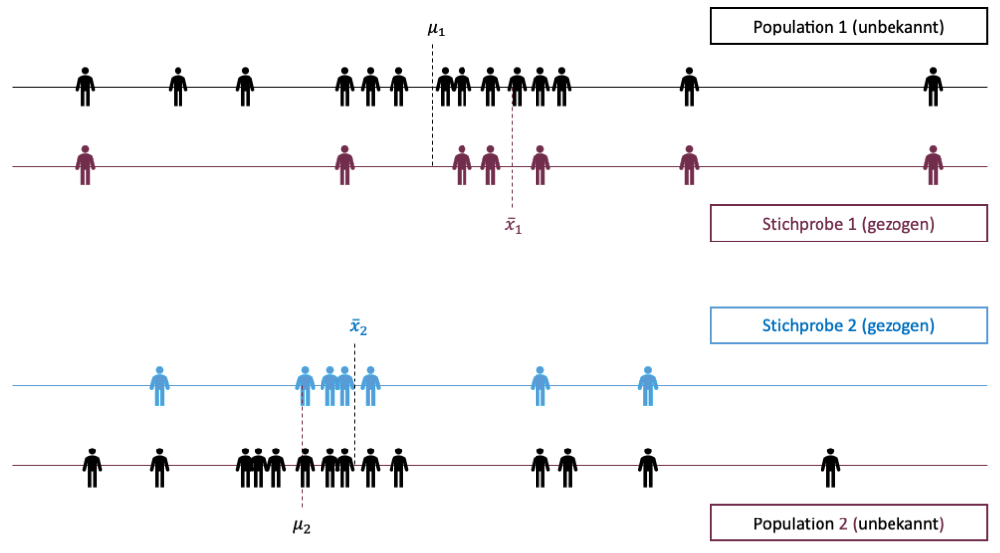

```{r setup, include=FALSE}
options(htmltools.dir.version = FALSE)

library(tidyverse)
library(kableExtra)
library(ggplot2)
library(plotly)
library(htmlwidgets)
library(MASS)
library(ggpubr)
library(xaringanthemer)
library(xaringanExtra)
library(gghighlight)

style_duo_accent(
  primary_color = "#621C37",
  secondary_color = "#EE0071",
  background_image = "blank.png"
)

xaringanExtra::use_xaringan_extra(c("tile_view"))

use_scribble(
  pen_color = "#EE0071",
  pen_size = 4
)

knitr::opts_chunk$set(
  fig.retina = TRUE,
  warning = FALSE,
  message = FALSE
)
```

name: Title slide
class: middle, left
<br><br><br><br><br><br><br>
# Statistik I
***
### Einheit 8: $t$-Test
##### `r format(as.Date(data.frame(readxl::read_excel("Modul Quantitative Methoden I_Termine.xlsx"))$Datum), "%d.%m.%Y")[8]` | Prof. Dr. Stephan Goerigk

---
class: top, left
### $t$-Test

#### Lernziele:

Sie lernen:

* Den $t$-Test - ein Signifikanztest zum Vergleich von 2 Mittelwerten in 3 Varianten
  * Ein-Stichproben $t$-Test
  * Unabhängiger $t$-Test (Zwei-Stichproben $t$-Test)
  * Abhängiger $t$-Test 
  
* Die Voraussetzungen, die für die Durchführung eines $t$-Tests gegeben sein müssen

* Die Entscheidungsregel, basierend auf dem kritischen t-Wert (unter Annahme Signifikanzniveau $\alpha= .05$)

* Die Abgrenzung zwischen einem einseitigen und einem zweiseitigen $t$-Test

---
class: top, left
### $t$-Test

#### Ein-Stichproben $t$-Test

* Hypothesen über $μ$ einer normalverteilten Variable, wobei $σ^2$ unbekannt

* Mögliche Hypothesen:
  * $H_0$: $μ=μ_{0}$; $H_1$: $μ\neqμ_0$
  * $H_0$: $μ≤μ_{0}$; $H_1$: $μ>μ_{0}$ 
  * $H_0$: $μ≥μ_{0}$; $H_1$: $μ<μ_{0}$

* Prüft anhand des Mittelwerts einer Stichprobe ob der Erwartungswert in der entsprechenden Population gleich einem vorgegebenen Wert ist (dem unter $H_{0}$ erwarteten $μ_{0}$).

* Vergleich eines Stichprobenmittelwertes mit einem hypothetischen Populationsparameter $μ_{0}$.

---
class: top, left
### $t$-Test

#### Entwicklung eines Entscheidungskriteriums

* Zur Erinnerung: Warhscheinlichkeit, die $H_0$ abzulehnen, obwohl sie in Wirklichkeit gilt, heißt $\alpha$-Fehler oder Fehler 1. Art

* t-Wert ist signifikant, wenn seine Auftretenswahrscheinlichkeit kleiner ist als das gewählte $\alpha$

* Für die Signifikanzprüfung kann der t-Wert $(t_{emp})$ auch mit dem kritischen t-Wert $(t_{krit})$ verglichen werden (in t-Tabelle nachsehen)

* Die Wahl des Signikanzniveaus ist von inhaltlichen Überlegungen abhängig und wird oft als $\alpha=.05$ gewählt.

---
class: top, left
### $t$-Test

#### Vergleich von ein- und zweiseitigen Fragestellungen

.pull-left[

.center[
```{r echo = F, out.width="400px"}
ggplot(data.frame(x = c(-4, 4)), aes(x)) +
    stat_function(fun = dnorm, geom = "area", fill = "steelblue", alpha = .3) +
    stat_function(fun = dnorm,geom = "area", fill = "steelblue", xlim = c(qnorm(.975), 4)) +
  stat_function(fun = dnorm,geom = "area", fill = "steelblue", xlim = c(-4, qnorm(.025))) +
  labs(x = "", y = "") +
      annotate(geom = "text", x = -2.5, y = 0.05, label = "2.5%", size = 6) +
    annotate(geom = "text", x = 2.5, y = 0.05, label = "2.5%", size = 6) +
  scale_x_continuous(breaks = c(qnorm(.025), 0, qnorm(.975)), labels = c(expression(-t[krit]), "0", expression(t[krit]))) +
  ggtitle("Zweiseitige Fragestellung") +
   theme_classic() +
  theme(text = element_text(size = 25), axis.text.y = element_blank(), axis.ticks.y = element_blank())  
```
]
]

.pull-right[
* Signifikanzniveau $\alpha=.05$ muss auf beide Seiten aufgeteilt werden

* Damit $\alpha=.05$ erreicht wird, darf $t_{krit}$ nur 2.5% der Fläche abschneiden

* Auftretenswahrscheinlichkeit von $t_{emp}$ muss kleiner als 2.5% 

* Ist Betrag von $t_{emp}$ größer als $t_{krit}$ so ist Test signifikant
]

---
class: top, left
### $t$-Test

#### Vergleich von ein- und zweiseitigen Fragestellungen

.pull-left[

* Mittelwertsdifferenz muss in vorhergesagte Richtung auftreten

* Gesamte 5% liegen auf vorhergesagter Seite der Verteilung

* Folge: Gleiche empirische Mittelwertsdifferenz wird bei einseitigen Hypothesen leichter signifikant (Betrag von $t_{krit}$ ist kleiner, bzw. Ablehnungsbereich ist größer).

]

.pull-right[

.center[
```{r echo = F, out.width="400px"}
ggplot(data.frame(x = c(-4, 4)), aes(x)) +
    stat_function(fun = dnorm, geom = "area", fill = "steelblue", alpha = .3) +
    stat_function(fun = dnorm,geom = "area", fill = "steelblue", xlim = c(qnorm(.95), 4)) +
    scale_x_continuous(breaks = c( 0, qnorm(.95)), labels = c("0", expression(t[krit]))) +
  labs(x = "", y = "") +
    annotate(geom = "text", x = 2.5, y = 0.05, label = "5%", size = 6) +
  ggtitle("Einseitige Fragestellung") +
   theme_classic() +
  theme(text = element_text(size = 25), axis.text.y = element_blank(), axis.ticks.y = element_blank())  
```
]
]

---
class: top, left
### $t$-Test

#### Ein-Stichproben $t$-Test

.center[
```{r eval = TRUE, echo = F, out.width = "850px"}
knitr::include_graphics("bilder/one_sample_t.png")
```
]

---
class: top, left
### $t$-Test

#### Ein-Stichproben $t$-Test

<small>

**Beispiel:**

* Stichprobe von $n = 36$ Schülern mit Unterricht in Geometrie absolvieren Raumvorstellungstest normiert in Population auf $μ = 100$

* Es soll die Hypothese geprüft werden, dass Schülern mit Geometrieunterricht im Schnitt besser sind.

* $n = 36$, Testpunkte normalverteilt, $\bar{x}_{Geo} = 101.32$ , $s_{Geo} = 4.15$

* $H_{0}$: $μ_{Geo} \leq μ$; $H_{1}$: $μ_{Geo} > μ$; $α=0.05$

$$t = \frac{101.32 − 100}{\frac{4.15}{\sqrt{36}}} = 1.91$$

* $df = 35$; $t_{30;0.95} = 1.70$, $t_{40;0.95} = 1.68$

* Richtung stimmt: unter $H_{1}$ positiver t-Wert erwartet

* $1.91 > 1.69 \rightarrow$ $H_{0}$ verwerfen

* Interpretation: Schüler mit Geometrieunterricht zeigen überdurchschnittliche Testleistungen.

</small>

---
class: top, left
### $t$-Test

#### Unabhängige vs. abhängige Stichproben

<small>

.pull-left[
**Abhängige Stichproben:**

* Elemente der zwei Stichproben können einander paarweise zugeordnet werden

**Beispiele:**

* die gleichen Personen wurden 2 Mal befragt (Messwiederholungen)

* es handelt sich um Paare (Geschwisterpaare, Ehepaare,..) 

* Personen wurden aufgrund eines oder mehrerer Variablen parallelisiert wurden (z.B. aufgrund eines Vortests werden je zwei Personen mit gleicher Punktezahl zu Paaren zusammengefasst).

]

.pull-right[
**Unabhängige Stichproben:**

* Es besteht keine Beziehung zwischen den Elementen der Stichproben. 

* Werte in der einen Stichprobe erlauben keine Vorhersage über Werte in der anderen Stichprobe (unkorreliert). 

**Beispiele:**

* Zufällige Zuteilung von Personen in Versuchsgruppe (VG) und Kontrollgruppe (KG) in einem Experiment

* Zufallsstichproben aus zwei unterschiedlichen Populationen

* Frauen und Männer (wobei es sich nicht um Paare handeln darf).
]

</small>

---
class: top, left
### $t$-Test

#### $t$-Test für unabhängige Stichproben mit gleichen Varianzen

* Unterscheiden sich die Mittelwerte zweier unabhängiger Stichproben aus normalverteilten Grundgesamtheiten signifikant voneinander?

* Wichtigster Wert für $t$-Test (Effekt von Interesse): **Mittelwertsdifferenz** $\bar{x}_{1} - \bar{x}_{2}$

* Die dichotome Gruppenvariable ist beim $t$-Test die UV, die numerische Variable, deren Mittelwerte berechnet werden, die AV

**Ungerichtete Hypothese:**

* $H_0$: $μ_1=μ_2$ bzw. $μ_1−μ_2=0$ und $σ_1=σ_2=σ$
* $H_1$: $μ_1\neqμ_2$ bzw. $μ_1−μ_2\neq0$ und $σ_1=σ_2=σ$ 

**Gerichtete Hypothese z.B.:**

* $H_0$: $μ_1\leqμ_2$ bzw. $μ_1−μ_2\leq0$ und $σ_1=σ_2=σ$
* $H_1$: $μ_1>μ_2$ bzw. $μ_1−μ_2>0$ und $σ_1=σ_2=σ$

---
class: top, left
### $t$-Test

#### $t$-Test für unabhängige Stichproben mit gleichen Varianzen

.center[
```{r eval = TRUE, echo = F, out.width = "750px"}

```
]

---
class: top, left
### $t$-Test

#### $t$-Test für unabhängige Stichproben mit gleichen Varianzen

**Voraussetzungen:**

  * Unabhängige Stichproben

  * Metrische AV

  * Normalverteilung in beiden Populationen

  * Homogene Varianzen 

**Folgen verletzter Voraussetzungen:**

* Sind Voraussetzungen für $t$-Test erfüllt, ist er der mächtigste Test zum Vergleich zweier unabhängiger Stichproben.

* Ist eine (oder mehrere) der Voraussetzungen nicht erfüllt, liegt keine $t$-Verteilung vor, das reale $α$ entspricht nicht dem vorgegebenen $α$ und es kommt zu Fehlentscheidungen.

---
class: top, left
### $t$-Test

#### $t$-Test für unabhängige Stichproben mit gleichen Varianzen

Prüfung der Voraussetzungen:

<small>

**Unabhängige Stichproben**

* Kein formeller Test $\rightarrow$ Beurteilung anhand der Kenntnis Studiendesigns (z.B. Liegt eine Messwiederholung vor?)

**Metrische AV**

* Kein formeller Test $\rightarrow$ Beurteilung anhand der Kenntnis des Messinstruments

**Normalverteilung in beiden Populationen**

* Prüfung der NV anhand der Verteilung in der Stichprobe (Rückschluss auf Population)
* Graphische Prüfung: Histogramm oder QQ-Plot
* Prüfung mit Signifikanztest (Wenn signifikant $\rightarrow$ NV-Annahme verletzt):
  * Shapiro-Wilk Test (empfohlen für $3 \leq n \leq 5.000)$
  * Kolgomorow-Smirnov Test
  * berechnen wir nicht händisch $\rightarrow$ in Klausur wird angegeben, ob NV in Population angenommen werden kann
* Viele Statistiker nehmen mittlerweile an, dass Tests ab balancierten Gruppengrößen von $n_1=n_2 \geq 30$ robust sind

**Homogene Varianzen**

* Prüfung mittels Levene-Test (F-Test) $\rightarrow$ siehe nächste Folie

</small>

---
class: top, left
### $t$-Test

#### $t$-Test für unabhängige Stichproben mit gleichen Varianzen

##### Vergleich zweier unabhängiger Varianzen: F-Test

<small>

* Unterscheiden sich die Varianzen zweier unabhängiger Stichproben aus normalverteilten Grundgesamtheiten?

* $H_0$: $σ_1^2 = σ_2^2$
* $H_1$: $σ_1^2 \neq σ_2^2$

Teststatistik:

$$F=\frac{\hat{\sigma}^2_1}{\hat{\sigma}^2_2}; df_1 = n_1 − 1, df_2 = n_2 − 1$$

* Voraussetzungen: NV in jeder Population

* ACHTUNG: Größere Varianz muss im Zähler stehen!

* $H_0$: $σ_1^2 = σ_2^2$ wird verworfen, wenn $F > F(df_1,df_2,1−α/2)$ (kritischer Wert)

</small>

---
class: top, left
### $t$-Test

#### $t$-Test für unabhängige Stichproben mit gleichen Varianzen

##### Vergleich zweier unabhängiger Varianzen: F-Test

<small>

.pull-left[
Beispiel: Gruppenvergleich mit homogenen Varianzen

.center[
```{r echo=FALSE, out.width="350px", out.height="350px"}
df <- data.frame(PF = rnorm(100000, mean = 10, sd = sqrt(6.12)))
df2 <- data.frame(PF = rnorm(100000, mean = 7, sd = sqrt(6.54)))

df$Gruppe = "VG"
df2$Gruppe = "KG"

#df = rbind(df, df2)

ggplot(df, aes(x = PF, colour = Gruppe)) + 
    # geom_histogram(aes(y =..density..),
    #                breaks = seq(0, 15, by = 1),
    #                fill = "transparent", bins = 100) +
 # scale_x_continuous(breaks = c(0,4.91,7.22, 10, 15)) +
  # geom_vline(xintercept = 7.22, linetype = "dashed", colour = "blue") +
  # geom_vline(xintercept = 4.91, linetype = "dashed", colour = "red") +
  stat_function(fun = dnorm, args = list(mean = mean(df$PF), sd = sd(df$PF)), colour = "blue") +
  stat_function(fun = dnorm, args = list(mean = mean(df2$PF), sd = sd(df2$PF)), colour = "red") +
  labs(x = "X", y = "relative Häufigkeit") +
   theme_classic() +
  theme(text = element_text(size = 25))
```
]
]

.pull-right[
Beispiel: Gruppenvergleich mit inhomogenen Varianzen

.center[
```{r echo=FALSE, out.width="350px", out.height="350px"}
df <- data.frame(PF = rnorm(100000, mean = 10, sd = sqrt(6.12)))
df2 <- data.frame(PF = rnorm(100000, mean = 7, sd = sqrt(6.54)))

df$Gruppe = "VG"
df2$Gruppe = "KG"

#df = rbind(df, df2)

ggplot(df, aes(x = PF, colour = Gruppe)) + 
    # geom_histogram(aes(y =..density..),
    #                breaks = seq(0, 15, by = 1),
    #                fill = "transparent", bins = 100) +
 # scale_x_continuous(breaks = c(0,4.91,7.22, 10, 15)) +
  # geom_vline(xintercept = 7.22, linetype = "dashed", colour = "blue") +
  # geom_vline(xintercept = 4.91, linetype = "dashed", colour = "red") +
  stat_function(fun = dnorm, args = list(mean = mean(df$PF), sd = sd(df$PF)), colour = "blue") +
  stat_function(fun = dnorm, args = list(mean = mean(df2$PF), sd = sd(df2$PF)*1.5), colour = "red") +
  labs(x = "X", y = "relative Häufigkeit") +
   theme_classic() +
  theme(text = element_text(size = 25))
```
]
]

</small>

---
class: top, left
### $t$-Test

#### $t$-Test für unabhängige Stichproben mit gleichen Varianzen

##### Vergleich zweier unabhängiger Varianzen: F-Test

F-Test - Beispiel 1

* Im Rahmen eines Experimentes hört die Versuchsgruppe während der Bearbeitung eines Gedächtnistests Hintergrundmusik, die Kontrollgruppe bearbeitet den Test ohne Hintergrundmusik. 

* Frage, die Levene-Test beantwortet: Streuen die Testleistungen der beiden Bedingungen unterschiedlich stark?

Hypothesen des F-Tests:

* $H_0$: $σ_{VG}^2 = σ_{KG}^2$ 
* $H_1$: $σ_{VG}^2 \neq σ_{KG}^2$
 
---
class: top, left
### $t$-Test

#### $t$-Test für unabhängige Stichproben mit gleichen Varianzen

##### Vergleich zweier unabhängiger Varianzen: F-Test

F-Test - Beispiel 1

Gegeben: 

* $s_{VG}^2 =8.5$
* $s_{KG}^2 =4.7$
* $n_{VG} =n_{KG} =50$
* NV der Daten in VG und KG kann angenommen werden.

$$F=\frac{8.5}{4.7}=1.81; df_1 = 49, df_2 = 49$$

* Nachprüfen in F-Tabelle: $F_{50,50;0.975} = 1.75 < 1.81 \rightarrow$ $H_0$ wird verworfen

* Levene-Test ist signifikant $\rightarrow$ Die Varianzen sind unterschiedlich (nicht homogen).

---
class: top, left
### $t$-Test

#### Prüfgröße t, unabhängige Stichproben, homogene Varianzen

<small>

* $t$ ist der Wert, welcher auf der t-Verteilung liegt und uns eine Wahrscheinlichkeitseinschätzung für die Mittelwertsdifferenz erlaubt:

$$t = \frac{\bar{x}_{1}- \bar{x}_{2}}{\sqrt{\frac{(n_{1} - 1) \cdot \hat{\sigma^2_{1}}+ (n_{2} - 1) \cdot \hat{\sigma^2_{2}}}{(n_{1} - 1) + (n_{2} - 1)} (\frac{1}{n_{1}}+\frac{1}{n_{2}})}}; df=n_{1}+n_{2} - 2$$

Verbal:

$$t=\frac{\text{Mittelwert Gruppe 1 - Mittelwert Gruppe 2}}{\text{geschätzter Standardfehler der Mittelwertsdifferenz}}$$

* Der Effekt (Mittelwertsdifferenz) wird gewichtet mit der Stichprobengröße und der Streuung innerhalb der Gruppen

* Zweiseitige $H_{0}$ wird verworfen, wenn $|t| > t(df; 1−α/2)$ (kritischer Wert) 

* Einseitige $H_{0}$ wird verworfen, wenn Abweichung in die erwartete Richtung und $|t| > t(df; 1−α)$

</small>

---
class: top, left
### $t$-Test

#### $t$-Test für unabhängige Stichproben mit gleichen Varianzen

##### Standardfehler der Mittelwertsdifferenz

<small>

* Standardfehler der Mittelwertsdifferenz bei $σ_{1}^2 = σ_{2}^2 = σ^2$

$$\sigma_{\bar{x}_{1}- \bar{x}_{2}}= \sqrt{\sigma^2 \cdot (\frac{1}{n_{1}}+\frac{1}{n_{2}})}$$

* Varianzschätzung innerhalb (der Stichproben)

$$\hat{\sigma}^2 = \frac{(n_{1} - 1) \cdot \hat{\sigma^2_{1}}+ (n_{2} - 1) \cdot \hat{\sigma^2_{2}}}{(n_{1} - 1) + (n_{2} - 1)}$$
Schätzung des Standardfehlers der Mittelwertsdifferenz

$$\hat{\sigma}_{\bar{x}_{1}- \bar{x}_{2}} = \sqrt{\frac{(n_{1} - 1) \cdot \hat{\sigma^2_{1}}+ (n_{2} - 1) \cdot \hat{\sigma^2_{2}}}{(n_{1} - 1) + (n_{2} - 1)} \cdot (\frac{1}{n_{1}}+\frac{1}{n_{2}})}$$

</small>

---
class: top, left
### $t$-Test

#### $t$-Test für unabhängige Stichproben mit gleichen Varianzen

##### Standardfehler der Mittelwertsdifferenz

**Warum Varianzschätzung innerhalb?**

* Unter $H_1$ beide Stichproben normalverteilt mit gleichem $σ$, aber unterschiedlichen Mittelwerten

* Würde man die Stichproben zu einer einzigen zusammenfassen und die Varianz berechnen, entstünde eine zweigipfelige Verteilung und man erhielte eine größere Varianz

* Man spricht bei Varianzschätzung innerhalb auch von gepoolten Varianzen

---
class: top, left
### $t$-Test

#### $t$-Test für unabhängige Stichproben mit gleichen Varianzen

Beispiel 1:

<small>

* Es soll überprüft werden, ob zusätzliches autogenes Training einen positiven Effekt bei der Behandlung von Depressionen hat.
* Klassischer Zwei-Gruppen-Versuchsplan: eine Gruppe von Patientinnen erhält nur die konventionelle Therapie (KG), eine zweite Gruppe erhält zusätzlich autogenes Training (VG).
* Operationalisierung des Effekts der Therapien: Scoredifferenz (vorher minus nachher) in einem Depressionsfragebogen.

* $H_0$: $μ_{VG} \leq μ_{KG}, σ^2_{VG} =σ^2_{KG}$ 
* $H_1$: $μ_{VG} > μ_{KG}, σ^2_{VG} =σ^2_{KG}$ 

Gegeben:

* VG: $\bar{x}_{VG} =7.22,s^2_{VG} =6.12;n_{VG}=53$ 
* KG: $\bar{x}_{KG} =4.91,s^2_{KG} =6.54;n_{KG}=51$ 
* NV gegeben, $α=.05$

</small>

---
class: top, left
### $t$-Test

#### $t$-Test für unabhängige Stichproben mit gleichen Varianzen

.pull-left[
Beispiel 1:

Gegeben:

* VG: $\bar{x}_{VG} =7.22,s^2_{VG} =6.12;n_{VG}=53$ 
* KG: $\bar{x}_{VG} =4.91,s^2_{VG} =6.54;n_{VG}=51$ 
* NV gegeben, $α=.05$

]

.pull-right[
.center[
```{r echo=FALSE, out.width="450px", out.height="450px"}
df <- data.frame(PF = rnorm(100000, mean = 7.22, sd = sqrt(6.12)))
df2 <- data.frame(PF = rnorm(100000, mean = 4.91, sd = sqrt(6.54)))

df$Gruppe = "VG"
df2$Gruppe = "KG"

#df = rbind(df, df2)

ggplot(df, aes(x = PF, colour = Gruppe)) + 
    # geom_histogram(aes(y =..density..),
    #                breaks = seq(0, 15, by = 1),
    #                fill = "transparent", bins = 100) +
  scale_x_continuous(breaks = c(0,4.91,7.22, 10, 15)) +
  geom_vline(xintercept = 7.22, linetype = "dashed", colour = "blue") +
  geom_vline(xintercept = 4.91, linetype = "dashed", colour = "red") +
  stat_function(fun = dnorm, args = list(mean = mean(df$PF), sd = sd(df$PF)), colour = "blue") +
  stat_function(fun = dnorm, args = list(mean = mean(df2$PF), sd = sd(df2$PF)), colour = "red") +
  labs(x = "IQ", y = "relative Häufigkeit") +
   theme_classic() +
  theme(text = element_text(size = 25))
```
]
]


---
class: top, left
### $t$-Test

#### $t$-Test für unabhängige Stichproben mit gleichen Varianzen

Beispiel 1:

Homogenität der Varianzen: $H_0$: $σ_1^2 = σ^2,$ $H_1:$ $σ_1^2 \neq  σ^2$

$$F=\frac{6.54}{6.12}=1.07; df_1=50, df_2=52$$

* Prüfung in F-Tabelle: $F_{50,50;0.975} = 1.75 > 1.07 \rightarrow$ $H_0$ wird beibehalten, Varianzen sind homogen.

$$t = \frac{7.22- 4.91}{\sqrt{\frac{52 \cdot 6.12 + 50 \cdot 6.54}{52+50} (\frac{1}{53}+\frac{1}{51})}}=4.64; df=53+51 - 2=102$$

* Prüfung in t-Tabelle: $t_{102;0.95} = 1.66 < 4.64 \rightarrow$ $H_0$ verwerfen

* Interpretation: Ergebnis spricht dafür, dass autogenes Training zusätzlichen Effekt hat.

---
class: top, left
### $t$-Test

#### $t$-Test für unabhängige Stichproben mit gleichen Varianzen

**Bewertung des t-Werts:**

* t-Wert schneidet geiwssen Prozentsatz der Fläche einer t-Verteilung ab

* Wahrscheinlichkeit des t-Werts gibt Wahrscheinlichkeit an, ob Nullhypothese zutrifft

* Ergibt t-Test (Nullhypothesentest) eine geringe Wahrscheinlichkeit, ist Ablehnung der Nullhypothese mögllich

* die zugrundeliegenden Populationen haben nicht den gleichen, sondern verschiedene Mittelwerte

* Entscheidungen eines t-Tests sind nie zu 100% sicher


---
class: top, left
### $t$-Test

#### Welch’s $t$-Test

<small>

* Was wenn Varianzen nicht homogen sind? $\rightarrow$ Annahme des unabhängigen $t$-Tests verletzt

* Prüfgröße $t$ mit gepoolten Varianzen nicht anwendbar

* Näherungslösung: Prüfgröße $t$ nach Welch

$$t_{Welch}= \frac{\bar{x}_1 - \bar{x}_2}{\sqrt{\frac{s^2_1}{n_1} + \frac{s^2_2}{n_2}}}$$

* Es wird eine Korrektur der Freiheitsgrade $(df)$ vorgenommen:

$$df=\frac{(\frac{s^2_1}{n_1} + \frac{s^2_2}{n_2})^2}{\frac{(\frac{s^2_1}{n_1})^2}{n_{1}-1}+\frac{(\frac{s^2_2}{n_2})^2}{n_{2}-1}}$$

* korrigierte $df$ abrunden auf die nächste ganze Zahl

* kritischen Wert aus $t$-Tabelle ablesen

</small>

---
class: top, left
### $t$-Test

#### Freiheitsgerade einer $t$-Verteilung

* Exakte Form der $t$-Verteilung ist abhängig vom Stichprobenumfang $\rightarrow$ deckt sich nicht exakt mit $z$-Verteilung

* Unterschied zwischen $t$-Verteilung und $z$-Verteilung $\rightarrow$ in $t$-Verteilung müssen 2 Schätzer eingehen 

  * empirische Mittelwertsdifferenz
  * Standardfehler der Mittelwertsdifferenz

Strebt $N$ gegen unendlich nähert sich $t$-Verteilung der $z$-Verteilung an.

---
class: top, left
### $t$-Test

<small>

#### Abhängiger $t$-Test

* wird z.B. bei Messwiederholungen eingesetzt $(t_0-t_1)$

* Ähnliches Prinzip wie unabhängiger $t$-Test

* Betrachtet nicht die Mittelwerte beider Zeitpunkte sondern die Differenz der Werte jeder einzelnen Versuchsperson

$\rightarrow$ es geht nur der Unterschied der Messwerte zwischen 1. und 2. Messung in die Auswertung mit ein

* allgemeine Unterschiede, die zwischen den Personen zu beiden Messzeitpunkten wirken gehen nicht mit ein

* Der relevante Effekt für den abhängigen $t$-Test ist also:

$$\bar{x}_d = \frac{\sum\limits _{i=1}^{N}d_{i}}{N}$$

Hypothesen:

* $H_0$: $μ_d \leq 0$ bzw. $μ_d = 0$
* $H_1$: $μ_d > 0$ bzw. $μ_d \neq 0$

</small>

---
class: top, left
### $t$-Test

<small>

#### Abhängiger $t$-Test

**Berechnung der Teststatistik:**

Da dieser Test die Verteilung der Mittelwerte von Differenzen betrachtet, ergibt sich eine andere Schätzung der Streuung:

$$t_{abhängig}=\frac{\bar{x}_d}{\hat{\sigma}_{\bar{x}_d}}$$

**Berechnung des Standardfehlers der Differenzen:**

$$\hat{\sigma}_{\bar{x}_d} = \frac{\hat{\sigma}_d}{\sqrt{N}}$$

**Schätzung der Streuung der Differenzen:**

$$\hat{\sigma}_d = \sqrt{\frac{\sum\limits _{i=1}^{N}(d_{i}-\bar{x}_d)^2}{N-1}}$$

**Berechnung der Freiheitsgrade:**

* $df=N-1$ (Anzahl der Messwertpaare - 1)

</small>

---
class: top, left
### $t$-Test

#### Abhängiger $t$-Test

Beispiel 1:

* Übungseffekt bei Wiederholung einer motorischen Aufgabe (Tippen einer kurzen Sequenz). 

* AV = Anzahl richtiger Sequenzen; UV = Zeitpunkt (dichotom): $t_0$ vs. $t_1$

* Ungerichtete Hypothese $μ_d = 0$: Übung könnte Leistung verbessern vs. Ermüdung könnte Leistung verschlechtern.

Gegeben:

* $N=36$ Teilnehmer:innen
* $\bar{x}_d=0.722$ und $\hat{\sigma}_d=4.186$
* $\alpha=.05$

---
class: top, left
### $t$-Test

#### Abhängiger $t$-Test


* $N=36$ Teilnehmer:innen
* $\bar{x}_d=0.722$ und $\hat{\sigma}_d=4.186$
* $\alpha=.05$

$$t_{abhängig}=\frac{\bar{x}_d}{\hat{\sigma}_{\bar{x}_d}}= \frac{\bar{x}_d}{\frac{\hat{\sigma}_d}{\sqrt{N}}}=\frac{0.722}{\frac{4.186}{\sqrt{36}}}=\frac{0.722}{0.698}=1.035$$
* kritischer Wert (nächster df Wert in Tabelle ist 30) von $t_{30,0.975}=2.042$

* t-Wert ist nicht größer als kritischer Wert.

* Interpretation: Es besteht kein signifikanter Unterschied zwischen den beiden Messzeitpunkten.

---
class: top, left
### $t$-Test

#### Berechnung in R 

**Unabhängiger t-Test:**

Beispiel: Vergleich der Reduktion von Symptomatik zwischen 2 Gruppen $(N=16)$

```{r echo = F, out.width="430px"}
df = data.frame(Reduktion = c(round(rnorm(8, 10, 2)), round(rnorm(8, 7, 2))),
                                    Gruppe = c(rep("G1", 8), rep("G2", 8)))                                         
```

.pull-left[
```{r echo=FALSE}
df_med = plyr::ddply(df, c("Gruppe"), plyr::summarise,
                                               Mittelwert = round(mean(Reduktion, na.rm = T), 2),
                                               SD = round(sd(Reduktion, na.rm = T), 2))
knitr::kable(df_med,
             booktabs = T,
             longtable = F) %>%
  kable_classic(full_width = F,
                  font_size = 18,
                  html_font = "Times New Roman")
```

.center[
```{r, echo = F, out.width="250px"}
ggplot(df, aes(x = Gruppe, y = Reduktion)) +
   stat_summary(size = 1.5, geom = "bar") +
    labs(x = "Gruppe", y = "Reduktion") +
  theme_classic() +
  theme(text = element_text(size = 28))
```
]
]
.pull-right[
.code80[
```{r}
t.test(Reduktion ~ Gruppe, data = df, var.equal = T)
```
]
]

---
class: top, left
### $t$-Test

#### Berechnung in R 

**Abhängiger t-Test:**

Beispiel: Prüfung, ob Symptomreduktion zwischen 2 Zeitpunkten signifikant ist $(N=8)$

```{r echo = F, out.width="430px"}
df = data.frame(Reduktion = c(round(rnorm(8, 10, 2)), round(rnorm(8, 7, 2))),
                                    Messung = c(rep("T1", 8), rep("T2", 8)))                                         
```

.pull-left[
```{r echo=FALSE}
df_med = plyr::ddply(df, c("Messung"), plyr::summarise,
                                               Mittelwert = round(mean(Reduktion, na.rm = T), 2),
                                               SD = round(sd(Reduktion, na.rm = T), 2))
knitr::kable(df_med,
             booktabs = T,
             longtable = F) %>%
  kable_classic(full_width = F,
                  font_size = 18,
                  html_font = "Times New Roman")
```

.center[
```{r, echo = F, out.width="250px"}
ggplot(df, aes(x = Messung, y = Reduktion)) +
   stat_summary(size = 1.5) +
  stat_summary(geom = "line", group = 1) +
    labs(x = "Messung", y = "Reduktion") +
  theme_classic() +
  theme(text = element_text(size = 28))
```
]
]
.pull-right[
.code80[
```{r}
t.test(Reduktion ~ Messung, data = df, paired = T)
```
]
]

---
class: top, left
### Take-aways

.full-width[.content-box-gray[
* t-Test ist eine Auswertungsverfahren für den **Vergleich von 2 Mittelwerten**

* Vergleich von Mittelwerten 2er Gruppen erfolgt mittels **unabhängigem t-Test**, von Mittelwerten 2er Zeitpunkte mit **abhängigem t-Test** und Vergleich von Mittelwert mit vorgegebenem Referenzwert mit **Ein-Stichproben t-Test**

* **Voraussetzungen** für unabhängige t-Test umfassen unabhängige Daten, Intervallskalenniveau, Normalverteilung und Varianzhomogenität

* Vorgehen: Berechnung von $t_{emp}$ und Vergleich mit $t_{krit}$, welcher aus **t-Tabelle** abgelesen wird

* Vorsicht: t-Test kann zu **Fehlentscheidungen** führen (s.h. $\alpha$-Fehler und $\beta$-Fehler)

* Prüfung, ob Effekt (Mittelwertunterschiede/Mittelwertsdifferenzen), die in Stichprobe gemessen wurden auf Population **generalisierbar** sind.
]
]


