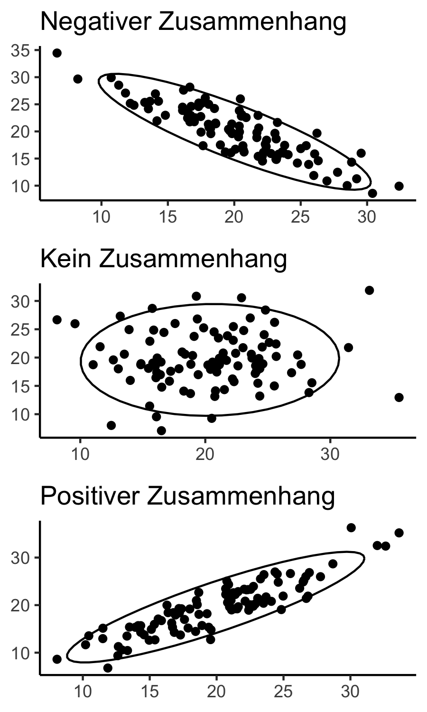
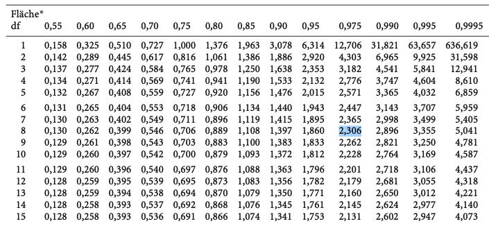

```{r setup, include=FALSE}
options(htmltools.dir.version = FALSE)

library(tidyverse)
library(kableExtra)
library(ggplot2)
library(plotly)
library(htmlwidgets)
library(MASS)
library(ggpubr)
library(xaringanthemer)
library(xaringanExtra)
library(gghighlight)

style_duo_accent(
  primary_color = "#621C37",
  secondary_color = "#EE0071",
  background_image = "blank.png"
)

xaringanExtra::use_xaringan_extra(c("tile_view"))

use_scribble(
  pen_color = "#EE0071",
  pen_size = 4
)

knitr::opts_chunk$set(
  fig.retina = TRUE,
  warning = FALSE,
  message = FALSE
)
```

name: Title slide
class: middle, left
<br><br><br><br><br><br><br>
# Statistik I
***
### Einheit 9: Korrelation
#####  `r format(as.Date(data.frame(readxl::read_excel("Modul Quantitative Methoden I_Termine.xlsx"))$Datum), "%d.%m.%Y")[9]` | Prof. Dr. Stephan Goerigk

---
class: top, left
### Korrelation

#### Der Begriff des (bivariaten) Zusammenhangs

Was bedeutet es, wenn zwei Variablen miteinander zusammenhängen?

* Die Ausprägung, die eine Person auf der einen Variable aufweist, gibt zu gewissen Teilen auch Auskunft darüber, welche Ausprägung diese Person auf der anderen Variable erreicht.

* Beide Variablen variieren dann systematisch miteinander.

**Beispiel: Müdigkeit und Konzentrationsfähigkeit**

* Müdigkeit und Konzentrationsfähigkeit stehen in Beziehung zueinander

* Überdurchschnittlich müde Menschen weisen in der Regel eine niedrigere Konzentrationsfähigkeit auf als weniger müde Menschen

Mit anderen Worten: Je höher die Müdigkeit, umso niedriger die Konzentrationsfähigkeit

$\rightarrow$ Aussagen wie diese postulieren einen Zusammenhang

---
class: top, left
### Korrelation

#### Der Begriff des (bivariaten) Zusammenhangs

##### Stärke des Zusammenhangs

.pull-left[

* Die Stärke des Zusammenhangs ist davon abhängig, wie zwingend von der einen Variable auf die andere geschlossen werden kann.

**Beispiel: Müdigkeit und Konzentrationsfähigkeit**

* wenn alle überdurchschnittlich müden Personen eine niedrige Konzentrationsfähigkeit aufweisen $\rightarrow$ starker Zusammenhang

* wenn es unter den überdurchschnittlich müden Personen auch welche mit hoher Konzentrationsfähigkeit gibt $\rightarrow$ weniger starker Zusammenhang
]

.pull-right[
.center[
```{r eval = TRUE, echo = F, out.width = "350px"}

```
]
]

---
class: top, left
### Korrelation

#### Der Begriff des (bivariaten) Zusammenhangs

##### Richtung des Zusammenhangs

* Zusammenhänge können in zwei "Richtungen" vorliegen: positiv oder negativ.

**Positiver Zusammenhang:**

* Hohe Werte auf der einen Variable entsprechen hohen Werten auf der anderen Variable

**Negativer Zusammenhang:**

* Hohe Werte auf der einen Variable entsprechen niedrigen Werten auf der anderen Variable

**Kein Zusammenhang:**

* Werte auf der einen Variable gehen mal mit hohen und mal mit niedrigen Werten auf der anderen Variable einher

* Beide Merkmale sind stochastisch unabhängig voneinander

---
class: top, left
### Korrelation
.pull-left[
#### Der Begriff des Zusammenhangs

##### Richtung des Zusammenhangs

```{r include=FALSE}
# library(faux)
# dat1 <- rnorm_multi(n = 100, 
#                   mu = c(20, 20),
#                   sd = c(5, 5),
#                   r = c(-0.9), 
#                   varnames = c("A", "B"),
#                   empirical = FALSE)
# dat2 <- rnorm_multi(n = 100, 
#                   mu = c(20, 20),
#                   sd = c(5, 5),
#                   r = c(0), 
#                   varnames = c("A", "B"),
#                   empirical = FALSE)
# dat3 <- rnorm_multi(n = 100, 
#                   mu = c(20, 20),
#                   sd = c(5, 5),
#                   r = c(0.9), 
#                   varnames = c("A", "B"),
#                   empirical = FALSE)
```


**Stärke des Zusammenhangs**

* Je enger die elliptische Form eines Punkteschwarms ist, umso stärker ist der Zusammenhang

* Ist die Punktewolke kreisförmig, besteht kein Zusammenhang

* Grafische Interpretation erlaubt grobe Orientierung über den Grad des Zusammenhangs. Diesen zu quantifizieren ist Aufgabe der Kovarianz und Korrelation.

]
.pull-right[
.center[
```{r eval = TRUE, echo = F, out.width = "300px"}

```

```{r echo=F, message=FALSE, warning=FALSE}
# png(file="/Users/stephangoerigk/Desktop/Universität/CFH/Lehre/Bachelor/Quantitative Methoden I/VO_Statistik I/Statistik_I_Folien/bilder/ellipse.png", width =3, height = 5, units = "in", res = 300)
# ggpubr::ggarrange(ggplot(dat1, aes(A, B)) + geom_point() + stat_ellipse() + ggtitle("Negativer Zusammenhang") + theme_classic() + theme(axis.title = element_blank()),
#                   ggplot(dat2, aes(A, B)) + geom_point() + stat_ellipse() + ggtitle("Kein Zusammenhang") + theme_classic() + theme(axis.title = element_blank()),
#                   ggplot(dat3, aes(A, B)) + geom_point() + stat_ellipse() + ggtitle("Positiver Zusammenhang") + theme_classic() + theme(axis.title = element_blank()),
#                   nrow = 3)
# dev.off()
```
]
]
---
class: top, left
### Korrelation

#### Kovarianz $(cov_{(x,y)})$

$$cov_{x,y}=\frac{\displaystyle \sum_{i=1}^{n}(x_{i}-\bar{x})\cdot(y_{i}-\bar{y})}{n-1}$$

* Unstandardisiertes Maß, dass den Zusammenhang zweier Variablen erfasst (bivariat)

* Ist in ihrer Berechnung der Varianz nicht unähnlich

* Varianz: Erfasst die Abweichungen einer Variable um ihren Mittelwert
  * Liefert aufgrund der Quadrierung nur positive Ergebnisse

* Kovarianz: Gleichgerichtete Abweichungen zweier Variablen von deren Mittelwerten
  * Kann auch negative Werte annehmen

---
class: top, left
### Korrelation

#### Kovarianz $(cov_{(x,y)})$

##### Wertespektrum:

* Betrag der Kovarianz zwischen 2 Variablen kann beliebige Werte zwischen 0 und einer maximalen Kovarianz $|cov_{max}|$ annehmen.

* $|cov_{max}|$ ist für positiver und negative Zusammenhänge identisch

Definition von $|cov_{max}|$:

* Definiert als das Produkt der beiden Merkmalsstreuungen:

$$|cov_{max}|=\hat{\sigma}_x \cdot \hat{\sigma}_y$$

---
class: top, left
### Korrelation

#### Kovarianz $(cov_{(x,y)})$

##### Wertespektrum:

$(cov_{(x,y)}) > 0$:

* Kovarianz ist positiv, wenn positive Abweichungen vom Mittelwert in $X$ mit positiven in $Y$ und negativen Abweichungen in $X$ mit negativen in $Y$ einhergehen.

$(cov_{(x,y)}) < 0$:

* Kovarianz ist negativ, wenn positive Abweichungen vom Mittelwert in $X$ mit negativen in $Y$ einhergehen und umgekehrt.

$(cov_{(x,y)}) = 0$:

* Kovarianz von 0 besagt, dass beide Variablen in keinem Zusammenhang zueinander stehen.

---
class: top, left
### Korrelation

#### Kovarianz $(cov_{(x,y)})$

##### Wertespektrum:

* Abweichungen, die in Formel zur Berechnung der Kovarianz eingehen, sind abhängig von der Skalierung (Maßstab) der Merkmale.

**Beispiel:**

Für dieselbe Länge ergibt sich eine höhere Kovarianz, wenn in cm anstatt in m gemessen wird

$\rightarrow$ Höhe der Kovarianz ist ein unstandardisiertes Maß für den Zusammenhang

* Es lässt sich nur Richtung erkennen

* Höhen unterschiedlicher Zusammenhänge lassen sich nicht vergleichen (hierfür nutzen wir Korrelation)

---
class: top, left
### Korrelation

#### Kovarianz $(cov_{(x,y)})$ - Beispiel

Ein Psychologe misst die Schlafdauer (X) von $(N=16)$ Proband:innen in Stunden (h). Nach dem Aufstehen müssen Sie einen Konzentrationstest (Y) durchführen (0-15 Punkte). Hohe Punktzahl entspricht guter Konzentrationsleistung.

```{r echo = F}
set.seed(123)
N = 16
df = data.frame(ID = c(paste0(rep(1:N))),
                Schlaf = round(c(rnorm(N, 8, 3)))
)

df$Konzentration = faux::rnorm_pre(df$Schlaf, mu = 7, sd = 3, r = .7)
df$Konzentration = round(df$Konzentration)
names(df) = c("ID", "Schlaf (X)", "Konzentration (Y)")
df2 = df
df = as.data.frame(t(df))
#rownames(df) = NULL
kable(df[,], col.names = NULL)%>%
  kable_styling(font_size = 18)
```

Die Kovarianz von Schlaf und Konzentration in dieser Stichprobe berechnet sich wie folgt $(\bar{x}=`r round(mean(df2[,2]), 2)`, \bar{y}=`r round(mean(df2[,3]),2)`)$:

$$cov_{x,y}=\frac{(`r df2[1,2]`-`r round(mean(df2[,2]), 2)`)\cdot(`r df2[1,3]`-`r round(mean(df2[,3]), 2)`)+(`r df2[2,2]`-`r round(mean(df2[,2]), 2)`)\cdot(`r df2[2,3]`-`r round(mean(df2[,3]), 2)`)+...}{`r N-1`}=`r round(cov(df2[,2], df2[,3]), 2)`$$
* Der Zusammenhang zwischen Schlaf und Konzentrationsfähigkeit ist also positiv.

* Über die relative Höhe des Zusammenhangs sagt dieser Wert nichts aus. Dafür brauchen wir ein standardisiertes Maß.

---
class: top, left
### Korrelation

#### Produkt-Moment-Korrelation $(r)$

* Standardisiertes Maß für den Zusammenhang zweier intervallskalierter Variablen

* Gebräuchlichstes Maß für die Stärke des Zusammenhangs

* Stärke des Zusammenhangs wird mit dem Korrelationskoeffizient $r$ angegeben.

* Anderer Name für die Korrelation: Pearson-Korrelation

---
class: top, left
### Korrelation

#### Produkt-Moment-Korrelation $(r)$

##### Berechnung

* Standardisierung der im vorherigen Abschnitt besprochenen Kovarianz

* Die berechnete Kovarianz wird anhand der maximalen Kovarianz $(|cov_{max}|)$ relativiert

$$r_{xy}=\frac{cov_{emp}}{cov_{max}}=\frac{cov_{x,y}}{\hat{\sigma}_x \cdot \hat{\sigma}_y}=\frac{\displaystyle \sum_{i=1}^{n}(x_{i}-\bar{x})\cdot(y_{i}-\bar{y})}{(n-1) \cdot \hat{\sigma}_x \cdot \hat{\sigma}_y}$$

* Dadurch wird die Kovarianz von der Streuung der Merkmale bereinigt.

* Das resultierende $r$ (Korrelationskoeffizient) ist somit maßstabsunabhängig (kann direkt interpretiert werden)

---
class: top, left
### Korrelation

#### Produkt-Moment-Korrelation $(r)$

##### Wertespektrum:

Der Korrelationskoeffizient kann nur Werte zwischen -1 und +1 annehmen:

* $r=1$ perfekter positiver Zusammenhang 

* $r=-1$ perfekter negativer Zusammenhang 

* $r=0$  kein Zusammenhang (Nullkorrelation)

* $r>0$  positiver Zusammenhang 

* $r<0$  negativer Zusammenhang

---
class: top, left
### Korrelation

#### Produkt-Moment-Korrelation $(r)$ - Beispiel

```{r echo = F}
set.seed(123)
N = 16
df = data.frame(ID = c(paste0(rep(1:N))),
                Schlaf = round(c(rnorm(N, 8, 3)))
)

df$Konzentration = faux::rnorm_pre(df$Schlaf, mu = 7, sd = 3, r = .7)
df$Konzentration = round(df$Konzentration)
names(df) = c("ID", "Schlaf (X)", "Konzentration (Y)")
df2 = df
df = as.data.frame(t(df))
#rownames(df) = NULL
kable(df[,], col.names = NULL)%>%
  kable_styling(font_size = 18)
```

Um den Korrelationskoeffizienten $(r)$ für unser Beispiel zu bestimmen, müssen wir zunächst die Standardabweichungen von X und Y als Schätzer der Merkmalsstreuung berechnen:

* $\hat{\sigma}_x = `r round(sd(df2[,2]), 2)`$
* $\hat{\sigma}_y = `r round(sd(df2[,3]), 2)`$

$$cov_{x,y}=\frac{(`r df2[1,2]`-`r round(mean(df2[,2]), 2)`)\cdot(`r df2[1,3]`-`r round(mean(df2[,3]), 2)`)+(`r df2[2,2]`-`r round(mean(df2[,2]), 2)`)\cdot(`r df2[2,3]`-`r round(mean(df2[,3]), 2)`)+...}{`r N-1`}=`r round(cov(df2[,2], df2[,3]), 2)`$$

$$r_{xy}=\frac{cov_{x,y}}{\hat{\sigma}_x \cdot \hat{\sigma}_y}=\frac{`r round(cov(df2[,2], df2[,3]), 2)`}{`r round(sd(df2[,2]), 2)` \cdot `r round(sd(df2[,3]), 2)`}= `r round(round(cov(df2[,2], df2[,3]), 2) / (round(sd(df2[,2]), 2) * round(sd(df2[,3]), 2)),2)`$$

---
class: top, left
### Korrelation

####  Produkt-Moment-Korrelation $(r)$

##### Interpretation

* Ab welcher Höhe eine Korrelation zwischen 2 Variablen als inhaltlich bedeutsam angesehen werden kann, hängt stark vom Forschungsgegenstand ab.

Beispiel: Labor- vs. Feld

* Labor: Aufgrund der Kontrollierbarkeit von Störeinflüssen werden höhere Zusammenhänge erwartet.
* Feld: Anspruch an die Höhe der Korrelation ist in der Regel niedriger.
* Unterschied des berechneten $r$ vs. 0 muss mittels Signifikanztest geprüft werden.

Einteilung der Größe des Effekts (Cohen, 1992):

```{r echo = F}
d = data.frame("r" = c(">0.1 oder < -0.1",
                       ">0.3 oder < -0.3",
                       ">0.5 oder < -0.5"),
               Interpretation = c("kleiner Effekt",
                                  "mittlerer Effekt",
                                  "großer Effekt"))
kable(d)%>%
  kable_styling(font_size = 18)
```

---
class: top, left
### Korrelation

####  Produkt-Moment-Korrelation $(r)$

##### Skalierung des Korrelationskoeffizienten

* Der Korrelationskoeffizient ist nicht intervallskaliert.

* Er kann demnach nicht als Prozentmaß des Zusammenhangs interpretiert werden.

* z.B. 0.4 ist nicht doppelt so hoch wie 0.8 (Äquidistanz ist nicht gegeben)

* Relationen ist kein perfektes Maß, wenn Zusammenhänge aus mehreren Studien miteinander verglichen und zusammen gefasst werden sollen (ein $r$ vs. ein zweites $r)$

* Um direkte Vergleiche zwischen Korrelationskoeffizienten zu ermöglichen, benötigt man einen Zwischenschritt (Fishers Z-Transformation)

---
class: top, left
### Korrelation

####  Produkt-Moment-Korrelation $(r)$

##### Pearson-Korrelation als Signifikanztest

<small>

* Die Korrelation kann als Signifikanztest genutzt werden
* Signifikanztest der Korrelation verläuft analog zum t-Test
* Einziger Unterschied: Interessierender Wert ist eine Korrelation anstelle einer Mittelwertdifferenz
* Schreibweise:
  * Empirisch ermittelte Korrelation: $r$
  * Zusammenhang in der Population (Grundgesamtheit): $\rho$ (Rho)

**Ungerichtete Hypothese: (*"Es besteht ein Zusammenhang zwischen X und Y."*)**
* $H_0$: $\rho = 0$
* $H_1$: $\rho \neq 0$

**Gerichtete Hypothese: (*"Es besteht ein positiver/negativer Zusammenhang zwischen X und Y."*)**
* $H_0$: $\rho \leq 0$, bzw. $\rho \geq 0$
* $H_1$: $\rho > 0$, bzw. $\rho < 0$

</small>

---
class: top, left
### Korrelation

####  Produkt-Moment-Korrelation $(r)$

##### Pearson-Korrelation als Signifikanztest

* Die zugehörige Prüfstatistik (t-Verteilung) ist uns bereits bekannt

* Der empirische t-Wert $(t_{emp})$ berechnet sich aus der empirisch ermittelte Korrelation $(r)$ und dem Stichprobenumfang $(N)$

$$t=\frac{r \cdot \sqrt{N-2}}{\sqrt{1-r^2}}; df=N-2$$

Vorgehen:

* Empirischer t-Wert $(t_{emp})$ wird gegen kritischen t-Wert $(t_{krit})$ getestet (aus t-Tabelle ablesen)

* Zweiseitige $H_{0}$ wird verworfen, wenn $|t_{emp}| > t(df; 1−α/2)$ (kritischer t-Wert) 

* Einseitige $H_{0}$ wird verworfen, wenn Abweichung in die erwartete Richtung und $|t_{emp}| > t(df; 1−α)$ (kritischer t-Wert) 

---
class: top, left
### Korrelation

####  Produkt-Moment-Korrelation $(r)$

##### Pearson-Korrelation als Signifikanztest - Beispiel

Der Psychologe aus unserem Beispiel möchte wissen, ob ein signifikanter positiver Zusammenhang zwischen Schlaf und Aufmerksamkeitsleistung besteht.

Hypothesen:

* $H_0$: $\rho \leq 0$
* $H_1$: $\rho > 0$

---
class: top, left
### Korrelation

####  Produkt-Moment-Korrelation $(r)$

##### Pearson-Korrelation als Signifikanztest - Beispiel

Der Psychologe aus unserem Beispiel möchte wissen, ob ein positiver Zusammenhang zwischen Schlaf und Aufmerksamkeitsleistung besteht.

* $r_{xy}= `r round(round(cov(df2[,2], df2[,3]), 2) / (round(sd(df2[,2]), 2) * round(sd(df2[,3]), 2)),2)`$
* $N=16$

$$t=\frac{0.76 \cdot \sqrt{16-2}}{\sqrt{1-0.76^2}}; df=16-2$$

$$t=\frac{2.84}{0.65}=4.37; df=14$$
Bestimmung von $(t_{krit})$ aus Tabelle (s.h. nächste Folie):

---
class: top, left
### Korrelation

<small>

####  Produkt-Moment-Korrelation $(r)$

##### Pearson-Korrelation als Signifikanztest - Beispiel

Kritischen t-Wert $(t_{krit})$ für $a=.05$ nachschlagen:

.center[
```{r eval = TRUE, echo = F, out.width = "700px"}
knitr::include_graphics("bilder/ttab4.png")
```
]
</small>

---
class: top, left
### Korrelation

####  Produkt-Moment-Korrelation $(r)$

##### Pearson-Korrelation als Signifikanztest - Beispiel

<small>

Der Psychologe aus unserem Beispiel möchte wissen, ob ein positiver Zusammenhang zwischen Schlaf und Aufmerksamkeitsleistung besteht.

* $r_{xy}= `r round(round(cov(df2[,2], df2[,3]), 2) / (round(sd(df2[,2]), 2) * round(sd(df2[,3]), 2)),2)`$
* $N=16$

$$t=\frac{0.76 \cdot \sqrt{16-2}}{\sqrt{1-0.76^2}}; df=16-2$$

$$t=\frac{2.84}{0.65}=4.37; df=14$$

* $t_{krit(df=14)}=1.761$ $\rightarrow$ Spalte für 0.95 in der t-Tabelle, da gerichtete Hypothese
* Der empirische t-Wert ist größer als der kritische t-Wert, der Korrelationskoeffizient ist signifikant größer als  0 (positiver Zusammenhang).
* Die $H_{0}$ kann verworfen werden. Es besteht ein positiver Zusammenhang zwischen Schlaf und Aufmerksamkeitsleistung.

</small>

---
class: top, left
### Korrelation

#### Rangkorrelation $(r_s)$

* Standardisiertes Maß für den Zusammenhang zweier ordinalskalierter Variablen

* Stellt eine Analogie zur Produkt-Momentkorrelation dar.

* Unterschied: Anstelle intervallskalierter Messwerte werden Rangplätze von ordinalskalierten Rangreihen verwendet.

* Erfasst, inwieweit zwei Rangreihen systematisch miteinander variieren.

* Stärke des Zusammenhangs wird mit dem Korrelationskoeffizient $r_s$ angegeben.

* Anderer Name für dieselbe Korrelation: Spearman-Korrelation

---
class: top, left
### Korrelation

#### Rangkorrelation $(r_s)$ - Beispiel

.pull-left[

* Eine Gruppe aus Frauen und Männern sollen $N=10$ Filme danach bewerten, wie lustig sie sind. 

* Dafür sollen die Filme in eine Rangreihe (Platz 1-10) gebracht werden.

* Es sollt untersucht werden, ob ein Zusammenhang zwischen der Rangliste der Frauen und der Rangliste der Männer besteht.
]

.pull-right[
```{r echo = F}
set.seed(123)
N = 10
df = data.frame(ID = c(paste0(rep(1:N))),
                Schlaf = c(8,10,3,1,6,7,2,5,9,4)
)

df$Konzentration = c(6,10,1,4,7,9,3,2,8,5)
df$Konzentration = round(df$Konzentration)
names(df) = c("Film", "Rangplatz Frauen", "Rangplatz Männer")
df$`Rangplatz Männer`[df$`Rangplatz Männer` > 10] = 10
df$`Rangplatz Männer`[df$`Rangplatz Männer` < 1] = 1
df$`Rangplatz Frauen`[df$`Rangplatz Frauen` > 10] = 10
df$`Rangplatz Frauen`[df$`Rangplatz Frauen` < 1] = 1

df2 = df
df = as.data.frame(df)
#rownames(df) = NULL
kable(df[,])%>%
  kable_styling(font_size = 16)
```
]

---
class: top, left
### Korrelation

#### Rangkorrelation $(r_s)$ - Beispiel

.pull-left[

* Eine Gruppe aus Frauen und Männern sollen $N=10$ Filme danach bewerten, wie lustig sie sind. 

* Dafür sollen die Filme in eine Rangreihe (Platz 1-10) gebracht werden.

* Es sollt untersucht werden, ob ein Zusammenhang zwischen der Rangliste der Frauen und der Rangliste der Männer besteht.

$$r_s={}1-\frac{6 \cdot \displaystyle \sum_{i=1}^{n}d^2_i}{N \cdot (N^2 - 1)}$$
]

.pull-right[
```{r echo = F}
set.seed(123)
N = 10
df = data.frame(ID = c(paste0(rep(1:N))),
                Schlaf = c(8,10,3,1,6,7,2,5,9,4)
)

df$Konzentration = c(6,10,1,4,7,9,3,2,8,5)
df$Konzentration = round(df$Konzentration)
names(df) = c("Film", "Rangplatz Frauen", "Rangplatz Männer")
df$`Rangplatz Männer`[df$`Rangplatz Männer` > 10] = 10
df$`Rangplatz Männer`[df$`Rangplatz Männer` < 1] = 1
df$`Rangplatz Frauen`[df$`Rangplatz Frauen` > 10] = 10
df$`Rangplatz Frauen`[df$`Rangplatz Frauen` < 1] = 1

df[, "Differenz (d)"] = df$`Rangplatz Frauen` - df$`Rangplatz Männer` 
names(df) = c("Film", "Rangplatz Frauen (X)", "Rangplatz Männer (Y)", "Differenz (d)")

df2 = df
df = as.data.frame(df)
#rownames(df) = NULL
kable(df[,])%>%
  kable_styling(font_size = 16)
```
]

---
class: top, left
### Korrelation

#### Rangkorrelation $(r_s)$ - Beispiel

* $d_i$ ist die Differenz der Ranglistenplätze einer Untersuchungseinheit i bezüglich der Variablen X und Y.

$$r_s={}1-\frac{6 \cdot \displaystyle \sum_{i=1}^{n}d^2_i}{N \cdot (N^2 - 1)}$$

$$r_s={}1-\frac{6 \cdot [2^2 + 0 + 2^2 +... + (-1)^2]}{10 \cdot (10^2 - 1)}=1-\frac{6 \cdot 34}{990}= 0.79$$

* Die Ranglisten der Frauen und Männer korrelieren also relativ stark miteinander.

* Frage: Ist dieser Zusammenhang auch statistisch signifikant?

---
class: top, left
### Korrelation

#### Rangkorrelation $(r_s)$ - Signifikanztest

Für $n \geq 30$ kann der Korrelationskoeffizient der Rangkorrelation mit dem t-verteilten Test näherungsweise auf Signifikanz geprüft werden $(r_{s}= 0.79; N=10)$.

Hypothesen:

* $H_0$: $\rho = 0$
* $H_1$: $\rho \neq 0$

$$t=\frac{r \cdot \sqrt{N-2}}{\sqrt{1-r^2}}; df=N-2$$

$$t=\frac{0.79 \cdot \sqrt{10-2}}{\sqrt{1-0.79^2}}=\frac{2.23}{0.61}=3.66$$
Bestimmung von $(t_{krit})$ aus Tabelle (s.h. nächste Folie):

---
class: top, left
### Korrelation

<small>

#### Rangkorrelation $(r_s)$ - Signifikanztest

Kritischen t-Wert $(t_{krit})$ für $a=.05$ nachschlagen (ungerichtete Hypothese):

.center[
```{r eval = TRUE, echo = F, out.width = "700px"}

```
]
</small>

---
class: top, left
### Korrelation

<small>

#### Rangkorrelation $(r_s)$ - Signifikanztest

Für $n \geq 30$ kann der Korrelationskoeffizient der Rangkorrelation mit dem t-verteilten Test näherungsweise auf Signifikanz geprüft werden $(r_{s}= 0.79; N=10)$.

Hypothesen:

* $H_0$: $\rho = 0$
* $H_1$: $\rho \neq 0$

$$t=\frac{r \cdot \sqrt{N-2}}{\sqrt{1-r^2}}; df=N-2$$

$$t=\frac{0.79 \cdot \sqrt{10-2}}{\sqrt{1-0.79^2}}=\frac{2.23}{0.61}=3.66$$


* $t_{krit(df=8)}=2.306$ $\rightarrow$ Spalte für 0.975 in der t-Tabelle, da ungerichtete Hypothese
* Der empirische t-Wert ist größer als der kritische t-Wert, der Korrelationskoeffizient ist signifikant größer als 0 (positiver Zusammenhang).
* Die $H_{0}$ kann verworfen werden. Es besteht ein positiver Zusammenhang zwischen den Ratings der Männer und Frauen.

</small>

---
class: top, left
### Korrelation

#### Rangkorrelation $(r_s)$ - Weitere Verwendung

**Ausreißer:**

* Die Rangkorrelation wird der Produkt-Moment-Korrelation auch vorgezogen, wenn Ausreißer in den Daten sind.

* Grund: Formel der Produkt-Moment-Korrelation nutzt Standardabweichungen (stark von Außreißern beeinflusst).

**Korrelation einer intervallskalierten Variable mit einer ordinalen Variable:**

* Es wird ebenfalls die Rangkorrelation verwendet.

* Hierfür wird die intervallskalierte variable auf Rangskalenniveau transformiert (z.B. kleinster Wert erhält niedrigsten Rang)

* Die Variable erfährt also eine Herabstufung des Skalenniveaus

---
class: top, left
### Korrelation

#### Exkurs: Korrelation und Kausalität

* Korrelation darf nicht vorschnell als Beweis für Kausalitätsbeziehungen betrachtet werden

* Ursache-Wirkungs-Beziehungen sind durch das ledigliche gemeinsame Auftreten zweier Variablen nicht bewiesen

**Kausalmöglichkeiten:**

* X verursacht Y
* Y verursacht X
* Gemeinsames Auftreten durch drittes Merkmal bedingt (Scheinkorrelation)

**Beispiel Scheinkorrelation:**

Nach dem 1. Weltkrieg nahmen in Deutschland die Anzahl der Störche und die Geburtenrate gleichermaßen ab.

$\rightarrow$ Der Storch bringt die Kinder.

---
class: top, left
### Take-aways

.full-width[.content-box-gray[
* Ein (bivariater) Zusammenhang zeigt sich darin, dass zwei Variablen **systematisch miteinander variieren**.

* Die **Kovarianz**, ein unstandardisiertes Zusammenhangsmaß, kann uns die Richtung des Zusammenhangs anzeigen, aber nicht direkt hinsichtlich seiner Stärke interpretiert werden.

* Der **Korrelationskoeffizient** $(r)$ ist ein standardisiertes Maß für den Zusammenhang zweier Variablen und kann Werte im Bereich von -1 bis +1 annehmen.

* Zusammenhänge zwischen zwei intervallskalierten Variablen werden mit der **Produkt-Moment-Korrelation** (Pearson), ordinalskalierte mit der **Rangkorrelation** (Spearman) berechnet.

* Die **Einteilung nach Cohen** erlaubt für $|r\geq.1|$, $|r\geq.3|$, $|r\geq.5|$ eine Unterteilung in kleine, mittlere und starke/große Zusammenhänge.

* Ein bestehender Zusammenhang gibt **keine Auskunft über Kausalbeziehungen** zwischen den untersuchten Variablen
]
]


